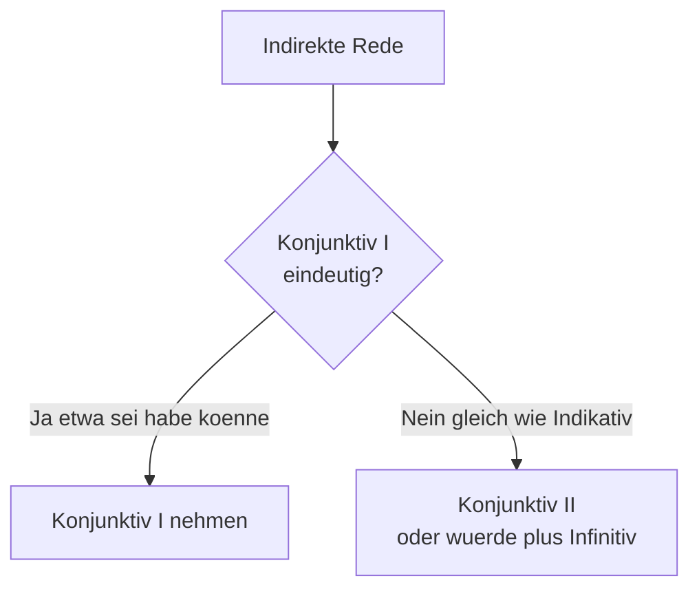

# Phase 4 · Grammar — The Formal Register

> **Level:** B2 → C1 · **Focus:** indirekte Rede (Konjunktiv I), indirect questions, diplomatic structures, Passiv in reports · **Time:** ~5–6 h
> _After this module you can report what colleagues said, relay questions indirectly, soften requests diplomatically, and write the neutral, agent-less German that fills real minutes, reports and post-mortems._

Phase 4 grammar is not new *vocabulary* — it is a **change of tone**. The same facts get repackaged so they sound objective, careful and professional. Four structures do almost all the work: **reported speech** (Konjunktiv I), **indirect questions**, **diplomatic softeners**, and the **Passiv**. You already own the machinery underneath — the Nebensatz verb-final rule from [Phase 1 · Grammar](#/phase-1/grammar) and Konjunktiv II from [Phase 2 · Grammar](#/phase-2/grammar) — so this module is about *deploying* it in a meeting-minutes and status-report context.

## Objectives / Lernziele

- Report statements with **Konjunktiv I** (`er sagte, das Feature sei fertig`) and know when to fall back to Konjunktiv II.
- Turn direct questions into **indirect questions** with `ob` and W-words.
- Phrase requests, disagreement and bad news **diplomatically**.
- Use the **Passiv** to write neutral, non-blaming reports and status updates.
- Recognize the **register signals** (Sie, Nominalstil, hedging) that mark professional German.

## 1. What "formal register" actually changes

Register is *how* you say something, not *what*. Compare the same message from a dev-chat one-liner to a written status report:

| Feature | Casual / chat | Formal / report |
|---|---|---|
| Address | du, first name | **Sie**, Herr/Frau + Nachname |
| Verb of saying | „Er meint, …“ | „Er teilte mit, … / gab an, …“ |
| Agent | „**Ich** hab den Bug gefixt.“ | „Der Fehler **wurde behoben**.“ (Passiv) |
| Style | verbs, short | **Nominalstil** (nouns): „nach Behebung des Fehlers“ |
| Requests | „Mach mal.“ | „**Könnten Sie** bitte …?“ |

**Sie is the workplace default** with clients, management, HR and anyone you don't know. But recall the culture note from the style guide: most German dev teams say *„Wir sind hier alle per du“* and switch to **du** internally within minutes. Register still applies even when you're per du — a written Protokoll stays neutral and formal regardless of how the standup sounds.

## 2. Indirekte Rede — reporting what was said (Konjunktiv I)

To report someone's words *without vouching for them*, German uses **Konjunktiv I**. It signals: "this is their claim, not my fact." It is the grammar of minutes, news and post-mortems.

Form the 3rd-person singular from the infinitive stem + **-e**; `sein` is the irregular star:

| Infinitiv | er/sie/es (K I) | Plural (K I) |
|---|---|---|
| sein | **sei** | **seien** |
| haben | **habe** | (haben → hätten) |
| werden | **werde** | (werden → würden) |
| können | **könne** | (können → könnten) |
| müssen | **müsse** | (müssen → müssten) |
| machen | **mache** | (machen → machten/würden machen) |

🇩🇪 Direct: **Die Teamleiterin sagt: „Ich habe den Bericht gelesen.“**
🇩🇪 Indirect: **Die Teamleiterin sagt, sie *habe* den Bericht gelesen.** — *The team lead says she has read the report.*

**The fallback rule:** whenever Konjunktiv I looks identical to the normal present tense (this happens in the plural and the *ich* form), switch to **Konjunktiv II** (`hätten, wären, müssten`) or **würde + Infinitiv**, so the "reported" flavour stays visible.



🇩🇪 **„Die Entwickler arbeiten am Fix.“** → *sie arbeiten* = indicative → ambiguous → **Er berichtet, die Entwickler *würden* am Fix *arbeiten*.**

Tense collapses to three time-frames: present → K I present (`sei`, `habe`), any past → K I perfect (`habe … gemacht`, `sei … gegangen`), future → `werde … `. With **dass** the verb goes to the end (that Nebensatz rule again from [Phase 1](#/phase-1/grammar)); without **dass** it stays in position 2:

🇩🇪 **Er sagte, dass das Deployment *geplant sei*.** = **Er sagte, das Deployment *sei* geplant.**

## 3. Indirect questions — `ob` and the W-words

Meetings are full of relayed questions. A **yes/no** question becomes an `ob`-clause; a **W-question** keeps its W-word. Both are Nebensätze → **verb to the end**.

| Direct question | Indirect question |
|---|---|
| „Läuft der Build?“ | Er fragt, **ob** der Build **laufe**. |
| „Ist die Migration getestet?“ | Sie möchte wissen, **ob** die Migration getestet **sei**. |
| „Wann deployen wir?“ | Es ist unklar, **wann** wir **deployen**. |
| „Warum ist der Test rot?“ | Ich frage mich, **warum** der Test rot **sei**. |

Note the polite openers that introduce them: *„Könnten Sie mir sagen, **ob** …?“*, *„Wissen Sie zufällig, **wann** …?“* — far softer than a bare question, and a staple of client email.

## 4. Diplomatic & polite structures

German professional culture prizes *klare, sachliche* communication — but "clear" is not "blunt." Soften the edges with Konjunktiv II (drilled in [Phase 2 · Grammar](#/phase-2/grammar)) and hedging words.

| Blunt | Diplomatic |
|---|---|
| Das ist falsch. | Da **sehe ich das etwas anders**. / Da **bin ich mir nicht ganz sicher**. |
| Machen Sie das. | **Könnten Sie** das bitte übernehmen? |
| Ich brauche das heute. | Es **wäre schön, wenn** wir das heute schaffen **könnten**. |
| Das geht nicht. | Das **wird schwierig** / **lässt sich so leider nicht umsetzen**. |

**Hedging vocabulary** buys room: *eventuell, vielleicht, unter Umständen, gegebenenfalls (ggf.), tendenziell, eher, grundsätzlich*. And when something went wrong, the Passiv (next section) lets you name the problem **without naming a person** — the single most useful diplomatic move in a retro:

🇩🇪 Instead of **„Du hast einen Bug eingebaut.“** → **„Hier hat sich ein Fehler eingeschlichen.“** *(A bug crept in here.)*

## 5. Passiv in reports

Reports care about *what happened to the system*, not *who did it*. The **Vorgangspassiv** (`werden` + Partizip II) puts the action centre-stage and the actor in the background — this is the backbone of technical writing you first met in [Phase 3 · Grammar](#/phase-3/grammar).

| Tense | Aktiv | Passiv |
|---|---|---|
| Präsens | Wir **beheben** den Bug. | Der Bug **wird behoben**. |
| Präteritum | Wir **behoben** den Bug. | Der Bug **wurde behoben**. |
| Perfekt | Wir **haben** ihn behoben. | Der Bug **ist behoben worden**. |
| mit Modalverb | Wir **müssen** testen. | Die Migration **muss getestet werden**. |

Contrast the **Zustandspassiv** (`sein` + Partizip II), which describes the *resulting state*, not the process: **„Das Ticket *ist* geschlossen.“** (it is now closed) vs. **„Das Ticket *wird* geschlossen.“** (someone is closing it). When you *do* want a light agent without a person, reach for **man**: *„Man hat den Server neu gestartet.“*

```audio
Im gestrigen Deployment wurde ein kritischer Fehler entdeckt. Der Product Owner teilte mit, die Ursache sei bereits bekannt. Es wurde entschieden, dass ein Hotfix noch heute ausgeliefert werden muss.
```

That passage is the whole module in three sentences: **Passiv** (wurde entdeckt), **indirekte Rede** (die Ursache sei bekannt), and a neutral, agent-less **decision** (es wurde entschieden) — exactly how a real Protokoll reads.

---

## 🧾 Zusammenfassung · Summary

Formal German is a **register shift**, powered by four structures. **Indirekte Rede** with **Konjunktiv I** (`sei, habe, könne`) reports others' words without endorsing them — fall back to **Konjunktiv II / würde** when Konjunktiv I looks like the indicative. **Indirect questions** wrap a question in `ob` or a W-word with the verb at the end. **Diplomatic softeners** (Konjunktiv II + hedging + Passiv) keep you *sachlich* without being blunt. The **Passiv** removes the actor so reports stay neutral and non-blaming. You built all of this on the Nebensatz and Konjunktiv II rules from Phases 1–2 — this module only re-aimed them at meetings and reports.

## 📇 Vokabel-Checkliste · Vocabulary checklist

| Deutsch | Artikel | Plural | English | VI (if hard) |
|---|---|---|---|---|
| indirekte Rede | die | — | reported speech | lời nói gián tiếp |
| Konjunktiv | der | Konjunktive | subjunctive mood | |
| Aussage | die | Aussagen | statement | |
| Bericht | der | Berichte | report | |
| Vermutung | die | Vermutungen | assumption / conjecture | |
| Vorgangspassiv | das | — | dynamic/process passive | |
| Zustandspassiv | das | — | statal (result) passive | |
| Ursache | die | Ursachen | (root) cause | |
| mitteilen | — | — | to inform / notify | |
| einschleichen (sich) | — | — | to creep in (an error) | |

→ Drill these and more in [Flashcards](#/@flashcards).

## 🗣️ Sprechübung · Speaking practice

1. Report three sentences your PO said today in **Konjunktiv I**: *„Er sagte, das Release sei … / die Tests seien …“*.
2. Turn three blunt requests into diplomatic **Konjunktiv II** ones (*„Könnten Sie …?“*).
3. Describe yesterday's incident **only in the Passiv** — no *ich*, no names. Record and compare with the 🔊 below.

```audio
Könnten Sie mir kurz sagen, ob der Fix schon deployt wurde? Der Kunde fragte, wann mit einer Lösung zu rechnen sei.
```

## ❓ Mini-Quiz

1. Konjunktiv I of *sein*, 3rd sg.? *„Er sagt, das Feature ___ fertig.“*
2. Make it indirect: „Ist die Pipeline grün?“ → *Sie fragt, ___ die Pipeline grün ___.*
3. Passiv (Präteritum): *„Wir haben den Server neu gestartet.“* → *Der Server ___ neu ___.*
4. Why switch to Konjunktiv II in *„Die Entwickler ___ (arbeiten) am Fix“* (reported)?

> **Lösungen:** 1) **sei** · 2) *…fragt, **ob** die Pipeline grün **sei**.* (verb to the end) · 3) *…**wurde** neu **gestartet**.* · 4) K I *arbeiten* = indicative *arbeiten* → ambiguous, so use **würden … arbeiten** (or *arbeiteten*). Full quiz: [Quizzes](#/@quiz).

## 📝 Hausaufgabe · Homework

- [ ] Rewrite **6 statements** from today's chat as **indirekte Rede** (Konjunktiv I, fall back to K II where needed).
- [ ] Convert **4 direct questions** into **indirect questions** (2× `ob`, 2× W-word).
- [ ] Write a **5-sentence incident report entirely in the Passiv** — no personal subjects.
- [ ] Soften **5 blunt sentences** into diplomatic requests/feedback.
- [ ] Do the [Formal Register quiz](#/@quiz) — aim for ≥ 4/5.

## 📚 Empfohlene Ressourcen · Recommended resources

- **Grammar reference:** deutsch.lingolia.com (Konjunktiv I, indirekte Rede, Passiv) and mein-deutschbuch.de.
- **Practice:** Schubert-Verlag online B2/C1 exercises (schubert-verlag.de) — Konjunktiv I and Passiv sets.
- **Coursebook:** *Aspekte neu B2/C1* (Klett) and *Sicher! C1* (Hueber) — reported-speech and report-writing units.
- **Video:** Deutsch mit Marija — Konjunktiv I & Passiv playlists.
- **Next:** [Phase 4 · Vocabulary](#/phase-4/vocabulary) → then [Phase 4 · Writing](#/phase-4/writing) to apply the Passiv in real minutes.
