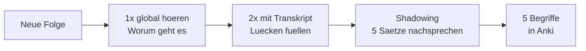

# Phase 4 · Listening — Meetings, Presentations & Podcasts

> **Level:** B2 → C1 · **Focus:** business/meeting German, presentations, and professional tech podcasts · **Time:** ~4–5 h (mostly listening)
> _After this module you can follow a fast, Denglisch-heavy meeting, catch the decision and the action items, and use a weekly podcast routine to keep your professional ear sharp._

Meeting German is a different listening skill from the news. It's **faster**, full of **Denglisch** (deployen, das Feature, gemerged), interrupted, and littered with fillers (*also, genau, sozusagen, im Prinzip*). Your goal isn't to catch every word — it's to catch the **Entscheidung** and the **Maßnahmen**. This module gives you a resource ladder from B2 to C1 and two active techniques so listening actually moves the needle instead of washing over you.

## Objectives / Lernziele

- Follow **meeting and presentation German** at natural tempo.
- Filter for the **decision, owner and deadline** even when you miss words.
- Recognise **Denglisch** and filler words instead of freezing on them.
- Build a **repeatable weekly listening routine** with the right resources.

## 1. Why business listening is harder

| Challenge | What it sounds like | Your move |
|---|---|---|
| Speed & overlap | people talk over each other | listen for the **decision**, not every word |
| Denglisch | „Wir haben das Feature gemerged.“ | accept anglicisms — they're *easier* for you |
| Fillers | *also, genau, ja, im Prinzip* | treat as pauses, not content |
| Nominalstil | „nach Rücksprache mit dem Kunden“ | decode the noun to a verb: *sich absprechen* |
| Regional accent | Bavarian/Swiss colleagues | pick standard-German sources first |

🇩🇪 **„Also im Prinzip sind wir uns einig — wir deployen Freitag.“** The only load-bearing words are **einig** and **Freitag**; the rest is padding.

## 2. Your resource ladder (B2 → C1)

Climb this over the month — start where you understand ~70% and move up.

| Level | Resource | Why |
|---|---|---|
| B2 warm-up | **DW — Top-Thema** & *Langsam gesprochene Nachrichten* | clear, slow, with transcripts |
| B2 → C1 | **Slow German** (Annik Rubens), **Easy German Podcast** | everyday + explained culture |
| C1 tech | **Engineering Kiosk**, **programmier.bar** | real dev conversations, your domain |
| C1 tech | **Working Draft**, **heise show**, **t3n-Podcast** | news, opinion, fast register |
| Meetings | recordings of your own team's calls (if allowed) | the exact accent & jargon you need |

**Engineering Kiosk** and **programmier.bar** are gold: the *content* is familiar (you know microservices and CI), so your brain can spend its budget on the *language*. Comprehensible input at its best.



## 3. Two active techniques

Passive listening plateaus fast. Use these two:

- **Die Protokoll-Methode.** While listening to a meeting or panel, jot a mini-Protokoll: *Thema · Entscheidung · offene Punkte.* This trains you to extract structure under time pressure — exactly the telc B2 listening task.
- **Shadowing.** Replay a 20–30-second chunk and speak *along with* the speaker, copying rhythm and intonation. This is where listening feeds back into the speaking Redemittel from [Phase 4 · Speaking](#/phase-4/speaking).

🇩🇪 Try the Protokoll-Methode on this passage:

```audio
Also, fassen wir zusammen: Wir haben uns entschieden, die Migration auf nächste Woche zu verschieben. Offen ist noch, wer den Kunden informiert. Thomas, kannst du das übernehmen? Gut, dann halten wir das so fest.
```

Your mini-Protokoll should read: **Entscheidung** = Migration verschoben (nächste Woche) · **offener Punkt** = Kunde informieren → **Thomas**.

## 4. A weekly listening routine

| Day | Input | Technique |
|---|---|---|
| Mon/Wed/Fri | 1 tech-podcast segment (~15 min) | global listen + 5 Anki terms |
| Tue/Thu | 1 DW Top-Thema | Protokoll-Methode |
| Sat | re-listen to the week's hardest clip | shadowing |
| Daily | 5 min forvo/YouGlish on new terms | pronunciation |

Consistency beats marathon sessions. Fifteen focused minutes a day, cross-checked against the [Weekly Study Checklist](#/@checklist), will outperform a two-hour Sunday binge.

---

## 🧾 Zusammenfassung · Summary

Business listening is fast, Denglisch-heavy and full of fillers — so **listen for the decision and the action items**, not every word. Climb a **resource ladder** from DW Top-Thema up to **Engineering Kiosk** and **programmier.bar**, where familiar tech content frees your brain to absorb language. Make it active with the **Protokoll-Methode** (extract Thema/Entscheidung/offene Punkte) and **shadowing** (copy rhythm), and lock it in with a light daily routine tracked in the [checklist](#/@checklist).

## 📇 Vokabel-Checkliste · Vocabulary checklist

| Deutsch | Artikel | Plural | English | VI (if hard) |
|---|---|---|---|---|
| Folge | die | Folgen | episode | tập (podcast) |
| Transkript | das | Transkripte | transcript | |
| Aussprache | die | Aussprachen | pronunciation | |
| Redefluss | der | (rare) | flow of speech / fluency | |
| Füllwort | das | Füllwörter | filler word | |
| Stichwort | das | Stichwörter | keyword / note | |
| mitschreiben | — | — | to take notes (while listening) | |
| sich einigen | — | — | to reach agreement | |

→ Drill these and more in [Flashcards](#/@flashcards).

## 🗣️ Sprechübung · Speaking practice

1. **Shadow** the audio below twice — match the speaker's rhythm, not just the words.
2. Listen to one podcast segment and **summarise it aloud** in 4 sentences.
3. Re-tell a meeting clip's **decision and owner** as indirekte Rede (*„Er sagte, die Migration werde verschoben“*).

```audio
Herzlich willkommen zu unserer Folge. Heute sprechen wir über Continuous Deployment. Bevor wir einsteigen, ein kurzer Überblick: Erstens, was ist das Problem? Zweitens, welche Lösung schlagen wir vor? Und drittens, was bedeutet das für euer Team?
```

## ❓ Mini-Quiz

1. When you can't catch every word in a meeting, what **two things** must you catch?
2. What is the **Protokoll-Methode**?
3. Name **two** approved tech podcasts good for a C1 ear.
4. What does *„Wir haben uns geeinigt“* mean?

> **Lösungen:** 1) the **Entscheidung** and the **Maßnahmen/owner** · 2) jotting a mini-Protokoll while listening: *Thema · Entscheidung · offene Punkte* · 3) **Engineering Kiosk** and **programmier.bar** (also Working Draft, heise show) · 4) *"We've reached agreement / agreed."* Full quiz: [Quizzes](#/@quiz).

## 📝 Hausaufgabe · Homework

- [ ] Listen to **3 tech-podcast segments** this week; write a 3-line mini-Protokoll for each.
- [ ] **Shadow** one 30-second clip until your rhythm matches.
- [ ] Collect **15 Denglisch/filler terms** you heard and add them to Anki.
- [ ] Do **one DW Top-Thema** with the Protokoll-Methode (Thema/Entscheidung/offene Punkte).
- [ ] Log all sessions in the [Weekly Study Checklist](#/@checklist).

## 📚 Empfohlene Ressourcen · Recommended resources

- **Learner podcasts:** DW — *Top-Thema* & *Langsam gesprochene Nachrichten*, Slow German (Annik Rubens), Easy German Podcast, Coffee Break German.
- **German tech podcasts:** Engineering Kiosk, programmier.bar, Working Draft, heise show, Golem.de-Podcast, t3n-Podcast.
- **Pronunciation:** forvo.com, YouGlish (German), the 🔊 TTS in this app.
- **Community:** Engineering Kiosk Discord — listen in on real dev discussions.
- **Next:** [Phase 4 · Reading](#/phase-4/reading) to work the same register in written company docs.
