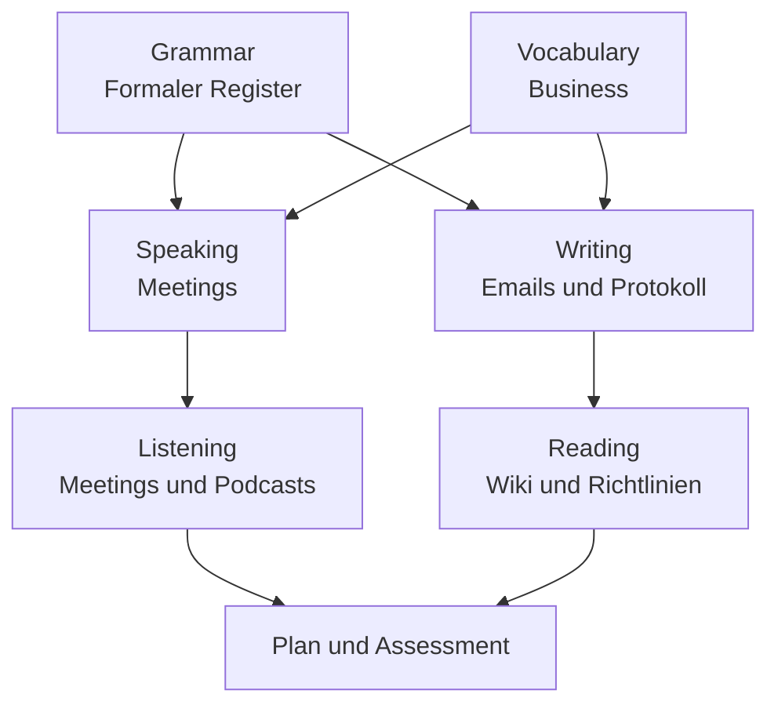

# Phase 4 · Overview — Professional Communication

> **Level:** B2 → C1 · **Focus:** how this phase turns solid B2 into workplace-ready C1 communication · **Time:** ~1 h (read first)
> _This is your map for Phase 4: what you'll learn, why it matters for a job in Germany, and how the eight modules fit together._

By now (Phases 1–3) you can *survive* technically in German: correct sentences, IT vocabulary, technical docs. Phase 4 is about **communicating professionally** — the softer, higher-stakes skill that decides whether German colleagues experience you as a peer. The theme is **register**: reporting neutrally, running meetings, writing emails and minutes, and giving feedback that lands. This is exactly the ground the **telc B2** and **Goethe-Zertifikat C1** exams test, so the phase doubles as exam prep.

## Objectives / Lernziele

- Shift confidently between **Sie and du** and the neutral written register.
- **Report** what others said and **run** meetings and presentations.
- Write professional **emails, minutes, docs and tickets**.
- Understand fast **meeting German** and dense **company documents**.
- Be ready for the **telc B2 / Goethe C1** communicative tasks.

## How the modules fit together

Everything radiates from **register** (grammar) and **business vocabulary**, then splits into the four skills:



| Module | You'll be able to … |
|---|---|
| [Grammar](#/phase-4/grammar) | report speech (Konjunktiv I), passive reports, diplomatic phrasing |
| [Vocabulary](#/phase-4/vocabulary) | run the meeting lifecycle: Termin → Protokoll → Maßnahme |
| [Speaking](#/phase-4/speaking) | moderate, take turns, present, give feedback |
| [Listening](#/phase-4/listening) | follow fast, Denglisch-heavy meetings & tech podcasts |
| [Reading](#/phase-4/reading) | skim wikis, decode policies & announcements |
| [Writing](#/phase-4/writing) | emails, minutes, docs, tickets |

## Why this matters for the job

German firms value **Struktur, Pünktlichkeit und klare Kommunikation** over "sales talk." A backend developer who writes a clean Protokoll, files an actionable ticket and moderates a crisp standup signals *Verlässlichkeit* (reliability) — the trait that gets you trusted with more. At a company like **Zalando**, **N26** or **SAP**, the code review may happen in English, but the retro, the Betriebsrat notice and the customer email are in German.

🇩🇪 **Wer klar schreibt und strukturiert spricht, wird als verlässlich wahrgenommen.**
*Whoever writes clearly and speaks in a structured way is perceived as reliable.*

## Exam alignment (accurate)

- **telc B2:** reading + language elements (~90 min), listening (~20 min), writing (~30 min), plus a **paired oral** (~15 min: presentation, discussion, plan together) — precisely the Speaking module's skills.
- **Goethe-Zertifikat C1:** Lesen ~70 min, Hören ~40 min, Schreiben ~65 min, Sprechen ~15 min (paired); each module /100, **≥60 to pass**.

Treat every module's Hausaufgabe as timed exam practice and you prepare for the job *and* the certificate at once.

```audio
Willkommen in Phase vier. In diesem Abschnitt lernen Sie, professionell zu kommunizieren: in Besprechungen, Präsentationen, E-Mails und Protokollen. Am Ende können Sie sich sicher zwischen Sie und du bewegen.
```

## 🧠 Systems-Check (Foundations)

Phase 4 through the lens of [German as a System](#/foundations/german-as-a-system) and
[Your Learning System](#/foundations/learning-system):

| Systems view | Phase 4 |
|---|---|
| **Fokus-Subsystem** | the **Register layer** — Sie/du, Konjunktiv I, diplomatic middleware; tone bugs now outweigh grammar bugs |
| **Erwarteter Engpass** | spontaneous professional speech — switching registers *live* in meetings |
| **Hebel** | **Informationsflüsse (#5)**: the [Fehlerjournal](#/@journal) goes meeting-driven; one weekly meeting simulation = your integration test |
| **P1-Fehler** | register mismatch (blunt imperative to the wrong audience) · broken reported speech (Konjunktiv I) in Protokollen |
| **Gate zu Phase 5** | moderate a 10-minute mock meeting + write a clean Protokoll ([Assessment](#/phase-4/assessment)) |

---

## 🧾 Zusammenfassung · Summary

Phase 4 turns technical survival into **professional communication**. Two foundation modules — **formal register** (grammar) and **business vocabulary** — feed the four skills of **speaking, writing, listening and reading**, all built around the workplace default of **Sie** (with **du** inside dev teams). The phase maps directly onto **telc B2** and **Goethe C1**, so studying it is also exam prep. Start with [Grammar](#/phase-4/grammar) and [Vocabulary](#/phase-4/vocabulary), then work outward to the skills, using the [Plan](#/phase-4/plan) to pace yourself and the [Assessment](#/phase-4/assessment) to check progress.

## 📇 Vokabel-Checkliste · Vocabulary checklist

| Deutsch | Artikel | Plural | English | VI (if hard) |
|---|---|---|---|---|
| Register | das | Register | (language) register | văn phong |
| Kommunikation | die | (rare) | communication | |
| Verlässlichkeit | die | (rare) | reliability | sự đáng tin cậy |
| Zusammenhang | der | Zusammenhänge | connection / context | |
| Ziel | das | Ziele | goal / objective | |
| wahrnehmen | — | — | to perceive | |

→ Drill these and more in [Flashcards](#/@flashcards).

## 🗣️ Sprechübung · Speaking practice

1. Say in German **why** professional communication matters for your job (2–3 sentences).
2. Name the **eight modules** of this phase from memory.
3. Read the audio below aloud and record yourself.

```audio
Mein Ziel in dieser Phase ist es, in Besprechungen sicher zu moderieren und professionelle E-Mails zu schreiben. Am wichtigsten sind mir klare Struktur und Verlässlichkeit.
```

## ❓ Mini-Quiz

1. What is the workplace-default form of address — and the common team exception?
2. Which two modules are the **foundation** the others build on?
3. Which exam has a **paired oral** with presentation + discussion + planning?

> **Lösungen:** 1) **Sie** by default; dev teams are often **per du** internally · 2) **Grammar (formal register)** and **Vocabulary** · 3) **telc B2** (Goethe C1 is also paired). Full quiz: [Quizzes](#/@quiz).

## 📝 Hausaufgabe · Homework

- [ ] Read this overview and **skim all eight modules'** objectives.
- [ ] Write a **3-line goal** for Phase 4 in German ("Am Ende kann ich …").
- [ ] Book a real or mock **telc B2 / Goethe C1** date to anchor your timeline.
- [ ] Open the [Plan](#/phase-4/plan) and block study time in your calendar.

## 📚 Empfohlene Ressourcen · Recommended resources

- **Exam boards:** telc (telc.net) and Goethe-Institut (goethe.de) — formats, sample papers, dates.
- **Coursebooks:** *Aspekte neu B2/C1* (Klett), *Sicher! B2/C1* (Hueber).
- **Community:** r/German and r/cscareerquestionsEU for exam & workplace-language experiences.
- **Next:** [Phase 4 · Grammar](#/phase-4/grammar) — start with the formal register.
