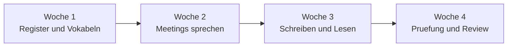

# Phase 4 · Plan — Weekly Milestones & Daily Plan

> **Level:** B2 → C1 · **Focus:** a 4-week schedule with weekly milestones and a Mon–Sun daily rhythm · **Time:** ~1 h to plan; ~8–10 h/week to execute
> _This is your operating plan for Phase 4: what to hit each week, and a repeatable daily template so you never wonder "what do I study today?"_

Phase 4 is designed as a **four-week sprint**. Each week has one theme and a concrete **milestone** (a deliverable you can check off), plus a fixed daily rhythm. Consistency is the whole game — 90 focused minutes a day beats a weekend cram, and it matches how the language actually gets used at work. Track everything against the [Weekly Study Checklist](#/@checklist).

## Objectives / Lernziele

- Follow a **weekly milestone** path from register → meetings → writing → exam.
- Run a repeatable **Mon–Sun** daily template.
- Produce **checkable deliverables** each week (email, Protokoll, presentation, mock exam).

## The four-week arc



## Weekly milestones

| Week | Theme | Milestone (deliverable) |
|---|---|---|
| 1 | Formal register + business vocab | 20 Konjunktiv-I sentences + 40 Anki cards; [Grammar](#/phase-4/grammar), [Vocabulary](#/phase-4/vocabulary) done |
| 2 | Meetings & presentations | record a **3-min presentation** + moderate a mock standup; [Speaking](#/phase-4/speaking), [Listening](#/phase-4/listening) |
| 3 | Writing & reading | write **1 email + 1 Protokoll + 1 ticket**; skim 5 wiki/policy texts; [Writing](#/phase-4/writing), [Reading](#/phase-4/reading) |
| 4 | Consolidate & exam-simulate | one **timed mock** (telc B2 or Goethe C1 section); [Assessment](#/phase-4/assessment) |

## Daily plan template (Mon–Sun)

A repeatable weekday rhythm — swap the "Focus block" to match the current week's theme:

| Day | Warm-up (15 min) | Focus block (45 min) | Output (30 min) |
|---|---|---|---|
| Mo | Anki review | Grammar module + exercises | 8 sentences in the day's structure |
| Di | podcast segment | Speaking Redemittel drill | record 2 min speaking |
| Mi | Anki review | Reading (wiki/policy/article) | 5-line summary in German |
| Do | shadowing clip | Listening + Protokoll-Methode | mini-Protokoll of a clip |
| Fr | Anki review | Writing task (email/ticket) | finish + self-correct 1 text |
| Sa | — | **Integration:** mock meeting or timed writing | review week's outputs |
| So | light review | rest / catch-up + plan next week | update [checklist](#/@checklist) |

🇩🇪 **Mein Plan für heute: erst Vokabeln wiederholen, dann die Grammatik üben und am Ende acht Sätze schreiben.**
*My plan for today: first review vocab, then practise the grammar, and write eight sentences at the end.*

```audio
Diese Woche konzentriere ich mich auf Besprechungen. Am Montag lerne ich die Redemittel, am Mittwoch übe ich das Moderieren, und am Samstag halte ich eine kurze Präsentation auf Deutsch.
```

## Adjusting the plan

If a week slips, **protect the milestone, cut the volume** — better to finish a shorter Protokoll than to skip writing entirely. Keep the daily warm-up (Anki + one audio) sacred even on busy days; it's what maintains momentum between the bigger blocks.

---

## 🧾 Zusammenfassung · Summary

Phase 4 runs as a **4-week sprint**: Week 1 register + vocabulary, Week 2 meetings & presentations, Week 3 writing & reading, Week 4 exam simulation. Each week ends with a **checkable deliverable**. A fixed **Mon–Sun template** (warm-up → focus block → output) removes daily decision fatigue and guarantees you both *input* and *production* every day. Protect the milestone and the daily warm-up above all, and log progress in the [Weekly Study Checklist](#/@checklist).

## 📇 Vokabel-Checkliste · Vocabulary checklist

| Deutsch | Artikel | Plural | English | VI (if hard) |
|---|---|---|---|---|
| Wochenziel | das | Wochenziele | weekly goal | mục tiêu tuần |
| Meilenstein | der | Meilensteine | milestone | cột mốc |
| Zeitplan | der | Zeitpläne | schedule | |
| Aufwand | der | (rare) | effort / workload | |
| Gewohnheit | die | Gewohnheiten | habit | thói quen |
| durchhalten | — | — | to keep at it / persevere | |

→ Drill these and more in [Flashcards](#/@flashcards).

## 🗣️ Sprechübung · Speaking practice

1. Say your **plan for today** in German (erst … dann … am Ende …).
2. Describe this **week's milestone** and how you'll reach it.
3. Read the audio below aloud and adapt it to *your* current week.

```audio
Mein Wochenziel ist es, ein Protokoll und eine E-Mail auf Deutsch zu schreiben. Ich übe jeden Tag neunzig Minuten und halte meinen Fortschritt in der Checkliste fest.
```

## ❓ Mini-Quiz

1. What is Week **2's** theme and deliverable?
2. What three parts make up the **daily template**?
3. If a week slips, what do you protect and what do you cut?

> **Lösungen:** 1) **Meetings & presentations** → record a 3-min presentation + moderate a mock standup · 2) **warm-up → focus block → output** · 3) protect the **milestone**, cut the **volume** (and keep the daily warm-up). Full quiz: [Quizzes](#/@quiz).

## 📝 Hausaufgabe · Homework

- [ ] Block **90-minute** study slots for the next 7 days in your calendar.
- [ ] Choose this week's **theme** and write its milestone as a can-do sentence.
- [ ] Set up the **daily template** as a checklist you tick off.
- [ ] Sync your progress with the [Weekly Study Checklist](#/@checklist).

## 📚 Empfohlene Ressourcen · Recommended resources

- **SRS:** Anki for the daily warm-up (personal Business & IT deck + Aspekte/Menschen wordlists).
- **Habit/tracking:** the app's [Weekly Study Checklist](#/@checklist) and [Bookmarks](#/@bookmarks).
- **Exam pacing:** telc.net and goethe.de sample papers to time your Week-4 mock.
- **Next:** [Phase 4 · Assessment](#/phase-4/assessment) to measure the sprint's results.
