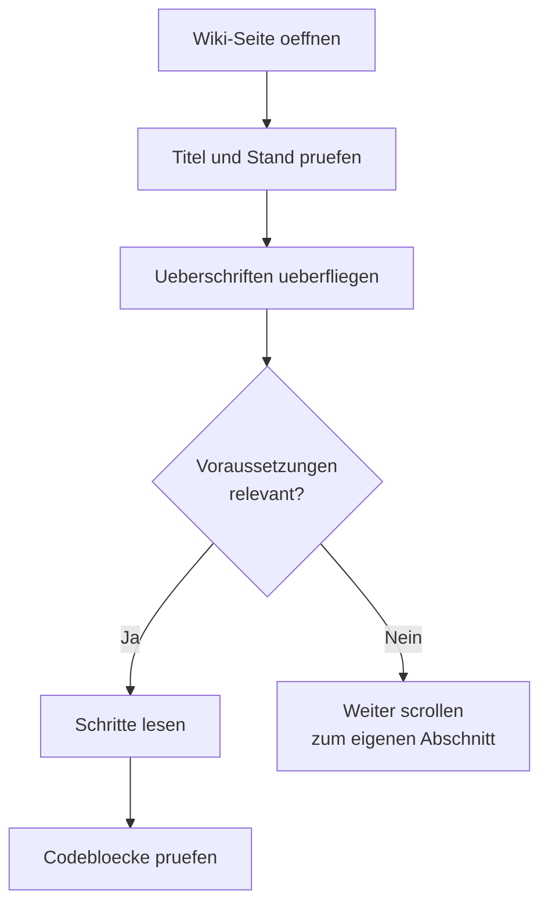

# Phase 4 · Reading — Company Communication & Docs

> **Level:** B2 → C1 · **Focus:** wiki/Confluence-style docs, internal announcements, policies, company communication · **Time:** ~4–5 h
> _After this module you can skim a Confluence page for the part you need, decode a Nominalstil-heavy policy, and get the point of an internal Rundmail without reading every line._

Once you're inside a German company, most of your reading is *internal*: the wiki (Confluence, often called **das Wiki** or **die Confluence-Seite**), Intranet announcements, HR policies, and long email threads. This German is dense — heavy on **Nominalstil** (nouns instead of verbs) and Passiv — but *predictable*. Each genre has a fixed shape, so once you know the shape you can skim to the 20% that matters. This module builds on the technical-reading skills from [Phase 3 · Reading](#/phase-3/reading) and re-aims them at *organisational* text.

## Objectives / Lernziele

- Recognise the **genres** of company reading and their typical structure.
- **Skim and scan** a wiki page for the section you actually need.
- Decode **Nominalstil and Passiv** back into plain meaning.
- Read **policies and announcements** for obligations, deadlines and exceptions.

## 1. The genres of company reading

| Genre | Deutsch | What to look for |
|---|---|---|
| Wiki / knowledge base | die Confluence-Seite, das Wiki | headings, "Voraussetzungen", code blocks, "Stand: …" (last updated) |
| Announcement | die Ankündigung, die Rundmail | first line = the point; date & deadline |
| Policy / guideline | die Richtlinie, die Betriebsvereinbarung | *muss / darf / ist untersagt*; scope & exceptions |
| How-to / runbook | die Anleitung | numbered steps, imperatives |
| Onboarding page | die Einarbeitung | who-does-what, first-week checklist |

🇩🇪 **„Stand: 12.06.2026 — diese Seite wird nicht mehr gepflegt.“**
*Last updated 12 June 2026 — this page is no longer maintained.* Always check the **Stand** before trusting a wiki page; stale docs are a universal hazard.

## 2. Reading a wiki / Confluence page

Wiki pages are built for skimming — use it. Read in this order, not top-to-bottom:



Typical section headings you can scan for: **Überblick, Voraussetzungen, Vorgehen/Anleitung, Konfiguration, Troubleshooting, Bekannte Probleme, Ansprechpartner.** Reading is *targeted*: you rarely need the whole page, only the section that unblocks you.

🇩🇪 **Voraussetzung: Zugriff auf das Repository und eine gültige VPN-Verbindung.**
*Prerequisite: access to the repo and a valid VPN connection.*

## 3. Internal announcements & policies

Announcements front-load the point; policies bury it in Nominalstil. For **policies**, hunt three things: the **obligation** (muss/darf/ist untersagt), the **scope** (Für wen gilt das?) and the **exception** (Ausnahme).

| Signal word | Meaning | Read as |
|---|---|---|
| ist verpflichtet / muss | is obligated / must | hard requirement |
| ist untersagt / ist nicht gestattet | is prohibited / not permitted | hard "no" |
| ist gestattet / darf | is permitted / may | allowed |
| es sei denn / Ausnahme | unless / exception | the loophole |
| bis spätestens | by … at the latest | your deadline |

🇩🇪 **Die Nutzung privater Geräte ist untersagt, es sei denn, sie wurde von der IT genehmigt.**
*Using private devices is prohibited unless approved by IT.* One sentence, one rule, one exception — that's the whole pattern.

## 4. Strategies for dense German — decoding Nominalstil

Company German loves nouns. To read faster, **turn the noun back into its verb** in your head:

| Nominalstil | Verb version | Meaning |
|---|---|---|
| nach **Prüfung** des Antrags | nachdem man den Antrag *geprüft* hat | after the request is reviewed |
| zur **Verbesserung** der Sicherheit | um die Sicherheit zu *verbessern* | to improve security |
| bei **Nichteinhaltung** der Frist | wenn man die Frist nicht *einhält* | if the deadline is missed |

Combine three habits: **skim** headings first, **scan** for signal words (muss, Frist, Ausnahme), and **decode** the nouns. You'll read a two-page Richtlinie for its actual obligations in minutes.

```audio
Zur Verbesserung der Informationssicherheit gilt ab dem ersten August eine neue Richtlinie. Alle Mitarbeitenden sind verpflichtet, die Zwei-Faktor-Authentifizierung zu aktivieren. Ausnahmen müssen bis spätestens fünfzehnten Juli beantragt werden.
```

## 5. A curated reading diet

Read *outside* work too, to keep the register warm:

- **heise.de, Golem.de, t3n.de** — news in the exact professional register of your future colleagues.
- **Informatik Aktuell, entwickler.de, Dev-Insider** — longer articles; great for Nominalstil practice.
- German **tool docs** (where available) — many projects ship German documentation.

Read one article every workday, and each day lift **five terms** into your Anki deck. Comprehension compounds fast when the topic is one you already understand in English.

---

## 🧾 Zusammenfassung · Summary

Company reading is **genre-shaped**: wiki pages, announcements, policies and runbooks each have a predictable structure, so **skim to the section you need** instead of reading top-to-bottom. Always check a wiki page's **Stand** (last-updated). In policies, hunt the **obligation, scope and exception** (muss / untersagt / es sei denn / Frist). Decode **Nominalstil** by turning nouns back into verbs. Keep the register warm with a daily article from heise, Golem or t3n. This extends the technical-reading habits from [Phase 3 · Reading](#/phase-3/reading) to organisational text.

## 📇 Vokabel-Checkliste · Vocabulary checklist

| Deutsch | Artikel | Plural | English | VI (if hard) |
|---|---|---|---|---|
| Richtlinie | die | Richtlinien | policy / guideline | quy định |
| Ankündigung | die | Ankündigungen | announcement | thông báo |
| Betriebsvereinbarung | die | -vereinbarungen | works agreement | thỏa ước lao động |
| Voraussetzung | die | Voraussetzungen | prerequisite | điều kiện tiên quyết |
| Anleitung | die | Anleitungen | instructions / how-to | |
| Ansprechpartner | der | Ansprechpartner | contact person | người phụ trách |
| Nichteinhaltung | die | (rare) | non-compliance / failure to meet | |
| untersagt | — | — | prohibited | |
| gestattet | — | — | permitted | |

→ Drill these and more in [Flashcards](#/@flashcards).

## 🗣️ Sprechübung · Speaking practice

1. Read the announcement audio below, then **explain the new rule aloud** in your own words.
2. Take one policy sentence and **decode its Nominalstil** into plain verbs out loud.
3. Skim a heise.de headline+teaser and **say the gist** in 2 German sentences.

```audio
Liebe Kolleginnen und Kollegen, ab nächster Woche wird das interne Wiki auf eine neue Version umgestellt. Bitte prüft, ob eure Seiten noch aktuell sind. Bei Fragen ist das Plattform-Team euer Ansprechpartner.
```

## ❓ Mini-Quiz

1. What field on a wiki page tells you whether to trust it?
2. In a policy, which three things should you hunt for?
3. Decode: *„bei Nichteinhaltung der Frist“*.
4. Does *„ist untersagt“* mean allowed or forbidden?

> **Lösungen:** 1) the **Stand** (last-updated date) · 2) **obligation, scope, exception** (muss / für wen / Ausnahme) · 3) *"if the deadline is not met."* · 4) **forbidden / prohibited**. Full quiz: [Quizzes](#/@quiz).

## 📝 Hausaufgabe · Homework

- [ ] Read **5 articles** this week (heise / Golem / t3n) — 5 new terms each into Anki.
- [ ] Take one **policy or announcement** and rewrite three Nominalstil phrases as verb clauses.
- [ ] Skim a real how-to page and write its **section headings** as a table of contents.
- [ ] Summarise one longer article (Informatik Aktuell / entwickler.de) in **5 German sentences**.
- [ ] Do the [Company Reading quiz](#/@quiz) — aim for ≥ 4/5.

## 📚 Empfohlene Ressourcen · Recommended resources

- **Tech media:** heise.de, Golem.de, t3n.de, Informatik Aktuell, entwickler.de, Dev-Insider.
- **Dictionaries:** DWDS.de and Duden.de for Nominalstil compounds; Linguee for phrase context.
- **Coursebook:** *Aspekte neu C1* (Klett) — reading strategies for dense expository text.
- **Docs:** German documentation of tools you use (where offered) for authentic register.
- **Next:** [Phase 4 · Writing](#/phase-4/writing) — turn what you read into emails, minutes and tickets.
