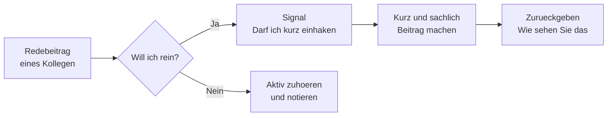

# Phase 4 · Speaking — Meetings & Presentations

> **Level:** B2 → C1 · **Focus:** moderating, turn-taking, interrupting politely, presenting, giving & receiving feedback · **Time:** ~5–6 h
> _After this module you can chair a short meeting, take and hold the floor politely, deliver a structured presentation with signposting, and give feedback that lands without stinging._

Speaking in meetings is a *choreography of phrases* — **Redemittel** — that native speakers reuse constantly. Learn a small kit of them and you'll sound fluent even under pressure, because you're not translating in real time; you're triggering a memorised move. This module gives you the moves for four jobs: **moderating**, **taking turns**, **presenting**, and **feedback**. Deliver them in the register you chose in [Phase 4 · Grammar](#/phase-4/grammar) — Sie with clients and management, du inside a per-du team.

## Objectives / Lernziele

- **Open, steer and close** a meeting with moderator Redemittel.
- **Take the floor** and **interrupt politely** without steamrolling.
- Give a **structured presentation**: Einleitung → Hauptteil → Schluss, with signposting.
- Give and receive **constructive feedback** using Ich-Botschaften.
- Handle **questions and disagreement** diplomatically and stay *sachlich*.

## 1. Moderating — opening, steering, closing

A moderator's job is three verbs: **eröffnen** (open), **strukturieren** (steer), **abschließen** (close).

| Phase | Redemittel |
|---|---|
| Eröffnen | „Vielen Dank, dass Sie da sind. **Ich würde gern pünktlich beginnen.**“ |
| Agenda | „Auf der **Tagesordnung** stehen heute drei Punkte.“ |
| Steuern | „**Bleiben wir kurz beim Thema** — dazu kommen wir gleich.“ |
| Zeit | „Wir haben dafür nur zehn Minuten, **lassen Sie uns fokussiert bleiben.**“ |
| Abschließen | „**Fassen wir zusammen:** Wir haben entschieden, dass …“ |

🇩🇪 **Lassen Sie uns zum nächsten Tagesordnungspunkt kommen.**
*Let's move on to the next agenda item.* — the single most useful moderator line.

## 2. Turn-taking & interrupting politely

The German dev-meeting norm is to *signal* before you cut in. Bare interruption reads as rude; a two-word softener fixes it.

| Move | Redemittel |
|---|---|
| Ask for the floor | „**Darf ich kurz einhaken?**“ / „Dürfte ich dazu etwas sagen?“ |
| Interrupt gently | „**Entschuldigung, wenn ich kurz unterbreche** …“ |
| Hold your turn | „**Ich würde den Gedanken gern zu Ende führen.**“ |
| Hand over | „**Wie sehen Sie das?**“ / „Anna, magst du ergänzen?“ |
| Come back to someone | „Sie wollten vorhin etwas sagen — **bitte.**“ |

🇩🇪 **Darf ich kurz einhaken? Ich glaube, wir vermischen gerade zwei Themen.**
*May I jump in briefly? I think we're mixing up two topics.*



## 3. Presenting — structure + signposting

A German audience expects **Struktur**. Announce it, follow it, and remind them where they are. Three parts, each with signposting Redemittel:

| Teil | Redemittel |
|---|---|
| **Einleitung** | „Ich möchte Ihnen heute … vorstellen. Ich habe meinen Vortrag in drei Teile gegliedert.“ |
| **Hauptteil** | „**Zunächst** …, **danach** …, **abschließend** …“ · „Wie Sie auf der Folie sehen …“ |
| Übergang | „**Damit komme ich zum nächsten Punkt.**“ |
| Betonen | „**Entscheidend ist hier**, dass …“ |
| **Schluss** | „**Zusammenfassend lässt sich sagen** …“ · „Vielen Dank. **Gern beantworte ich Ihre Fragen.**“ |

🇩🇪 **Zunächst zeige ich die Architektur, danach den Migrationsplan, abschließend die Risiken.**
*First I'll show the architecture, then the migration plan, finally the risks.* — a full agenda in one sentence. This mirrors the paired-oral **Präsentation** in the telc B2 exam (see the exam facts in [Phase 4 · Overview](#/phase-4/overview)).

```audio
Guten Morgen und vielen Dank, dass Sie da sind. Ich möchte Ihnen heute unseren neuen Deployment-Prozess vorstellen. Ich habe den Vortrag in drei Teile gegliedert: Zunächst der aktuelle Stand, danach die Änderungen, abschließend die nächsten Schritte.
```

## 4. Giving & receiving feedback constructively

German feedback is direct but should stay **sachlich** (fact-focused) and use **Ich-Botschaften** (I-statements) instead of accusations. A reliable frame is *Situation → Wirkung → Wunsch*.

| Situation | Say this |
|---|---|
| Praise | „Mir ist positiv aufgefallen, dass …“ |
| Concern (I-statement) | „**Mir ist aufgefallen**, dass … — das **wirkt auf mich** …“ |
| Wish, not command | „Ich **würde mir wünschen**, dass wir …“ |
| Receiving feedback | „**Danke für die offene Rückmeldung.** Das schaue ich mir an.“ |
| Disagree politely | „Da **sehe ich das etwas anders**, und zwar …“ |

🇩🇪 **Mir ist aufgefallen, dass der PR sehr groß war — das macht das Review schwer. Ich würde mir kleinere PRs wünschen.**
*I noticed the PR was very large — that makes review hard. I'd wish for smaller PRs.* Note the Konjunktiv II (`würde … wünschen`) doing the softening from [Phase 4 · Grammar](#/phase-4/grammar).

**Receiving** feedback well is half the skill: don't defend, acknowledge — *„Guter Punkt, das nehme ich mit.“* (Good point, I'll take that on board.)

## 5. Handling questions & disagreement

| Situation | Redemittel |
|---|---|
| Buy time | „**Das ist eine gute Frage.** Lassen Sie mich kurz überlegen.“ |
| Didn't understand | „**Können Sie das noch einmal anders formulieren?**“ |
| Park it | „Das **würde den Rahmen sprengen** — können wir das offline klären?“ |
| No answer yet | „Das kann ich Ihnen jetzt nicht sicher sagen — **ich melde mich dazu.**“ |

*„Ich melde mich dazu“* (I'll get back to you) is far better than guessing — and German colleagues will trust the follow-up because *Verlässlichkeit* (reliability) is prized.

---

## 🧾 Zusammenfassung · Summary

Meetings and presentations are won with a **Redemittel kit**. Moderating = eröffnen, strukturieren, abschließen (*„Kommen wir zum nächsten Punkt“, „Fassen wir zusammen“*). Turn-taking = signal before you cut in (*„Darf ich kurz einhaken?“*). Presenting = announce a **three-part structure** and signpost it (*zunächst … danach … abschließend*). Feedback = **Ich-Botschaften** + Konjunktiv II wishes, and graceful receiving (*„Danke, das nehme ich mit“*). Pick Sie or du to match the room, and when you don't know, promise a follow-up rather than bluff.

## 📇 Vokabel-Checkliste · Vocabulary checklist

| Deutsch | Artikel | Plural | English | VI (if hard) |
|---|---|---|---|---|
| Redemittel | das | Redemittel | set phrases / speech tools | mẫu câu giao tiếp |
| Vortrag | der | Vorträge | talk / presentation | |
| Folie | die | Folien | slide | |
| Wortmeldung | die | Wortmeldungen | request to speak | |
| Übergang | der | Übergänge | transition | |
| Ich-Botschaft | die | Ich-Botschaften | I-statement | |
| einhaken | — | — | to jump in / cut in | |
| gliedern | — | — | to structure / divide up | |
| ergänzen | — | — | to add (a point) | |

→ Drill these and more in [Flashcards](#/@flashcards).

## 🗣️ Sprechübung · Speaking practice

1. **Moderate** a 2-minute mock standup: open, run three "updates", close with a summary.
2. **Interrupt** a recording of yourself three times with different softeners (*„Darf ich kurz …“*).
3. Give a **60-second presentation** of a feature using *zunächst / danach / abschließend*. Record and compare with the 🔊 below.

```audio
Darf ich kurz einhaken? Mir ist aufgefallen, dass wir zwei Themen vermischen. Ich würde vorschlagen, dass wir zuerst das Deployment klären und danach über die Tests sprechen. Wie sehen Sie das?
```

## ❓ Mini-Quiz

1. Give a polite phrase to **interrupt** a colleague.
2. What three-part **structure** should a presentation announce?
3. Rephrase as an **Ich-Botschaft**: „Dein PR ist zu groß.“
4. Which phrase **parks** an off-topic question for later?

> **Lösungen:** 1) *„Darf ich kurz einhaken?“* / *„Entschuldigung, wenn ich kurz unterbreche …“* · 2) **Einleitung – Hauptteil – Schluss** (zunächst / danach / abschließend) · 3) e.g. *„Mir ist aufgefallen, dass der PR sehr groß ist — das macht das Review schwer.“* · 4) *„Das würde den Rahmen sprengen — können wir das offline klären?“* Full quiz: [Quizzes](#/@quiz).

## 📝 Hausaufgabe · Homework

- [ ] Memorise **8 Redemittel** (2 per job) and record yourself saying each cleanly.
- [ ] Record a **3-minute presentation** with a stated three-part structure and signposting.
- [ ] Write and speak **3 feedback items** as Ich-Botschaften (Situation → Wirkung → Wunsch).
- [ ] Watch one Easy German meeting/office clip and **copy 5 phrases** into your Anki deck.
- [ ] Do the [Meetings & Presentations quiz](#/@quiz) — aim for ≥ 4/5.

## 📚 Empfohlene Ressourcen · Recommended resources

- **Pronunciation:** forvo.com and YouGlish (German) for stress on long compound terms; the 🔊 TTS here for shadowing.
- **Redemittel banks:** *Aspekte neu B2/C1* (Klett) and *Sicher! C1* (Hueber) — Präsentation & Diskussion units.
- **Exam speaking:** *So geht's noch besser* (telc trainer) for the paired oral (presentation + discussion + plan together).
- **Video:** Easy German (real meeting/office language) and Deutsch mit Marija (formal speaking).
- **Next:** [Phase 4 · Listening](#/phase-4/listening) to train your ear on real meeting German.
