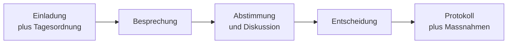

# Phase 4 · Vocabulary — Business & Meeting German

> **Level:** B2 → C1 · **Focus:** meetings, agendas, decisions, collaboration & feedback vocabulary · **Time:** ~4–5 h
> _After this module you can schedule, run and follow up on a meeting in German — invitation, agenda, discussion, decision, minutes and action items — with the right collocations._

Every job has a hidden second language: the vocabulary of *organising work*. In a German company this is where you'll spend more words than on code. The nine words in your brief — **die Besprechung, die Tagesordnung, das Protokoll, die Abstimmung, die Entscheidung, die Zusammenarbeit, die Rückmeldung, der Termin, die Einladung** — sit at the centre of it. Learn them *with their verbs and articles*, because German business language lives in fixed collocations: you don't just "have" a Termin, you **vereinbaren**, **verschieben** or **absagen** one.

## Objectives / Lernziele

- Schedule and manage appointments: **Termin, Einladung, Tagesordnung** + their verbs.
- Name the **meeting types** you'll actually attend (Daily, Retro, Abstimmung, Vieraugengespräch).
- Discuss and decide: **Abstimmung, Entscheidung, Protokoll** and how to say "let's decide."
- Talk about **Zusammenarbeit** and give/receive **Rückmeldung** constructively.
- Track outcomes: **Maßnahme, Frist, offene Punkte** and follow-up verbs.

## 1. Before the meeting — appointment, invitation, agenda

| Deutsch | Artikel · Plural | English | Key collocations |
|---|---|---|---|
| Termin | der · Termine | appointment / date | einen Termin **vereinbaren / ansetzen / verschieben / absagen** |
| Einladung | die · Einladungen | invitation | eine Einladung **verschicken / annehmen / ablehnen** |
| Tagesordnung | die · Tagesordnungen | agenda | die Tagesordnung **aufstellen / durchgehen** |
| Tagesordnungspunkt (TOP) | der · -punkte | agenda item | den nächsten **TOP** aufrufen |

🇩🇪 **Ich schlage einen Termin für Donnerstag vor und schicke gleich die Einladung mit der Tagesordnung.**
*I'm proposing a slot for Thursday and will send the invitation with the agenda right away.*

**Register tip:** *„Passt es Ihnen am Donnerstag?“* (Sie) vs. *„Passt's dir Donnerstag?“* (du). Calendar invites in tools are often bilingual, but the body text should match your team's register — recall the Sie/du note from [Phase 4 · Grammar](#/phase-4/grammar).

## 2. Meeting types you'll actually attend

Denglisch is everywhere here — *das Meeting, das Daily, die Retro* are normal — but the German words still appear in formal writing and with non-tech colleagues.

| Deutsch | Artikel · Plural | English |
|---|---|---|
| Besprechung | die · Besprechungen | meeting (general, slightly formal) |
| Daily / Stand-up | das · Dailys | daily standup |
| Abstimmung | die · Abstimmungen | sync / alignment meeting *and* a vote |
| Retrospektive (Retro) | die · Retrospektiven | retrospective |
| Vieraugengespräch | das · -gespräche | one-on-one (lit. "four-eyes talk") |
| Schulung | die · Schulungen | training session |

🇩🇪 **Wir haben um zehn ein kurzes Daily und danach eine Abstimmung mit dem Product Owner.**
*We have a short standup at ten and then an alignment with the PO afterwards.*

## 3. During the meeting — discuss & decide

`die Abstimmung` is a lovely two-in-one: as a *noun of coordination* ("alignment") and as a *vote*. The verb **(sich) abstimmen** = to coordinate / to vote.

| Deutsch | Artikel · Plural | English | Collocations |
|---|---|---|---|
| Abstimmung | die · Abstimmungen | alignment / vote | sich **abstimmen** mit; eine Abstimmung **durchführen** |
| Entscheidung | die · Entscheidungen | decision | eine Entscheidung **treffen / vertagen** |
| Protokoll | das · Protokolle | minutes | (das) Protokoll **führen / schreiben** |
| Vorschlag | der · Vorschläge | proposal | einen Vorschlag **machen / einbringen** |
| Einwand | der · Einwände | objection | einen Einwand **erheben / haben** |

🇩🇪 **Wer führt heute das Protokoll? — Wir treffen die Entscheidung, sobald wir uns mit dem Team abgestimmt haben.**
*Who's taking minutes today? We'll make the decision once we've aligned with the team.*



## 4. Collaboration & feedback

| Deutsch | Artikel · Plural | English | Collocations |
|---|---|---|---|
| Zusammenarbeit | die · (rare pl.) | collaboration | eng / reibungslos **zusammenarbeiten** |
| Rückmeldung | die · Rückmeldungen | feedback / reply | um Rückmeldung **bitten**; Rückmeldung **geben** |
| Absprache | die · Absprachen | arrangement / agreement | nach **Absprache** mit … |
| Schnittstelle | die · Schnittstellen | interface (team *or* API) | die Schnittstelle **zwischen** zwei Teams |
| Kritik | die · (rare pl.) | criticism | **konstruktive** Kritik üben |

🇩🇪 **Danke für die schnelle Rückmeldung — die Zusammenarbeit mit eurem Team läuft wirklich reibungslos.**
*Thanks for the quick feedback — the collaboration with your team is running really smoothly.*

Note the double life of **die Rückmeldung**: in a meeting it's *constructive feedback*; in an email *„Ich bitte um kurze Rückmeldung“* just means *"please reply."* Give feedback with Ich-Botschaften and Konjunktiv II — the diplomatic structures from [Phase 4 · Grammar](#/phase-4/grammar).

## 5. After the meeting — outcomes & follow-up

| Deutsch | Artikel · Plural | English | Collocations |
|---|---|---|---|
| Maßnahme | die · Maßnahmen | action / measure | Maßnahmen **festlegen / umsetzen** |
| Ergebnis | das · Ergebnisse | result / outcome | das Ergebnis **festhalten** |
| Frist | die · Fristen | deadline | eine Frist **einhalten / setzen** |
| offener Punkt | der · offene Punkte | open item | offene Punkte **klären** |
| Aufgabe / To-do | die · Aufgaben | task | eine Aufgabe **übernehmen** |

🇩🇪 **Im Protokoll halten wir die Maßnahmen fest und legen für jeden offenen Punkt eine Frist fest.**
*In the minutes we record the action items and set a deadline for every open point.*

```audio
Fassen wir zusammen: Wir haben uns auf den Hotfix geeinigt, die Frist ist Freitag, und Anna übernimmt die Abstimmung mit dem Kunden. Ich schicke das Protokoll heute Abend herum.
```

**Nominalstil bonus (C1):** business German loves nouns. *„Wir haben entschieden“* → *„nach der Entscheidung“*; *„Wir sprechen uns ab“* → *„nach Absprache“*. Turning verbs into nouns is a fast way to sound like the reports you'll read in [Phase 4 · Reading](#/phase-4/reading).

---

## 🧾 Zusammenfassung · Summary

Business German runs on **collocations**, not isolated words. Before a meeting: **Termin vereinbaren**, **Einladung verschicken**, **Tagesordnung aufstellen**. During it: **sich abstimmen**, eine **Entscheidung treffen**, **Protokoll führen**. Around it: **Zusammenarbeit**, **Rückmeldung geben**, **konstruktive Kritik**. After it: **Maßnahmen festlegen**, **Fristen einhalten**, **offene Punkte klären**. Learn each noun with its article, plural *and* its verb, and lean on the diplomatic phrasing from [Phase 4 · Grammar](#/phase-4/grammar) to make it land politely.

## 📇 Vokabel-Checkliste · Vocabulary checklist

| Deutsch | Artikel | Plural | English | VI (if hard) |
|---|---|---|---|---|
| Besprechung | die | Besprechungen | meeting | cuộc họp |
| Tagesordnung | die | Tagesordnungen | agenda | chương trình họp |
| Protokoll | das | Protokolle | minutes | biên bản họp |
| Abstimmung | die | Abstimmungen | alignment / vote | sự phối hợp / biểu quyết |
| Entscheidung | die | Entscheidungen | decision | |
| Zusammenarbeit | die | (rare) | collaboration | |
| Rückmeldung | die | Rückmeldungen | feedback / reply | phản hồi |
| Termin | der | Termine | appointment / date | |
| Einladung | die | Einladungen | invitation | |
| Maßnahme | die | Maßnahmen | action item / measure | biện pháp |

→ Drill these and more in [Flashcards](#/@flashcards).

## 🗣️ Sprechübung · Speaking practice

1. Propose and reschedule a meeting: *„Ich würde gern einen Termin vereinbaren … / Können wir den Termin verschieben?“*
2. Close a meeting in 20 seconds: summarise **Entscheidung + Maßnahme + Frist** ("Verantwortliche/r").
3. Give one piece of **konstruktive Rückmeldung** to a colleague. Record and compare with the 🔊 below.

```audio
Ich fasse kurz zusammen: Die Entscheidung ist gefallen, wir setzen den Vorschlag um. Die Frist ist Ende der Woche. Bitte gebt mir bis morgen eine kurze Rückmeldung.
```

## ❓ Mini-Quiz

1. Which verb goes with *Termin*: *einen Termin ___* (to schedule)?
2. `das Protokoll` — what's the verb for "to take minutes"?
3. Give the plural: *die Maßnahme → ___* and *der Termin → ___*.
4. *„Ich bitte um kurze ___“* — which of the nine key words means "please reply"?

> **Lösungen:** 1) **vereinbaren** (also *ansetzen*) · 2) das Protokoll **führen** (or *schreiben*) · 3) *Maßnahmen*, *Termine* · 4) **Rückmeldung**. Full quiz: [Quizzes](#/@quiz).

## 📝 Hausaufgabe · Homework

- [ ] Build an **Anki note per key word** with article + plural + one collocation + one example sentence.
- [ ] Write a **6-line meeting invitation** using Termin, Tagesordnung and Einladung.
- [ ] Write a **3-item action list** (Maßnahme + Verantwortliche/r + Frist) as it would appear in a Protokoll.
- [ ] Turn 5 of the verbs into **Nominalstil** nouns (*abstimmen → die Abstimmung*).
- [ ] Do the [Business Vocabulary quiz](#/@quiz) — aim for ≥ 8/10.

## 📚 Empfohlene Ressourcen · Recommended resources

- **Dictionaries / collocations:** DWDS.de and Duden.de for article + plural; Reverso Context and Linguee for real-world usage.
- **SRS:** keep a personal "Business & Meetings" Anki deck alongside the Aspekte/Menschen wordlists.
- **Coursebook:** *Aspekte neu B2/C1* (Klett) — the "Beruf & Besprechungen" chapters.
- **Video:** Easy German — office and meeting street-interview episodes for natural collocations.
- **Next:** [Phase 4 · Speaking](#/phase-4/speaking) to *use* this vocabulary live in meetings and presentations.
