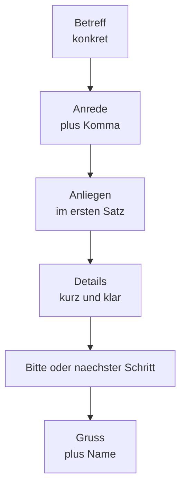

# Phase 4 · Writing — Emails & Documentation

> **Level:** B2 → C1 · **Focus:** professional emails, meeting minutes (das Protokoll), documentation, well-written tickets · **Time:** ~5–6 h
> _After this module you can write a professional German email with the right Anrede and Gruß, take clean meeting minutes, document a process, and write a ticket a colleague can act on without asking questions._

Writing is where German formality is *most visible and least forgiving* — a wrong Anrede or a sloppy Betreff is noticed. The good news: professional German writing is **template-driven**. Emails, minutes and tickets each have a fixed skeleton, and once you internalise the skeleton plus a handful of Redemittel, you produce correct text fast. This module leans hard on the **Passiv and indirekte Rede** from [Phase 4 · Grammar](#/phase-4/grammar) and the vocabulary from [Phase 4 · Vocabulary](#/phase-4/vocabulary).

## Objectives / Lernziele

- Write emails with the correct **Anrede / Gruß** and a clear structure.
- Choose the right **register** (Sie vs. du) and formality level per recipient.
- Write **meeting minutes (das Protokoll)** that capture decisions and action items.
- Write **documentation** and **tickets** that are precise and actionable.

## 1. Email anatomy — Anrede, body, Gruß

Every professional email has four fixed parts. Get the frame right and the middle writes itself.

| Part | Formal (Sie) | Semi-formal (du team) |
|---|---|---|
| Betreff | „Frage zur Deployment-Pipeline“ | same — always concrete |
| Anrede | „**Sehr geehrte Frau Weber,**“ | „**Hallo Anna,**“ / „Hi Anna,“ |
| Body | after comma, **lowercase** first word | same |
| Gruß | „**Mit freundlichen Grüßen**“ | „**Viele Grüße**“ / „VG“ |

Two hard rules learners break: the Anrede ends with a **comma**, so the first body word is **lowercase** (*„Sehr geehrte Frau Weber, **vielen** Dank …“*); and *„Sehr geehrte/r“* takes the name (**Herr Weber / Frau Weber**), never the first name. If you don't know the name: **„Sehr geehrte Damen und Herren,“**.



## 2. Email register & Redemittel

State your **Anliegen** (request/purpose) in the first sentence — Germans value getting to the point.

| Function | Redemittel |
|---|---|
| Reason for writing | „Ich schreibe Ihnen, **weil** …“ / „Es geht um …“ |
| Polite request | „**Könnten Sie mir bitte** … zukommen lassen?“ |
| Attaching | „**Im Anhang finden Sie** …“ |
| Reminder (soft) | „**Ich möchte kurz nachfassen** wegen …“ |
| Apology | „**Bitte entschuldigen Sie** die späte Rückmeldung.“ |
| Closing line | „**Für Rückfragen stehe ich gern zur Verfügung.**“ |

🇩🇪 **Sehr geehrter Herr Schulz, im Anhang finden Sie das Protokoll von heute. Für Rückfragen stehe ich gern zur Verfügung. Mit freundlichen Grüßen, …**
*Dear Mr Schulz, please find today's minutes attached. I'm happy to answer any questions. Kind regards, …*

## 3. Meeting minutes — das Protokoll

A Protokoll is neutral, past-tense and **agent-light** — the perfect home for the Passiv and indirekte Rede. Standard structure:

| Field | Content |
|---|---|
| Kopf | Datum, Teilnehmende, Protokollant/in |
| Tagesordnung | the TOPs discussed |
| Diskussion | key points, in **indirekte Rede** |
| Beschlüsse | decisions, in **Passiv** |
| Maßnahmen | action · owner · Frist (a table) |

🇩🇪 **Beschluss: Es wurde entschieden, den Hotfix am Freitag auszuliefern.** *(Passiv — no "we/I".)*
🇩🇪 **Herr Klein wies darauf hin, die Tests seien noch nicht vollständig.** *(indirekte Rede.)*

The Maßnahmen table is the part people actually read:

| Maßnahme | Verantwortlich | Frist |
|---|---|---|
| Hotfix ausliefern | Anna | Fr, 18.07. |
| Kunden informieren | Thomas | Do, 17.07. |

## 4. Documentation — wiki pages the German way

Docs should be **skimmable** (recall the reader's strategy from [Phase 4 · Reading](#/phase-4/reading)): headings, prerequisites, numbered steps. Use the **imperative** for instructions and keep sentences short.

```markdown
## Überblick
Dieser Service verarbeitet eingehende Zahlungen.

## Voraussetzungen
- Zugriff auf das Repository
- Gültige VPN-Verbindung

## Vorgehen
1. Klone das Repository.
2. Kopiere die Beispiel-Konfiguration.
3. Starte den Service mit `./run.sh`.
```

🇩🇪 **Kopiere die Beispiel-Konfiguration und passe die Datenbank-URL an.**
*Copy the sample config and adjust the database URL.* Imperative + short = readable.

## 5. Well-written tickets

A good ticket is a **contract**: title, context, and *acceptance criteria*. Vague tickets cost your colleagues time — and in German you can be precise cheaply.

| Feld | Inhalt |
|---|---|
| Titel | short, action-first: „Login schlägt bei Sonderzeichen fehl“ |
| Beschreibung | context — what & why |
| Schritte zur Reproduktion | 1., 2., 3. |
| Erwartetes / tatsächliches Verhalten | „Erwartet: … / Tatsächlich: …“ |
| Akzeptanzkriterien | „Fertig, **wenn** …“ |

```markdown
Titel: Login schlägt bei Sonderzeichen im Passwort fehl

Beschreibung:
Nutzer mit Sonderzeichen (z. B. „ä“, „&“) im Passwort können sich nicht anmelden.

Schritte zur Reproduktion:
1. Passwort mit „&“ setzen.
2. Abmelden und erneut anmelden.

Erwartet: Login erfolgreich.
Tatsächlich: Fehler 500.

Akzeptanzkriterien:
- Login funktioniert mit allen gültigen Sonderzeichen.
- Es wird ein automatischer Test ergänzt.
```

```audio
Sehr geehrte Frau Weber, vielen Dank für Ihre Nachricht. Im Anhang finden Sie das Protokoll der heutigen Besprechung. Die offenen Punkte sind darin markiert. Für Rückfragen stehe ich gern zur Verfügung. Mit freundlichen Grüßen, Cu Dinh.
```

---

## 🧾 Zusammenfassung · Summary

Professional German writing is **template-driven**. Emails need the right **Anrede** (comma → lowercase next word; *Sehr geehrte* + surname) and **Gruß** (*Mit freundlichen Grüßen* / *Viele Grüße*), with the Anliegen in sentence one. **Minutes (das Protokoll)** stay neutral: decisions in the **Passiv**, discussion in **indirekte Rede**, action items in a **Maßnahme · Verantwortlich · Frist** table. **Docs** are skimmable — headings, prerequisites, imperative steps. **Tickets** are contracts: title, reproduction steps, and **Akzeptanzkriterien**. Reuse the grammar from [Phase 4 · Grammar](#/phase-4/grammar) and the words from [Phase 4 · Vocabulary](#/phase-4/vocabulary).

## 📇 Vokabel-Checkliste · Vocabulary checklist

| Deutsch | Artikel | Plural | English | VI (if hard) |
|---|---|---|---|---|
| Anrede | die | Anreden | salutation | lời chào đầu thư |
| Betreff | der | Betreffe | subject line | dòng tiêu đề |
| Anhang | der | Anhänge | attachment | tệp đính kèm |
| Anliegen | das | Anliegen | request / concern | |
| Rückfrage | die | Rückfragen | follow-up question | |
| Protokollant | der | Protokollanten | minute-taker | người ghi biên bản |
| Akzeptanzkriterium | das | -kriterien | acceptance criterion | |
| nachfassen | — | — | to follow up | |
| zur Verfügung stehen | — | — | to be available (for) | |

→ Drill these and more in [Flashcards](#/@flashcards).

## 🗣️ Sprechübung · Speaking practice

1. **Dictate** a 4-line formal email aloud: Anrede → Anliegen → Bitte → Gruß.
2. Read the email audio below and **swap it to the du-register** on the fly (Hallo … / Viele Grüße).
3. Speak a **ticket** out loud: title, one reproduction step, one Akzeptanzkriterium.

```audio
Hallo zusammen, kurzes Update: Das Protokoll von heute liegt im Wiki. Die Maßnahmen habe ich mit Fristen versehen. Bitte gebt mir bis morgen Rückmeldung, ob etwas fehlt. Viele Grüße, Cu.
```

## ❓ Mini-Quiz

1. After *„Sehr geehrte Frau Weber,“* is the next word upper- or lowercase?
2. Which tense/voice dominates a **Beschluss** in minutes?
3. Give a standard formal **Gruß**.
4. Name two mandatory fields of a good **ticket**.

> **Lösungen:** 1) **lowercase** (the comma continues the sentence) · 2) **Passiv**, past (*„Es wurde entschieden …“*) · 3) **Mit freundlichen Grüßen** · 4) e.g. **Titel + Akzeptanzkriterien** (also Schritte zur Reproduktion). Full quiz: [Quizzes](#/@quiz).

> 🏋️ **Jetzt üben.** [Phase 4 · Writing · Übungsteil](#/phase-4/writing-uebungen) — 33 Aufgaben
> zu Anrede, Register, Protokollsätzen und Akzeptanzkriterien. Fertige Vorlagen gibt es im
> [E-Mail-Baukasten](#/templates/emails).

## 📝 Hausaufgabe · Homework

- [ ] Write **two versions** of one email: formal (Sie) and du-team — same content.
- [ ] Write a **one-page Protokoll** from a real/imagined meeting, with a Maßnahmen table.
- [ ] Write a **wiki how-to** (Überblick / Voraussetzungen / Vorgehen) in the imperative.
- [ ] Write **one full ticket** in German with Akzeptanzkriterien.
- [ ] Do the [Emails & Documentation quiz](#/@quiz) — aim for ≥ 4/5.

## 📚 Empfohlene Ressourcen · Recommended resources

- **Writing models:** *Aspekte neu B2/C1* (Klett) and *Sicher! C1* (Hueber) — formal email & report units.
- **Grammar support:** deutsch.lingolia.com (Passiv, indirekte Rede) for minutes; mein-deutschbuch.de.
- **Reference:** DWDS.de / Duden.de for spelling of Anrede & compound terms; Reverso Context for phrasing.
- **Exam writing:** *So geht's noch besser* (telc trainer) — the B2 writing task (formal message).
- **Next:** [Phase 4 · Plan](#/phase-4/plan) to schedule the practice, then [Phase 4 · Assessment](#/phase-4/assessment).
