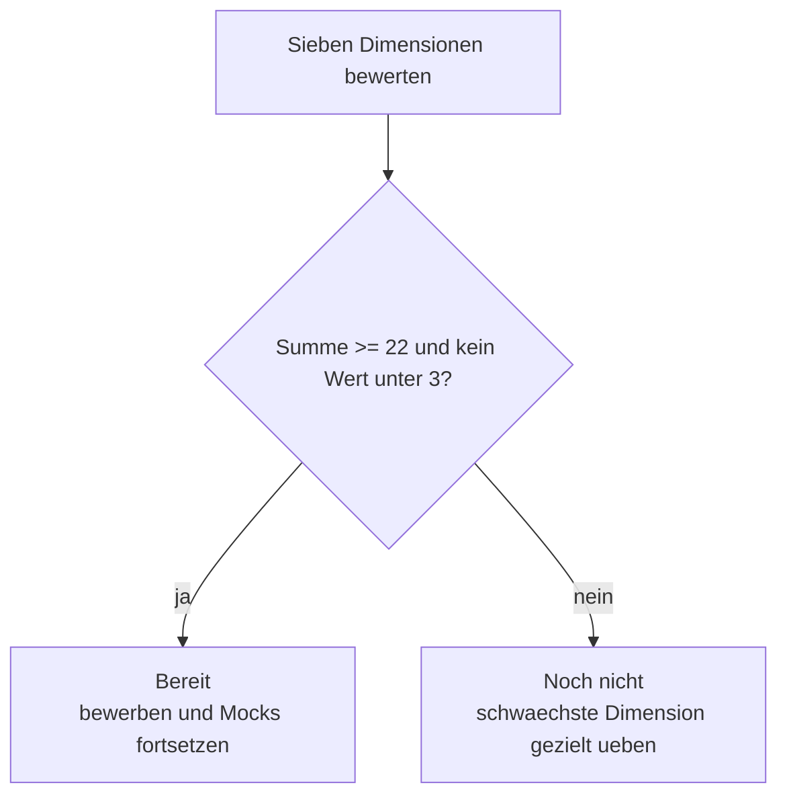

# Phase 5 · Assessment — Interview-Readiness Rubric

> **Level:** C1 · **Focus:** a self-scoring rubric that tells you, honestly, whether you are ready to interview in German · **Time:** ~1.5 h
> _After this module you can score your own interview readiness across seven dimensions and know exactly what to fix before you apply._

Confidence is a poor readiness signal; **evidence** is a good one. This assessment turns "I think I'm ready" into a number. Score yourself honestly against the rubric, run the mock checklist, and apply the go / no-go rule. Redo it at the end of each Phase 5 week to watch your scores climb.

## Objectives / Lernziele

- **Score** yourself 1–4 on the seven interview dimensions.
- **Run** a full mock-interview checklist end to end.
- **Apply** a clear go / no-go decision rule.
- **Target** your remaining weak spots by module.

## 1. The readiness rubric

Rate each dimension **1 (nicht bereit)** to **4 (interviewbereit)**. Be strict — score what you can do *out loud today*, not what you understand on paper.

| # | Dimension | 4 = interview-ready looks like | Train in |
|---|---|---|---|
| 1 | Selbstvorstellung | 90-sec intro, fluent, no notes | [Speaking](#/phase-5/speaking) |
| 2 | STAR-Geschichten | 3+ stories with quantified Ergebnis | [Speaking](#/phase-5/speaking) |
| 3 | Fachgespräch | explain a project & defend trade-offs | [Interview Q&A — Backend/Java](#/interviews/backend) |
| 4 | Höflichkeit & Grammatik | Konjunktiv II, Relativsätze on demand | [Grammar](#/phase-5/grammar) |
| 5 | Hörverstehen | follows fast HR German, recovers politely | [Listening](#/phase-5/listening) |
| 6 | Stellenanzeige lesen | sorts Muss vs. Kann in minutes | [Reading](#/phase-5/reading) |
| 7 | Bewerbungsunterlagen | CV + Anschreiben in German format | [Writing](#/phase-5/writing) |



## 2. The go / no-go rule

- **Total ≥ 22 / 28 AND no single score below 3** → **du bist bereit.** Start applying; keep mocking weekly.
- **Total 16–21, or any score of 1–2** → **noch nicht.** Fix your lowest dimension first; a single weak area (often listening or salary talk) sinks an otherwise strong candidate.
- **Total < 16** → step back to the [Plan](#/phase-5/plan) and give it another focused fortnight.

🇩🇪 **Selbsteinschätzung:** *Ich _bewerte_ mich in jeder Dimension ehrlich. Wenn eine Dimension unter drei _liegt_, _übe_ ich zuerst genau diese, bevor ich mich _bewerbe_.*
*Self-assessment: I rate myself honestly in every dimension. If one dimension is below three, I practise exactly that first before I apply.*

## 3. The mock-interview checklist

Run one full mock (partner or the app 🔊) and tick what you managed **without notes**:

- [ ] 90-second **Selbstvorstellung** delivered fluently.
- [ ] Two **STAR stories** with a quantified Ergebnis.
- [ ] One **Schwäche** with a real Gegenmaßnahme.
- [ ] Explained a project and defended one **trade-off** in the Fachgespräch.
- [ ] Recovered from **one misunderstood question** politely.
- [ ] Asked **three smart questions**.
- [ ] Opened **salary** in Konjunktiv II (brutto pro Jahr).

```audio
Zeit für die Selbsteinschätzung. Wie sicher fühle ich mich in der HR-Runde, im Fachgespräch und bei der Gehaltsverhandlung? Wo liegt meine schwächste Dimension, und wie übe ich sie diese Woche?
```

---

## 🧾 Zusammenfassung · Summary

Readiness is measurable, not a feeling. Score yourself **1–4 across seven dimensions** — Selbstvorstellung, STAR, Fachgespräch, Grammatik/Höflichkeit, Hörverstehen, Stellenanzeige lesen, Bewerbungsunterlagen — rating only what you can do aloud today. Apply the rule: **≥ 22/28 and nothing below 3 = ready**; otherwise fix your lowest dimension first. Run the full **mock checklist** without notes, and repeat this assessment weekly to watch the numbers rise.

## 📇 Vokabel-Checkliste · Vocabulary checklist

| Deutsch | Artikel | Plural | English | VI (if hard) |
|---|---|---|---|---|
| Selbsteinschätzung | die | Selbsteinschätzungen | self-assessment | tự đánh giá |
| Bewertung | die | Bewertungen | rating / evaluation | |
| Dimension | die | Dimensionen | dimension | |
| Schwachstelle | die | Schwachstellen | weak point | điểm yếu |
| bewerten | — | — | to rate / evaluate | |
| einschätzen | — | — | to assess / gauge | đánh giá |

→ Drill these and more in [Flashcards](#/@flashcards).

## 🗣️ Sprechübung · Speaking practice

1. Say your **seven scores** aloud in German (*In der Selbstvorstellung gebe ich mir eine Drei …*).
2. Name your **weakest dimension** and the exact task you'll do this week.
3. Read the 🔊 below, then answer its three questions about yourself.

```audio
Ich schätze mich ehrlich ein. Meine stärkste Dimension ist das Fachgespräch, meine schwächste das Hörverstehen. Diese Woche übe ich deshalb jeden Tag zwanzig Minuten aktives Hören.
```

## ❓ Mini-Quiz

1. What total (out of 28) plus which floor score means "ready"?
2. If listening scores a 2 but everything else is 3–4, are you ready?
3. Why score what you can do **aloud**, not on paper?

> **Lösungen:** 1) **≥ 22/28 and no single score below 3.** · 2) **No** — any score of 2 means fix that dimension first. · 3) Interviews are **live and spoken**; paper comprehension overstates readiness. Full quiz: [Quizzes](#/@quiz).

## 📝 Hausaufgabe · Homework

- [ ] Score all **seven dimensions** honestly and total them.
- [ ] Complete the **mock-interview checklist** without notes; tick what you managed.
- [ ] Write a **one-week action plan** for your lowest dimension.
- [ ] Re-take this assessment at the end of the week and compare scores.

## 📚 Empfohlene Ressourcen · Recommended resources

- **Level benchmark:** Goethe-Institut (goethe.de) C1 can-do descriptors; telc (telc.net) *So geht's noch besser*.
- **Mock partners:** Engineering Kiosk Discord and r/cscareerquestionsEU for practice buddies.
- **Loop back:** weakest-dimension module + the [Phase 5 · Plan](#/phase-5/plan); then move on to [Phase 6 · Overview](#/phase-6/overview).
