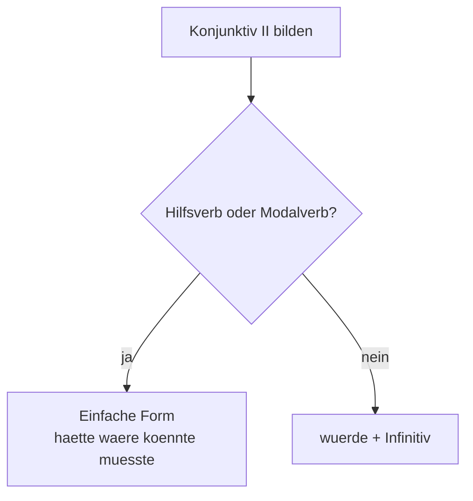

# Phase 5 · Grammar — Interview-Grade German

> **Level:** C1 · **Focus:** Konjunktiv II for hypotheticals & polite negotiation, Perfekt vs. Präteritum, relative clauses, modal nuance · **Time:** ~4 h
> _After this module you can answer hypothetical questions, describe your past precisely, and negotiate salary in polite, controlled German._

At C1 the interviewer is no longer grading whether your grammar is *correct* — they assume that. They are listening for **register**: can you soften a request, frame a hypothetical, describe your career without sounding like a beginner? Four structures carry that weight. Each builds on rules you already know, so we link back rather than repeat.

## Objectives / Lernziele

- Form **Konjunktiv II** for polite requests, hypotheticals and negotiation.
- Choose correctly between **Perfekt** (spoken) and **Präteritum** (written / *war, hatte, konnte*) when describing experience.
- Build **Relativsätze** to describe yourself precisely in one flowing sentence.
- Deploy **modal nuance** — *möchten, würde gern, sollte* — to sound mature, not blunt.

## 1. Konjunktiv II — the politeness & hypothetical engine

Konjunktiv II is *the* interview tense. It powers polite requests, "what would you do" answers, and every salary sentence. Formation is a two-way decision:



For **haben, sein, werden** and the **modals**, use the short irregular form; for almost all other verbs, use **`würde` + Infinitiv**.

| Verb | Konjunktiv II | Interview use |
|---|---|---|
| haben | **hätte** | *Ich hätte eine Frage zum Gehalt.* |
| sein | **wäre** | *Das wäre für mich ideal.* |
| können | **könnte** | *Könnten Sie das genauer erklären?* |
| müssen | **müsste** | *Ich müsste meine Kündigungsfrist prüfen.* |
| werden | **würde** | *Ich würde zuerst die Logs analysieren.* |

🇩🇪 **Wenn ich diesen Bug bekäme, _würde_ ich zuerst die Logs _prüfen_ und dann die Tests _laufen lassen_.**
*If I got this bug, I would first check the logs and then run the tests.* — the classic hypothetical answer shape.

**Negotiation politeness** lives almost entirely in Konjunktiv II — over-directness reads as rude:

🇩🇪 **Ich _hätte mir_ ein Jahresgehalt von 68.000 € _vorgestellt_. _Ließe sich_ das noch verhandeln?**
*I had imagined an annual salary of €68,000. Could that still be negotiated?*

> This extends the politeness preview from [Phase 1 · Grammar](#/phase-1/grammar) and the full drill in [Phase 2 · Grammar](#/phase-2/grammar).

## 2. Perfekt vs. Präteritum — narrating your Werdegang

Both are past tenses, but interviews use them differently. **Speak** in **Perfekt**; reserve **Präteritum** for *sein, haben* and the modals, and expect it in the *written* Anschreiben and Lebenslauf.

| Situation | Tense | Example |
|---|---|---|
| Spoken past action | **Perfekt** | *Ich **habe** drei Jahre bei einem Fintech **gearbeitet**.* |
| war / hatte / modal (spoken too) | **Präteritum** | *Ich **war** dort Team-Lead und **hatte** fünf Entwickler im Team.* |
| Written narration (Anschreiben) | **Präteritum** | *Bei Zalando **betreute** ich die Zahlungs-APIs.* |

🇩🇪 **Ich _habe_ die Microservices auf Kubernetes _migriert_, weil das alte System nicht _skalierte_.**
*I migrated the microservices to Kubernetes because the old system didn't scale.* — Perfekt for the action, Präteritum (*skalierte*) inside the *weil*-clause; the verb still goes to the end (recall the Nebensatz rule from [Phase 1 · Grammar](#/phase-1/grammar)).

**Trap:** don't over-use Präteritum for regular verbs when speaking — *"ich arbeitete, ich migrierte"* sounds like a written report, slightly stiff in a spoken answer. Perfekt is warmer and expected.

## 3. Relativsätze — precise self-description in one breath

Relative clauses let you pack a rich self-portrait into a single sentence — a hallmark of C1. The relative pronoun (*der/die/das*) takes the **gender of the noun** it describes but the **case of its own clause**, and the verb goes to the end (it *is* a Nebensatz).

| Antecedent | Case in clause | Pronoun | Example |
|---|---|---|---|
| der Entwickler | Nominativ | **der** | *Ich bin ein Entwickler, **der** gern im Team arbeitet.* |
| das Projekt | Akkusativ | **das** | *Ein Projekt, **das** ich von Grund auf aufgebaut habe.* |
| die Technologie | Dativ (+ mit) | **der** | *Eine Technologie, mit **der** ich täglich arbeite.* |
| der Kollege | Dativ (helfen) | **dem** | *Ein Kollege, **dem** ich oft geholfen habe.* |

🇩🇪 **Ich bin jemand, _der_ Verantwortung übernimmt und _der_ auch in stressigen Releases ruhig bleibt.**
*I'm someone who takes responsibility and who stays calm even in stressful releases.* — a reusable "über mich" template.

```audio
Ich bin ein Backend-Entwickler, der gern komplexe Probleme löst. Das Projekt, auf das ich besonders stolz bin, war eine Zahlungsplattform, die täglich Millionen Transaktionen verarbeitet hat.
```

## 4. Modal nuance — sounding mature, not blunt

The modals from [Phase 1 · Grammar](#/phase-1/grammar) carry fine social signals in interviews. Choosing the right one shows Fingerspitzengefühl (tact).

| Modal / form | Signal | Interview example |
|---|---|---|
| **wollen** | blunt want — use sparingly | *Ich will mehr Gehalt.* → too direct |
| **möchten** | polite want | *Ich **möchte** mich weiterentwickeln.* |
| **würde gern** | soft wish | *Ich **würde gern** mehr Verantwortung übernehmen.* |
| **sollen** | expectation from others | *Was **soll** ich in den ersten 90 Tagen liefern?* |
| **dürfen** | permission / opportunity | *Darf ich kurz nachfragen?* |

🇩🇪 **Ich _würde gern_ langfristig in eine Architektenrolle _hineinwachsen_ — das _wäre_ mein Ziel.**
*I'd like to grow into an architect role long-term — that would be my goal.* — *würde gern* + *wäre* = ambition without arrogance.

> Combine all four: hypothetical (*würde*) + Relativsatz + modal + Perfekt is exactly what "Erzählen Sie von einer Herausforderung" wants. Rehearse it in [Speaking](#/phase-5/speaking).

---

## 🧾 Zusammenfassung · Summary

Four structures make you sound interview-ready. **(1) Konjunktiv II** — *hätte, wäre, könnte, würde + Infinitiv* — powers polite requests, hypotheticals and salary talk. **(2)** Narrate experience in **Perfekt** when speaking, keeping **Präteritum** for *war/hatte/*modals and written text. **(3) Relativsätze** pack a precise self-description into one sentence, with the pronoun taking its clause's case and the verb at the end. **(4) Modal nuance** — *möchten* and *würde gern* over *wollen* — signals maturity. Together they let you be polite, precise and hypothetical on demand.

## 📇 Vokabel-Checkliste · Vocabulary checklist

| Deutsch | Artikel | Plural | English | VI (if hard) |
|---|---|---|---|---|
| Konjunktiv II | der | — | subjunctive II / conditional | thức giả định |
| Relativsatz | der | Relativsätze | relative clause | mệnh đề quan hệ |
| Werdegang | der | Werdegänge | career path / background | quá trình sự nghiệp |
| Herausforderung | die | Herausforderungen | challenge | |
| verhandeln | — | — | to negotiate | |
| übernehmen | — | — | to take on / take over | |

→ Drill these and more in [Flashcards](#/@flashcards).

## 🗣️ Sprechübung · Speaking practice

1. Turn three blunt sentences into polite ones with Konjunktiv II (*Geben Sie mir… → Könnten Sie mir… geben?*).
2. Describe your last project in **Perfekt**, then add one *war/hatte* sentence in Präteritum.
3. Build two "Ich bin jemand, der …" Relativsätze about yourself. Record and compare with the 🔊 below.

```audio
Wenn ich mehr Zeit hätte, würde ich die Testabdeckung erhöhen. Ich hätte da auch eine Frage: Wäre es möglich, teilweise im Homeoffice zu arbeiten?
```

## ❓ Mini-Quiz

1. Konjunktiv II of *können* in *"___ Sie das bitte wiederholen?"*
2. Speaking about the past: Perfekt or Präteritum for *"Ich ___ bei N26 ___ (arbeiten)."*?
3. Fill the pronoun: *"Ein Projekt, ___ ich geleitet habe."* (Akkusativ, neuter)
4. Make it polite: *"Ich will Homeoffice."*

> **Lösungen:** 1) **Könnten** · 2) **Perfekt** → *habe … gearbeitet* · 3) **das** (neuter, Akkusativ) · 4) e.g. *Ich **würde gern** teilweise im Homeoffice arbeiten.* Full quiz: [Quizzes](#/@quiz).

> 🏋️ **Jetzt üben.** [Phase 5 · Grammar · Übungsteil](#/phase-5/grammar-uebungen) — 44 Aufgaben
> zu Konjunktiv II, Perfekt vs. Präteritum, Relativsätzen und den Modalnuancen, die *möchten* von
> *wollen* trennen.

## 📝 Hausaufgabe · Homework

- [ ] Write **6 Konjunktiv-II sentences**: 3 polite requests, 3 hypotheticals ("Wenn …, würde ich …").
- [ ] Rewrite your last two Perfekt sentences and mark where Präteritum (*war/hatte/*modal) belongs.
- [ ] Write **4 Relativsätze** describing yourself for "Erzählen Sie etwas über sich".
- [ ] Do the [grammar quiz](#/@quiz) — aim for ≥ 4/5.

## 📚 Empfohlene Ressourcen · Recommended resources

- **Grammar reference:** deutsch.lingolia.com (Konjunktiv II, Relativsätze), mein-deutschbuch.de.
- **Practice:** Schubert-Verlag online C1 exercises (schubert-verlag.de).
- **Textbook:** *Aspekte neu C1* (Klett) and *Sicher! C1* (Hueber) — Konjunktiv & Relativsatz units.
- **Next:** [Phase 5 · Vocabulary](#/phase-5/vocabulary) → then rehearse in [Speaking](#/phase-5/speaking).
