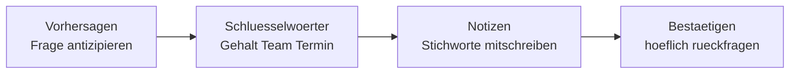

# Phase 5 · Listening — Understanding Recruiters & HR

> **Level:** C1 · **Focus:** interview simulations, recruiter/HR German, comprehension strategy under pressure · **Time:** ~4 h
> _After this module you can follow a fast recruiter phone call, catch the real question behind polite HR phrasing, and recover gracefully when you miss a word._

In an interview you can prepare your *own* sentences (that's [Speaking](#/phase-5/speaking)); you cannot prepare *theirs*. The recruiter speaks at native speed, on a possibly bad phone line, using HR idioms you've never heard. This module trains the receiving half: strategy first, then targeted practice.

## Objectives / Lernziele

- Recognise the **standard HR phrases** and the questions hiding inside them.
- Apply a **comprehension strategy**: predict, catch keywords, take notes, confirm.
- **Recover politely** from a word you didn't understand — without panic.
- Build a **listening ladder** from slow news to real tech talk.

## 1. What recruiter German actually sounds like

HR speech is polite, indirect and full of set phrases. Decode the intent behind the wrapping:

| What you hear | What they mean |
|---|---|
| *Erzählen Sie doch mal ein bisschen von sich.* | Give your 90-second pitch. |
| *Was reizt Sie an dieser Position?* | Why do you want this job? |
| *Wo sehen Sie sich in fünf Jahren?* | What are your goals / ambition? |
| *Was sind Ihre Gehaltsvorstellungen?* | State a brutto-per-year number. |
| *Ab wann wären Sie verfügbar?* | Your start date / notice period. |
| *Haben Sie noch Fragen an uns?* | Ask your smart questions now. |

🇩🇪 **"Wie ich sehe, bringen Sie einiges an Erfahrung mit — was _reizt_ Sie denn konkret an unserem Team?"**
*As I see, you bring quite some experience — what specifically appeals to you about our team?* — buried inside the compliment is a direct "why us" question.

## 2. A comprehension strategy that survives nerves

Don't try to understand every word — track the **question**. Use a four-step loop:



- **Vorhersagen** — you already know the HR question set (§1); expect them.
- **Schlüsselwörter** — listen for *Gehalt, verfügbar, Team, Herausforderung*; they anchor the topic.
- **Notizen** — jot keywords, not full sentences; a video call lets you glance down.
- **Bestätigen** — if unsure, paraphrase back before answering.

## 3. Recover politely — the phrases that buy time

Missing a word is normal at C1. What matters is the **recovery**. Memorise these so they come automatically:

| Need | German phrase |
|---|---|
| Ask to repeat | *Entschuldigung, könnten Sie das bitte noch einmal sagen?* |
| Ask to rephrase | *Habe ich das richtig verstanden — Sie meinen …?* |
| Buy thinking time | *Das ist eine gute Frage, lassen Sie mich kurz überlegen.* |
| Confirm a term | *Meinen Sie mit „Rufbereitschaft" den On-Call-Dienst?* |
| Slow them down | *Ich möchte sichergehen, dass ich alles verstehe — etwas langsamer, bitte.* |

🇩🇪 **"Lassen Sie mich kurz _überlegen_ … Ja, dazu _habe_ ich ein gutes Beispiel."**
*Let me think for a moment … yes, I have a good example for that.* — a pause with a frame is professional, not weak.

```audio
Guten Tag, hier ist Frau Berger von der Personalabteilung. Passt es gerade kurz? Ich hätte ein paar Fragen zu Ihrer Bewerbung und Ihrer Verfügbarkeit.
```

## 4. Your listening ladder

Interview German sits at the fast, spontaneous end of the spectrum. Climb toward it deliberately, from graded audio up to unscripted tech talk.

| Rung | Resource | Why it helps |
|---|---|---|
| 1 · slow, clear | DW *Langsam gesprochene Nachrichten* | trains the sound system at reduced speed |
| 2 · topic talk | DW *Top-Thema* & *Das Thema* | transcript + audio, work vocabulary |
| 3 · natural chat | Easy German Podcast · Coffee Break German | spontaneous, real register |
| 4 · tech register | Engineering Kiosk · programmier.bar | how engineers actually discuss systems |
| 5 · live drill | this app's 🔊 + [Speaking](#/phase-5/speaking) mocks | HR/technical simulation |

**Method for each clip:** listen once for gist → note keywords → listen again with the transcript → shadow one segment aloud. Twenty focused minutes beats an hour of passive background listening.

> Recruiters increasingly use video. Practise with **audio only** sometimes to train for phone screens, where you lose lip-reading and body language.

---

## 🧾 Zusammenfassung · Summary

You can't script the interviewer, so train the receiving half. Learn the **standard HR phrases** and the direct question inside each polite wrapper. Run the **four-step loop** — Vorhersagen → Schlüsselwörter → Notizen → Bestätigen — instead of chasing every word. Keep **recovery phrases** (*Könnten Sie das wiederholen? / Lassen Sie mich kurz überlegen*) automatic. Climb the **listening ladder** from DW *Langsam gesprochene Nachrichten* up to Engineering Kiosk, always with the active method: gist → keywords → transcript → shadow.

## 📇 Vokabel-Checkliste · Vocabulary checklist

| Deutsch | Artikel | Plural | English | VI (if hard) |
|---|---|---|---|---|
| Rückfrage | die | Rückfragen | follow-up question / query | câu hỏi lại |
| Schlüsselwort | das | Schlüsselwörter | keyword | từ khóa |
| Rufbereitschaft | die | Rufbereitschaften | on-call duty | trực sẵn sàng |
| Verfügbarkeit | die | Verfügbarkeiten | availability | |
| überlegen | — | — | to think / consider | |
| sichergehen | — | — | to make sure | |

→ Drill these and more in [Flashcards](#/@flashcards).

## 🗣️ Sprechübung · Speaking practice

1. Listen to the 🔊 below **once**, note three keywords, then summarise it in one German sentence.
2. Practise all five **recovery phrases** aloud until they're automatic.
3. Shadow the passage: play, pause, repeat with matching intonation.

```audio
Wir arbeiten agil in Zwei-Wochen-Sprints, es gibt ein tägliches Daily und alle zwei Wochen eine Retrospektive. Wie viel Erfahrung bringen Sie mit Scrum mit, und wie stehen Sie zur Rufbereitschaft?
```

## ❓ Mini-Quiz

1. What is the recruiter really asking with *"Was reizt Sie an dieser Position?"*
2. Name the four steps of the comprehension loop.
3. Give one German phrase to buy thinking time.
4. Why practise **audio-only** for some sessions?

> **Lösungen:** 1) **Why do you want this job / this team?** · 2) **Vorhersagen → Schlüsselwörter → Notizen → Bestätigen.** · 3) e.g. *Lassen Sie mich kurz überlegen.* · 4) To train for **phone screens** with no video cues. Full quiz: [Quizzes](#/@quiz).

> 🎧 **Jetzt hören.** [Phase 5 · Listening · Übungsteil](#/phase-5/listening-uebungen) — drei Hörtexte
> (Recruiter-Anruf, HR-Runde, Angebot am Telefon), 27 Aufgaben plus ein Zahlendiktat gegen den
> Klassiker 68 ↔ 86.

## 📝 Hausaufgabe · Homework

- [ ] Do **three active-listening sessions** (gist → keywords → transcript → shadow), one per ladder rung 2–4.
- [ ] Memorise the **five recovery phrases**; use each in a mock at least once.
- [ ] Listen to one **Engineering Kiosk** or **programmier.bar** episode; note 5 new tech terms.
- [ ] Simulate a **phone screen** audio-only with a friend or the app 🔊.

## 📚 Empfohlene Ressourcen · Recommended resources

- **Graded news:** Deutsche Welle — *Langsam gesprochene Nachrichten*, *Top-Thema*, *Das Thema* (audio + transcript).
- **Natural speech:** Easy German Podcast, Coffee Break German, Slow German (Annik Rubens).
- **Tech register:** Engineering Kiosk, programmier.bar, Working Draft, heise show.
- **Next:** turn to the written side in [Phase 5 · Reading](#/phase-5/reading).
