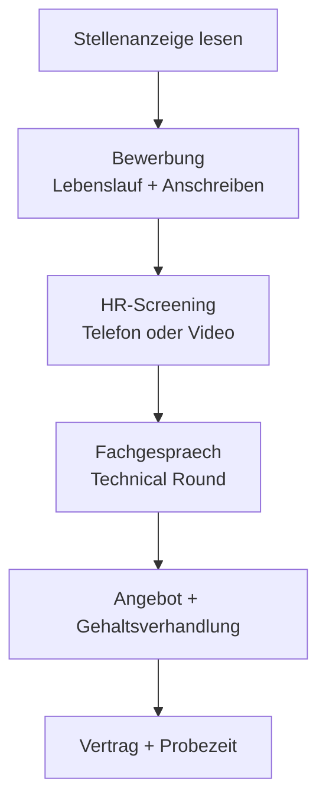

# Phase 5 · Overview — Landing the German IT Job Interview

> **Level:** C1 · **Focus:** the German application funnel, interview culture, how this phase fits together · **Time:** ~1 h
> _After this module you know exactly which German skill each interview stage demands — and where in Phase 5 to train it._

You already have the German to *do* the job (Phases 1–4). Phase 5 is about the German to *get* the job: reading a Stellenanzeige critically, writing a German Lebenslauf, surviving an HR screening, and holding your own in a Fachgespräch — all the way to a calm salary negotiation. This overview is your map. Every stage below links to the module that drills it.

## Objectives / Lernziele

- **Map** the German application funnel from job ad to signed contract.
- **Distinguish** the two interview rounds — HR (das HR-Gespräch) and technical (das Fachgespräch) — and what each tests.
- **Name** the three things German employers reward: **Pünktlichkeit, Struktur, klare Kommunikation** — not hype.
- **Navigate** the seven Phase 5 modules and know which one to open for each weakness.

## 1. The German application funnel

Bewerbung in Germany is a defined, document-heavy process. Know every stage before you enter it:

| Stage | German | You produce / do | Train in |
|---|---|---|---|
| Job ad | die Stellenanzeige | read Muss- vs. Kann-Kriterien | [Reading](#/phase-5/reading) |
| Application | die Bewerbung | Lebenslauf + Anschreiben | [Writing](#/phase-5/writing) |
| HR screening | das HR-Gespräch | self-intro, motivation, availability | [Speaking](#/phase-5/speaking) |
| Technical round | das Fachgespräch | explain projects, solve problems | [Speaking](#/phase-5/speaking) · [Interview Q&A — Backend/Java](#/interviews/backend) |
| Offer | das Angebot | negotiate Gehalt & Eintrittstermin | [Grammar](#/phase-5/grammar) |
| Contract | der Vertrag | Probezeit begins | [Vocabulary](#/phase-5/vocabulary) |



## 2. Two interview rounds, two registers

The HR round and the technical round are different games. HR filters for fit, motivation and communication; the Fachgespräch filters for competence. You switch register between them.

| | HR round | Technical round |
|---|---|---|
| Interviewer | der Personaler / die Personalerin | Team-Lead, Senior Engineers |
| Formality | usually **Sie** | often quickly **du** ("Wir sind per du") |
| Typical prompt | "Erzählen Sie etwas über sich." | "Wie würden Sie diesen Service skalieren?" |
| They assess | Motivation, Werdegang, Verfügbarkeit | Architektur, Trade-offs, Java/Spring depth |
| Your tool | STAR-Methode, clear narrative | precise IT vocab from [Phase 3](#/phase-3/vocabulary) |

## 3. What German employers actually reward

Coming from a US-influenced tech culture, resist the urge to "sell". German interviewers read confident over-claiming as a red flag. They reward **Struktur** (a structured answer), **Ehrlichkeit** (honesty, including a real Schwäche), and **Pünktlichkeit** (be online five minutes early). Substance beats enthusiasm.

🇩🇪 **Statt "Ich bin der Beste" lieber: "Ich habe drei Jahre Erfahrung mit Spring Boot und kann das an einem konkreten Projekt zeigen."**
*Instead of "I'm the best", rather: "I have three years of Spring Boot experience and can show it on a concrete project."* — evidence, not adjectives.

```audio
Herzlich willkommen zu Phase fünf. In den nächsten Wochen bereiten wir Ihr Vorstellungsgespräch auf Deutsch vor: von der Stellenanzeige bis zur Gehaltsverhandlung. Bleiben Sie ruhig, strukturiert und ehrlich.
```

## 4. How the seven modules fit together

Work them roughly in funnel order, but loop back as needed. The [Plan](#/phase-5/plan) sequences this into four weeks; the [Assessment](#/phase-5/assessment) tells you when you are interview-ready.

| Open this | When you need to … |
|---|---|
| [Grammar](#/phase-5/grammar) | sound polite & precise (Konjunktiv II, Relativsätze, past tense) |
| [Vocabulary](#/phase-5/vocabulary) | know HR words: Gehaltsvorstellung, Probezeit, Werdegang |
| [Speaking](#/phase-5/speaking) | run mock interviews (HR + technical) |
| [Listening](#/phase-5/listening) | understand fast recruiter German |
| [Reading](#/phase-5/reading) | decode Stellenanzeigen & research a company |
| [Writing](#/phase-5/writing) | build a German CV, Anschreiben, follow-up mail |

## 🧠 Systems-Check (Foundations)

Phase 5 through the lens of [German as a System](#/foundations/german-as-a-system) and
[Your Learning System](#/foundations/learning-system):

| Systems view | Phase 5 |
|---|---|
| **Fokus-Subsystem** | *all* subsystems **under stress** — this is the production deploy of your German |
| **Erwarteter Engpass** | fluency under pressure: retrieval latency spikes exactly when it matters; rehearsal ≠ retrieval under stress |
| **Hebel** | **Ziele (#2)**: scheduled full mock interviews as canary releases — staging (self-talk) → canary (mock) → production (real interview) |
| **P1-Fehler** | unstructured Werdegang narrative · over-claiming (a culture bug German interviewers flag) · valency slips in rehearsed answers |
| **Gate zu Phase 6** | one full mock (HR **and** Fachgespräch) passed calmly · salary phrases automatic ([Assessment](#/phase-5/assessment)) |

---

## 🧾 Zusammenfassung · Summary

The German hiring funnel runs **Stellenanzeige → Bewerbung → HR-Gespräch → Fachgespräch → Angebot → Vertrag**. Two interview rounds test different things: HR checks motivation and communication (usually *Sie*), the Fachgespräch checks competence (often *du*). German employers reward **Pünktlichkeit, Struktur and klare Kommunikation** over self-promotion. Each Phase 5 module trains one slice of this funnel — use this overview as your index and the [Plan](#/phase-5/plan) as your schedule.

## 📇 Vokabel-Checkliste · Vocabulary checklist

| Deutsch | Artikel | Plural | English | VI (if hard) |
|---|---|---|---|---|
| Stellenanzeige | die | Stellenanzeigen | job advertisement | tin tuyển dụng |
| Bewerbung | die | Bewerbungen | application | |
| Vorstellungsgespräch | das | Vorstellungsgespräche | job interview | |
| Fachgespräch | das | Fachgespräche | technical interview | |
| Gehaltsverhandlung | die | Gehaltsverhandlungen | salary negotiation | |
| Probezeit | die | Probezeiten | probation period | thời gian thử việc |

→ Drill these and more in [Flashcards](#/@flashcards).

## 🗣️ Sprechübung · Speaking practice

1. In **five German sentences**, describe your own funnel: which stage are you at, and what is your next step?
2. Explain to a friend *auf Deutsch* why German firms value *Struktur* over *Hype*.
3. Read the passage below aloud; aim for a calm, even pace (interview tempo).

```audio
Mein Ziel ist eine Festanstellung als Backend-Entwickler in Deutschland. Ich habe die Stellenanzeige gelesen, meine Bewerbung geschickt und bereite mich jetzt auf das Fachgespräch vor.
```

## ❓ Mini-Quiz

1. Which round usually stays with **Sie** — HR or technical?
2. Name the three qualities German employers reward.
3. Put in order: *Angebot, Bewerbung, Fachgespräch, Stellenanzeige.*

> **Lösungen:** 1) The **HR round** (the technical team often switches to *du*). · 2) **Pünktlichkeit, Struktur, klare Kommunikation.** · 3) **Stellenanzeige → Bewerbung → Fachgespräch → Angebot.**

## 📝 Hausaufgabe · Homework

- [ ] Write down **which funnel stage** you are currently at and your single next action.
- [ ] Skim all seven Phase 5 modules for **2 minutes each**; note your two weakest areas.
- [ ] Open the [Plan](#/phase-5/plan) and block your first study week.
- [ ] Bookmark [Interview Q&A — Backend/Java](#/interviews/backend) for the technical round.

## 📚 Empfohlene Ressourcen · Recommended resources

- **Culture & context:** r/cscareerquestionsEU for real German-market hiring reports.
- **Exam framing:** telc (telc.net) and Goethe-Institut (goethe.de) for the C1 level descriptors this phase targets.
- **Next:** start with [Phase 5 · Grammar](#/phase-5/grammar), then [Vocabulary](#/phase-5/vocabulary).
