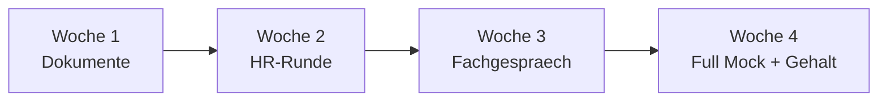

# Phase 5 · Plan — Weekly Milestones & Daily Schedule

> **Level:** C1 · **Focus:** a 4-week interview-prep sprint with weekly milestones and a Mon–Sun daily rhythm · **Time:** ~4 weeks · ~1 h/day
> _After this module you have a concrete, checkable schedule that takes you from documents to a confident mock interview in four weeks._

Interview readiness comes from **spaced, deliberate reps**, not one panic weekend. This plan sequences the seven Phase 5 modules into four themed weeks and a repeatable daily rhythm. Adjust the hours to your life, but keep the **order** and the **weekly milestone** — each week produces one finished artefact.

## Objectives / Lernziele

- Follow a **4-week roadmap** from application documents to full mock interview.
- Hit **one measurable milestone per week**.
- Run a **Mon–Sun daily rhythm** that mixes grammar, speaking and listening.
- Know when to loop back before the [Assessment](#/phase-5/assessment).

## 1. The 4-week roadmap



| Week | Theme | Primary modules | Milestone (Meilenstein) |
|---|---|---|---|
| 1 | Dokumente | [Reading](#/phase-5/reading), [Writing](#/phase-5/writing), [Vocabulary](#/phase-5/vocabulary) | finished Lebenslauf + one tailored Anschreiben |
| 2 | HR-Runde | [Speaking](#/phase-5/speaking), [Grammar](#/phase-5/grammar), [Listening](#/phase-5/listening) | recorded 90-sec self-intro + 3 STAR stories |
| 3 | Fachgespräch | [Speaking](#/phase-5/speaking), [Interview Q&A — Backend/Java](#/interviews/backend) | 10 technical answers spoken aloud |
| 4 | Full Mock | all + [Assessment](#/phase-5/assessment) | one end-to-end mock incl. salary talk |

## 2. The Mon–Sun daily rhythm

Roughly one hour a day, rotating skills so nothing goes stale. Keep mornings for output (speaking/writing) and commutes for input (listening).

| Day | Focus | Concrete task (~60 min) |
|---|---|---|
| Mo | Grammar | Konjunktiv II & Relativsätze drills from [Grammar](#/phase-5/grammar) |
| Di | Speaking | rehearse self-intro or one STAR story aloud; record |
| Mi | Listening | one active-listening session + 5 recovery phrases |
| Do | Vocabulary | 20 HR flashcards + write 5 sentences using them |
| Fr | Writing | improve Lebenslauf/Anschreiben; one follow-up draft |
| Sa | Reading | decode one real Stellenanzeige; 5-fact company note |
| So | Mock + review | 20-min mock, then log wins & gaps for next week |

🇩🇪 **Wochenrhythmus:** *Montags _übe_ ich Grammatik, dienstags _spreche_ ich laut, und sonntags _mache_ ich einen kleinen Mock und _notiere_, was ich verbessern muss.*
*Weekly rhythm: on Mondays I practise grammar, on Tuesdays I speak aloud, and on Sundays I do a small mock and note what I need to improve.*

```audio
Diese Woche konzentriere ich mich auf die HR-Runde. Ich übe meine Selbstvorstellung, drei STAR-Geschichten und die höfliche Gehaltsfrage. Am Sonntag mache ich einen kurzen Mock.
```

## 3. Guardrails

- **Record yourself** at least twice a week — hearing yourself is the fastest feedback.
- **Timebox** writing; a "perfect" Lebenslauf that's never finished helps no one.
- If a Sunday mock feels shaky, **repeat that week's theme** before advancing — quality over calendar.

---

## 🧾 Zusammenfassung · Summary

Four themed weeks — **Dokumente → HR-Runde → Fachgespräch → Full Mock** — each ending in one finished artefact, carry you to interview readiness. A **Mon–Sun rhythm** rotates grammar, speaking, listening, vocabulary, writing, reading and a Sunday mock, about an hour a day. Record yourself twice weekly, timebox your documents, and repeat a week rather than rush if the mock feels shaky. Then verify with the [Assessment](#/phase-5/assessment).

## 📇 Vokabel-Checkliste · Vocabulary checklist

| Deutsch | Artikel | Plural | English | VI (if hard) |
|---|---|---|---|---|
| Meilenstein | der | Meilensteine | milestone | cột mốc |
| Wochenrhythmus | der | Wochenrhythmen | weekly rhythm | |
| Vorbereitung | die | Vorbereitungen | preparation | sự chuẩn bị |
| Ziel | das | Ziele | goal | mục tiêu |
| üben | — | — | to practise | |
| verbessern | — | — | to improve | |

→ Drill these and more in [Flashcards](#/@flashcards).

## 🗣️ Sprechübung · Speaking practice

1. Say aloud **which week** you're in and its milestone.
2. Describe your **weekly rhythm** in 4 German sentences using days of the week.
3. Read the 🔊 below, then state your own focus for **this** week.

```audio
Mein Plan für vier Wochen: In Woche eins schreibe ich meinen Lebenslauf, in Woche zwei übe ich die HR-Runde, in Woche drei das Fachgespräch und in Woche vier mache ich einen vollständigen Mock mit Gehaltsverhandlung.
```

## ❓ Mini-Quiz

1. What is the Week 1 milestone?
2. Which day is reserved for the mock + review?
3. What should you do if the Sunday mock feels shaky?

> **Lösungen:** 1) A **finished Lebenslauf + one tailored Anschreiben.** · 2) **Sonntag (Sunday).** · 3) **Repeat that week's theme** before advancing. Full quiz: [Quizzes](#/@quiz).

## 📝 Hausaufgabe · Homework

- [ ] Copy the **Mon–Sun table** into your calendar and block the hours.
- [ ] Set the **four weekly milestones** as checkable goals.
- [ ] Schedule your **Week-4 full mock** now (with a partner if possible).
- [ ] Add a recurring reminder to [Weekly Study Checklist](#/@checklist).

## 📚 Empfohlene Ressourcen · Recommended resources

- **Tracking:** the app's [Weekly Study Checklist](#/@checklist) and [Bookmarks](#/@bookmarks).
- **Content anchors:** all seven Phase 5 modules, especially [Speaking](#/phase-5/speaking).
- **Next:** measure your readiness in [Phase 5 · Assessment](#/phase-5/assessment).
