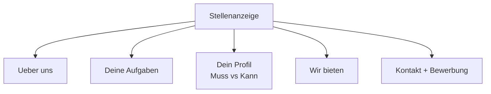

# Phase 5 · Reading — Decoding Stellenanzeigen & Company Research

> **Level:** C1 · **Focus:** anatomy of a job ad, Muss vs. Kann requirements, "wir bieten / wir erwarten", researching a company · **Time:** ~4 h
> _After this module you can read any German Stellenanzeige critically — separate hard requirements from nice-to-haves — and build a factual picture of the company before you apply._

A German job ad is a **contract of expectations** written in code. Learn to read it and you apply only where you fit, tailor your [Anschreiben](#/phase-5/writing) to the exact wording, and walk into the interview already knowing the company. This is close, strategic reading — not skimming.

## Objectives / Lernziele

- Recognise the **standard sections** of a Stellenanzeige.
- Separate **Muss-Kriterien** (must) from **Kann-Kriterien** (nice-to-have) by their signal words.
- Decode **"wir erwarten" / "wir bieten"** and read the fine print.
- Run **factual company research** from public sources before applying.

## 1. Anatomy of a Stellenanzeige

Most German tech ads follow the same skeleton. Learn the headings so you can jump straight to what matters:

| Section (typical heading) | Contains | Read it for |
|---|---|---|
| Über uns / Das sind wir | company & team | tone, tech culture |
| Deine Aufgaben / Ihre Aufgaben | day-to-day tasks | is this the work I want? |
| Dein Profil / Wir erwarten | requirements | Muss vs. Kann |
| Wir bieten / Benefits | what they offer | salary hints, remote, Weiterbildung |
| Kontakt / Bewerbung | how to apply | contact person, documents |

Note the **du vs. Sie** split even in the ad: startups write *"Deine Aufgaben"*, corporates *"Ihre Aufgaben"* — a first signal of company culture.



## 2. Muss vs. Kann — the most important reading skill

The "Profil" section mixes hard requirements with wishes. German phrasing tells you which is which. **Apply if you meet the Muss-Kriterien**, even with gaps in the Kann list.

| Signals a MUSS (hard) | Signals a KANN (nice-to-have) |
|---|---|
| *zwingend erforderlich* | *von Vorteil* |
| *setzen wir voraus* | *wünschenswert* |
| *Sie bringen mit* | *idealerweise* |
| *mehrjährige Erfahrung in* | *erste Erfahrung mit* |
| *abgeschlossenes Studium* | *Kenntnisse in … sind ein Plus* |

🇩🇪 **Muss:** *Mehrjährige Erfahrung mit Java und Spring Boot _setzen wir voraus_.*
🇩🇪 **Kann:** *Kenntnisse in Kubernetes sind _von Vorteil_; Erfahrung mit Kafka _wünschenswert_.*
*Must: We require several years' experience with Java and Spring Boot. Nice-to-have: Kubernetes knowledge is an advantage; Kafka experience desirable.*

A sample "Dein Profil" block (anonymised, not a real ad):

```
Dein Profil
- Mehrjährige Erfahrung in der Backend-Entwicklung mit Java (Muss)
- Fundierte Kenntnisse in Spring Boot und REST-APIs (Muss)
- Erfahrung mit Docker und CI/CD (setzen wir voraus)
- Kenntnisse in Kubernetes von Vorteil (Kann)
- Deutsch mind. B2, Englisch fließend
```

Read the language line carefully: *"Deutsch mind. B2"* is a Muss you can now clear — highlight it in your Anschreiben.

## 3. "Wir bieten" — reading between the lines

The offer section is marketing, so read it for **checkable facts**, not adjectives. *"Spannende Aufgaben"* tells you nothing; *"30 Tage Urlaub, anteiliges Homeoffice, jährliches Weiterbildungsbudget"* tells you a lot.

| Phrase | What to verify in the interview |
|---|---|
| *attraktives Gehalt* | the actual brutto range — ask! |
| *flexible Arbeitszeiten* | core hours? Gleitzeit? |
| *Homeoffice möglich* | how many days remote? |
| *flache Hierarchien* | who decides on architecture? |
| *moderner Tech-Stack* | which versions, how much legacy? |

🇩🇪 **"Wir _bieten_ 30 Tage Urlaub, ein jährliches _Weiterbildungsbudget_ und anteiliges Homeoffice."**
*We offer 30 days of holiday, an annual training budget and partial home office.* — concrete, so trustworthy.

```audio
Für diese Position setzen wir mehrjährige Erfahrung mit Java und Spring Boot voraus. Kenntnisse in Kubernetes sind von Vorteil. Wir bieten flexible Arbeitszeiten und anteiliges Homeoffice.
```

## 4. Company research from public sources

Walk in informed. German firms notice when you know their product — and when you don't. Build a factual picture from **public** information only:

- **The company's own site & careers page** — read the *Über uns*, the tech blog, the *Impressum* (legal page; great real reading practice and it names the leadership and location).
- **German tech media** — search **heise.de, Golem.de, t3n.de, Informatik Aktuell** for recent news, funding, incidents or migrations. *"Was hat Celonis zuletzt gebaut?"*
- **Their engineering voice** — some firms appear on **Engineering Kiosk** or **programmier.bar**; hearing their engineers talk is pure gold.
- **Market context** — r/cscareerquestionsEU for realistic salary bands and hiring reports.

🇩🇪 **Vorbereitung:** *Ich _habe_ mir Ihren Tech-Blog _angeschaut_ und _gesehen_, dass Sie gerade von einem Monolithen auf Microservices _umstellen_ — das finde ich spannend.*
*Preparation: I looked at your tech blog and saw you're migrating from a monolith to microservices — I find that exciting.* — one sentence like this in the interview outclasses ten generic compliments.

> Keep to **facts you can verify**. Never repeat rumours or invent internal details about a company — German interviewers value accuracy and will notice bluffing.

---

## 🧾 Zusammenfassung · Summary

A Stellenanzeige is coded expectations. Learn its **standard sections** (Über uns, Aufgaben, Profil, Wir bieten, Kontakt) and jump to what matters. The key skill is separating **Muss-Kriterien** (*zwingend erforderlich, setzen wir voraus, mehrjährige Erfahrung*) from **Kann-Kriterien** (*von Vorteil, wünschenswert, idealerweise*) — apply if you meet the musts. Read **"wir bieten"** for checkable facts, not adjectives. Then research the company from **public sources** — its own site and Impressum, heise/Golem/t3n, engineering podcasts — and bring one concrete, verified detail into the interview.

## 📇 Vokabel-Checkliste · Vocabulary checklist

| Deutsch | Artikel | Plural | English | VI (if hard) |
|---|---|---|---|---|
| Stellenanzeige | die | Stellenanzeigen | job advertisement | tin tuyển dụng |
| Anforderung | die | Anforderungen | requirement | yêu cầu |
| Voraussetzung | die | Voraussetzungen | prerequisite | điều kiện tiên quyết |
| Kenntnisse | die | (plural) | knowledge / skills | |
| wünschenswert | — | — | desirable | mong muốn có |
| voraussetzen | — | — | to require / presuppose | |

→ Drill these and more in [Flashcards](#/@flashcards).

## 🗣️ Sprechübung · Speaking practice

1. Read the sample "Dein Profil" block aloud and **classify** each line Muss or Kann.
2. Summarise a real Stellenanzeige in **three German sentences**: Aufgabe, Muss, Angebot.
3. Read the 🔊 passage below, then say one sentence about what you'd verify in the interview.

```audio
Über uns: Wir sind ein wachsendes Team im Zahlungsbereich. Deine Aufgaben: Du entwickelst skalierbare Backend-Services. Dein Profil: Du bringst mehrjährige Java-Erfahrung mit und arbeitest strukturiert.
```

## ❓ Mini-Quiz

1. Does *"von Vorteil"* mark a Muss or a Kann requirement?
2. Which two phrases signal a hard requirement?
3. In *"wir bieten"*, why prefer *"30 Tage Urlaub"* over *"attraktive Benefits"*?
4. Name two **approved** sources for company research.

> **Lösungen:** 1) A **Kann** (nice-to-have). · 2) e.g. *zwingend erforderlich* and *setzen wir voraus* (also *mehrjährige Erfahrung*). · 3) It's a **checkable fact**, not marketing. · 4) e.g. **heise.de, Golem.de, t3n.de** or the company's own site. Full quiz: [Quizzes](#/@quiz).

> 🏋️ **Jetzt üben.** [Phase 5 · Reading · Übungsteil](#/phase-5/reading-uebungen) — eine vollständige
> Stellenanzeige im Original und 29 Aufgaben zu Muss, Kann und den Weichmachern im „Wir bieten“.

## 📝 Hausaufgabe · Homework

- [ ] Take **two real Stellenanzeigen** and colour-code every line Muss vs. Kann.
- [ ] For one target company, write a **5-fact research note** from public sources only.
- [ ] List the **Muss-Kriterien you meet** and the **gaps** — decide: apply or upskill first?
- [ ] Extract 8 new nouns with article + plural into [Flashcards](#/@flashcards).

## 📚 Empfohlene Ressourcen · Recommended resources

- **Tech news:** heise.de, Golem.de, t3n.de, Informatik Aktuell, entwickler.de for company & tech context.
- **Company engineering voice:** Engineering Kiosk and programmier.bar episodes.
- **Vocabulary help:** DWDS.de and dict.leo.org for ad phrases (*voraussetzen, wünschenswert*).
- **Next:** turn your reading into a tailored application in [Phase 5 · Writing](#/phase-5/writing).
