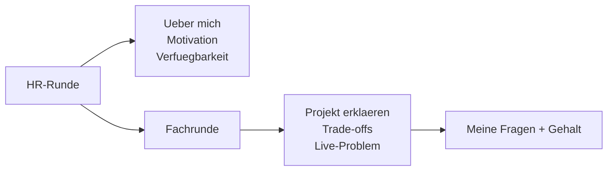

# Phase 5 · Speaking — Mock Interviews on Demand

> **Level:** C1 · **Focus:** HR round + technical round, STAR-Methode auf Deutsch, self-intro, strengths/weaknesses, smart questions, salary talk · **Time:** ~5 h
> _After this module you can run a full German interview end to end — introduce yourself, tell STAR stories, ask sharp questions and negotiate — out loud._

Reading about interviews doesn't pass them; **saying the sentences aloud** does. This module is a rehearsal studio. Every section gives you a reusable German frame you speak until it's automatic. Pair it with the grammar you just built ([Konjunktiv II, Relativsätze](#/phase-5/grammar)) and the technical answers in [Interview Q&A — Backend/Java](#/interviews/backend).

## Objectives / Lernziele

- Deliver a 90-second **"Erzählen Sie etwas über sich"** self-introduction.
- Structure any behavioural answer with the **STAR-Methode auf Deutsch**.
- Present a **Stärke** and a credible **Schwäche** without clichés.
- Explain a project and reason aloud in the **Fachgespräch**.
- Ask **smart questions** and open a **salary negotiation** politely.

## 1. The two rounds at a glance



The HR round rewards a clear **narrative**; the Fachgespräch rewards **precise reasoning**. Same calm voice, different content.

## 2. "Erzählen Sie etwas über sich" — the 90-second pitch

Do **not** retell your whole life. Use a three-beat structure in the present tense: **Jetzt → Werdegang → Warum hier**.

| Beat | Function | German opener |
|---|---|---|
| Jetzt | who you are today | *Ich bin Backend-Entwickler mit vier Jahren Erfahrung …* |
| Werdegang | 2–3 relevant stations | *Angefangen habe ich bei …, danach …* |
| Warum hier | why this role/company | *Jetzt suche ich … deshalb hat mich Ihre Stelle angesprochen.* |

🇩🇪 **Ich bin Backend-Entwickler mit vier Jahren Erfahrung in Java und Spring Boot. Zuletzt _habe_ ich bei einem Fintech die Zahlungs-APIs _betreut_. Jetzt _möchte_ ich in einem Produktteam mehr Verantwortung übernehmen — deshalb _hat_ mich Ihre Stelle _angesprochen_.**
*I'm a backend developer with four years' experience in Java and Spring Boot. Most recently I looked after the payment APIs at a fintech. Now I'd like to take on more responsibility in a product team — which is why your role appealed to me.*

Notice the Relativsatz-free, clean lines — controlled, not rushed.

## 3. Die STAR-Methode auf Deutsch

For every "Erzählen Sie von einer Herausforderung / einem Konflikt / einem Fehler", answer in four beats: **S**ituation → **A**ufgabe → **A**ktion → **R**esultat.

| STAR | German | Signal phrase |
|---|---|---|
| Situation | die Situation | *Die Situation war: …* |
| Task | die Aufgabe | *Meine Aufgabe war es, …* |
| Action | die Aktion / das Vorgehen | *Ich habe daraufhin … / Konkret habe ich …* |
| Result | das Ergebnis | *Das Ergebnis war, dass …* |

🇩🇪 **Situation:** *Unser Checkout _war_ freitags oft überlastet.* **Aufgabe:** *Ich _sollte_ die Antwortzeiten halbieren.* **Aktion:** *Ich _habe_ Caching mit Redis _eingeführt_ und die Datenbank-Queries _optimiert_.* **Ergebnis:** *Die Latenz _ist_ um 60 % _gesunken_, und es _gab_ keine Ausfälle mehr.*
*Situation: our checkout was often overloaded on Fridays. Task: I was to halve response times. Action: I introduced Redis caching and optimized the DB queries. Result: latency dropped by 60% and there were no more outages.*

Quantify the Ergebnis — German engineers respect measurable outcomes over adjectives.

## 4. Stärken & Schwächen — honest, not clichéd

Avoid the "my weakness is I work too hard" trap; it reads as evasive. Name a **real** weakness plus your **Gegenmaßnahme**.

🇩🇪 **Stärke:** *Eine meiner _Stärken_ ist strukturiertes Arbeiten — ich zerlege große Aufgaben in klare Schritte.*
🇩🇪 **Schwäche:** *Ich _neige_ dazu, zu lange nach der perfekten Lösung zu suchen. Deshalb _setze_ ich mir jetzt bewusst Timeboxen und hole früher Feedback ein.*
*Weakness: I tend to search too long for the perfect solution. So I now deliberately set timeboxes and get feedback earlier.*

## 5. The Fachgespräch — explain and reason aloud

Here you narrate architecture and defend trade-offs. Lean on the technical vocabulary from [Phase 3](#/phase-3/vocabulary) and these thinking-aloud frames:

| Function | German frame |
|---|---|
| Structure your answer | *Ich würde das in drei Schritten angehen: erstens …* |
| State a trade-off | *Der Vorteil wäre …, der Nachteil …* |
| Hypothesise | *Wenn die Last steigen würde, würde ich horizontal skalieren.* |
| Admit a limit honestly | *Das habe ich noch nicht gemacht, aber ich würde so vorgehen: …* |

🇩🇪 **Bei einem Berliner Scale-up wie N26 _würde_ ich einen ausfallsicheren Zahlungs-Service so _entwerfen_: idempotente Endpunkte, eine Queue mit RabbitMQ und Retries mit Backoff.**
*At a Berlin scale-up like N26 I would design a fault-tolerant payment service like this: idempotent endpoints, a RabbitMQ queue and retries with backoff.*

Honesty about gaps ("Das kenne ich noch nicht, aber …") is respected far more than bluffing.

## 6. Your questions + salary

Always have **smart questions** ready — silence signals disinterest. Then open salary with Konjunktiv II.

| Ask about | German question |
|---|---|
| The team | *Wie ist das Team aufgestellt, und wie läuft ein typisches Daily ab?* |
| Tech & quality | *Wie stellt ihr Code-Qualität sicher — Reviews, CI, Testabdeckung?* |
| Growth | *Welche Entwicklungsmöglichkeiten gibt es in den ersten zwei Jahren?* |

🇩🇪 **Salary opener:** *Zum Gehalt: Ich _hätte mir_ rund 72.000 € brutto im Jahr _vorgestellt_. Wie _sieht_ Ihr Rahmen dafür _aus_?*
*On salary: I had imagined around €72,000 gross per year. What does your range look like?*

```audio
Vielen Dank, das war sehr aufschlussreich. Ich hätte noch zwei Fragen zum Team und zur Codequalität. Und dürfte ich am Ende kurz das Gehalt ansprechen?
```

---

## 🧾 Zusammenfassung · Summary

A German interview is two rounds you can rehearse. Open the **HR round** with a three-beat self-intro (**Jetzt → Werdegang → Warum hier**), answer behavioural questions with **STAR** (Situation, Aufgabe, Aktion, Ergebnis) and quantify the result, and give an **honest Schwäche + Gegenmaßnahme**. In the **Fachgespräch**, reason aloud with trade-off and hypothesis frames, admitting gaps calmly. Close with **smart questions** and a Konjunktiv-II **salary opener**. Say every frame out loud until it's muscle memory.

## 📇 Vokabel-Checkliste · Vocabulary checklist

| Deutsch | Artikel | Plural | English | VI (if hard) |
|---|---|---|---|---|
| Selbstvorstellung | die | Selbstvorstellungen | self-introduction | |
| Gegenmaßnahme | die | Gegenmaßnahmen | countermeasure | biện pháp đối phó |
| Trade-off / Kompromiss | der | Kompromisse | trade-off | |
| Testabdeckung | die | Testabdeckungen | test coverage | |
| aufschlussreich | — | — | insightful / revealing | sâu sắc, hữu ích |
| ansprechen | — | — | to bring up (a topic) | |

→ Drill these and more in [Flashcards](#/@flashcards).

## 🗣️ Sprechübung · Speaking practice

1. Record your **90-second self-intro** (Jetzt → Werdegang → Warum hier). Time it.
2. Tell **one full STAR story** from your real work; quantify the Ergebnis.
3. Prepare **three questions** to ask and rehearse the salary opener aloud with the 🔊 below.

```audio
Erzählen Sie etwas über sich. — Gern. Ich bin Backend-Entwickler mit vier Jahren Erfahrung. Ich löse gern komplexe Probleme und arbeite strukturiert. Zuletzt habe ich eine Zahlungsplattform mitentwickelt, die täglich Millionen Transaktionen verarbeitet.
```

## ❓ Mini-Quiz

1. What are the three beats of the self-intro?
2. Spell out STAR **auf Deutsch**.
3. Why quantify the Ergebnis?
4. Which mood opens a salary sentence politely?

> **Lösungen:** 1) **Jetzt → Werdegang → Warum hier.** · 2) **Situation, Aufgabe, Aktion, Ergebnis.** · 3) German engineers value **measurable outcomes** over adjectives. · 4) **Konjunktiv II** (*Ich hätte mir … vorgestellt*). Full quiz: [Quizzes](#/@quiz).

> 🗣️ **Jetzt üben.** [Phase 5 · Speaking · Übungsteil](#/phase-5/speaking-uebungen) — ein Baukasten
> mit 18 Redemitteln plus 32 Aufgaben zu Pitch, STAR, Fachgespräch und Gehaltseinstieg.

## 📝 Hausaufgabe · Homework

- [ ] Write and **memorize** your 90-second self-intro; record two takes.
- [ ] Draft **three STAR stories** (challenge, conflict, mistake) with quantified results.
- [ ] Prepare **five smart questions** and one salary opener.
- [ ] Do one full mock run using [Interview Q&A — Backend/Java](#/interviews/backend) for the technical half.

## 📚 Empfohlene Ressourcen · Recommended resources

- **Speaking models:** Easy German (street interviews) and Deutsch mit Marija for natural spoken register.
- **Pronunciation:** forvo.com and YouGlish (German) for interview phrases; the 🔊 TTS in this app.
- **Technical answers:** [Interview Q&A — Backend/Java](#/interviews/backend) and [Phase 3 · Vocabulary](#/phase-3/vocabulary).
- **Next:** train your ear for their side of the conversation in [Phase 5 · Listening](#/phase-5/listening).
