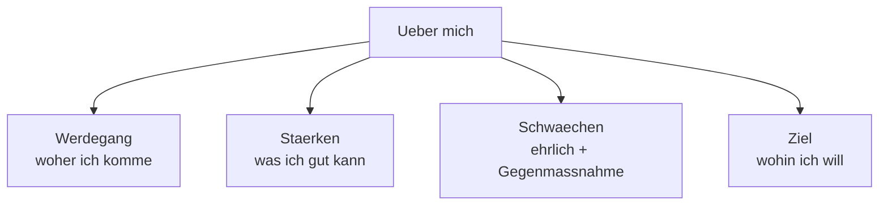

# Phase 5 · Vocabulary — Interview & HR German

> **Level:** C1 · **Focus:** application documents, contracts & conditions, self-description, the hiring process · **Time:** ~3 h
> _After this module you understand every HR word a recruiter throws at you — from Gehaltsvorstellung to Kündigungsfrist — and can use them back._

Technical vocabulary you already have from [Phase 3](#/phase-3/vocabulary). What trips up strong engineers in German interviews is the **HR layer**: the words on the contract, in the job ad's fine print, and in the recruiter's questions. This module groups them so you learn them as systems, not as a flat list. Learn each noun with **article + plural** — HR words love awkward plurals.

## Objectives / Lernziele

- Name every document in a German **Bewerbung** and what belongs in it.
- Understand **contract vocabulary**: Festanstellung, Probezeit, Kündigungsfrist, unbefristet.
- Talk about yourself with **Stärke, Schwäche, Werdegang, Kenntnisse**.
- Follow the **process words**: Zusage, Absage, Angebot, Verfügbarkeit.

## 1. Die Bewerbungsunterlagen — the application documents

A German application (die Bewerbung) is a *package* (die Bewerbungsunterlagen), not just a résumé.

| Deutsch | Artikel | Plural | English |
|---|---|---|---|
| Lebenslauf | der | Lebensläufe | CV / résumé (tabellarisch = tabular) |
| Anschreiben | das | Anschreiben | cover letter |
| Bewerbung | die | Bewerbungen | application |
| Arbeitszeugnis | das | Arbeitszeugnisse | employer reference letter |
| Zeugnis | das | Zeugnisse | certificate / diploma / reference |
| Anlage | die | Anlagen | attachment / enclosure |

🇩🇪 **Meine _Bewerbungsunterlagen_ bestehen aus _Anschreiben_, _Lebenslauf_ und den _Zeugnissen_.**
*My application package consists of cover letter, CV and the references.* — Build these in [Writing](#/phase-5/writing).

## 2. Vertrag & Konditionen — contract and conditions

This is the vocabulary of the *offer*. Know it before you negotiate — you cannot bargain over a word you do not understand.

| Deutsch | Artikel | Plural | English | Note |
|---|---|---|---|---|
| Festanstellung | die | Festanstellungen | permanent employment | the goal for most |
| Probezeit | die | Probezeiten | probation period | usually 6 months |
| Kündigungsfrist | die | Kündigungsfristen | notice period | e.g. *4 Wochen* |
| Gehaltsvorstellung | die | Gehaltsvorstellungen | salary expectation | asked in ads! |
| Verfügbarkeit | die | Verfügbarkeiten | availability / start date | |
| Eintrittstermin | der | Eintrittstermine | starting date | |

🇩🇪 **Die Stelle ist _unbefristet_, in _Vollzeit_, mit sechs Monaten _Probezeit_ und einer _Kündigungsfrist_ von vier Wochen.**
*The position is permanent, full-time, with six months' probation and a four-week notice period.*

Two adjectives you must not confuse:

- **unbefristet** = permanent (no end date) · **befristet** = fixed-term.
- **brutto** = gross (before tax) · **netto** = net. German salaries are always quoted **brutto** and **pro Jahr** (per year), e.g. *"70.000 € brutto im Jahr"*.

> Salary is negotiated with Konjunktiv II — see [Grammar §1](#/phase-5/grammar).

## 3. Über sich selbst sprechen — describing yourself

The HR round lives on these. Note *die Stärke / die Schwäche* and the collective plural *die Kenntnisse* (almost always plural: *Java-Kenntnisse, Deutschkenntnisse*).

| Deutsch | Artikel | Plural | English |
|---|---|---|---|
| Stärke | die | Stärken | strength |
| Schwäche | die | Schwächen | weakness |
| Werdegang | der | Werdegänge | career path / background |
| Kenntnisse | die | (plural) | knowledge / skills |
| Fähigkeit | die | Fähigkeiten | ability / competence |
| Berufserfahrung | die | Berufserfahrungen | professional experience |



🇩🇪 **Zu meinen _Stärken_ gehört strukturiertes Arbeiten; an meiner _Schwäche_, zu viele Details zu wollen, arbeite ich aktiv.**
*My strengths include structured work; I'm actively working on my weakness of wanting too many details.* — the honest-but-controlled Schwäche formula German HR expects.

## 4. Der Bewerbungsprozess — process & HR people

Finally, the words for the people and outcomes of the process.

| Deutsch | Artikel | Plural | English |
|---|---|---|---|
| Personaler / -in | der / die | Personaler / -innen | HR / recruiter (person) |
| Personalabteilung | die | Personalabteilungen | HR department |
| Vorstellungsgespräch | das | Vorstellungsgespräche | job interview |
| Zusage | die | Zusagen | acceptance / yes |
| Absage | die | Absagen | rejection |
| Angebot | das | Angebote | offer |

🇩🇪 **Nach dem zweiten _Vorstellungsgespräch_ habe ich eine _Zusage_ bekommen und das _Angebot_ geprüft.**
*After the second interview I got an acceptance and reviewed the offer.*

```audio
Vielen Dank für Ihre Bewerbung. Wir würden gern Ihre Gehaltsvorstellung und Ihre Verfügbarkeit besprechen. Wann könnten Sie frühestens anfangen?
```

> The recruiter's typical questions — *Gehaltsvorstellung? Verfügbarkeit? Wechselmotivation?* — are handled live in [Speaking](#/phase-5/speaking) and understood by ear in [Listening](#/phase-5/listening).

---

## 🧾 Zusammenfassung · Summary

Interview German has four vocabulary systems. **(1) Bewerbungsunterlagen** — der Lebenslauf, das Anschreiben, das Zeugnis. **(2) Vertrag & Konditionen** — die Festanstellung, die Probezeit, die Kündigungsfrist, die Gehaltsvorstellung, plus *unbefristet/befristet* and *brutto/netto*. **(3) Über mich** — die Stärke, die Schwäche, der Werdegang, die Kenntnisse. **(4) Prozess** — der Personaler, die Zusage, die Absage, das Angebot, die Verfügbarkeit. Learn each with article + plural; German salaries are quoted **brutto pro Jahr**.

## 📇 Vokabel-Checkliste · Vocabulary checklist

| Deutsch | Artikel | Plural | English | VI (if hard) |
|---|---|---|---|---|
| Lebenslauf | der | Lebensläufe | CV / résumé | sơ yếu lý lịch |
| Anschreiben | das | Anschreiben | cover letter | thư xin việc |
| Gehaltsvorstellung | die | Gehaltsvorstellungen | salary expectation | mức lương mong muốn |
| Kündigungsfrist | die | Kündigungsfristen | notice period | thời hạn báo trước nghỉ |
| Festanstellung | die | Festanstellungen | permanent employment | |
| Werdegang | der | Werdegänge | career path | quá trình sự nghiệp |
| Verfügbarkeit | die | Verfügbarkeiten | availability | |
| Zusage / Absage | die | Zusagen / Absagen | acceptance / rejection | |

→ Drill these and more in [Flashcards](#/@flashcards).

## 🗣️ Sprechübung · Speaking practice

1. Answer aloud: *"Was ist Ihre Gehaltsvorstellung?"* using *brutto pro Jahr*.
2. State one **Stärke** and one honest **Schwäche** with a Gegenmaßnahme (countermeasure).
3. Read the recruiter line below aloud, then answer it about your real notice period.

```audio
Ihre Bewerbungsunterlagen haben uns überzeugt. Sind Sie derzeit in einer Festanstellung, und wie lang ist Ihre Kündigungsfrist?
```

## ❓ Mini-Quiz

1. Article + plural of *Lebenslauf*?
2. What does **unbefristet** mean — and its opposite?
3. Are German salaries quoted brutto or netto, per month or per year?
4. Which word: the rejection email is *die ___*?

> **Lösungen:** 1) **der Lebenslauf, die Lebensläufe** · 2) **permanent (no end date)**; opposite = **befristet** · 3) **brutto, pro Jahr** · 4) **die Absage** (yes = die Zusage). Full quiz: [Quizzes](#/@quiz).

## 📝 Hausaufgabe · Homework

- [ ] Add all **8 checklist words** to your personal Anki IT-deck with article + plural.
- [ ] Write your own **Gehaltsvorstellung sentence** (brutto pro Jahr) and Verfügbarkeit.
- [ ] Draft **one Stärke + one Schwäche** with a countermeasure, in full sentences.
- [ ] Match 10 HR words to English without looking — score yourself.

## 📚 Empfohlene Ressourcen · Recommended resources

- **Dictionaries:** dict.leo.org and Linguee for HR collocations (*Kündigungsfrist einhalten*, *Gehalt aushandeln*).
- **SRS:** Anki — keep the HR words in your personal IT deck; Speakada / Language Atlas for review.
- **Context:** Reverso Context to see *Gehaltsvorstellung* and *Probezeit* used in real sentences.
- **Next:** take this vocabulary into [Phase 5 · Speaking](#/phase-5/speaking) and [Writing](#/phase-5/writing).
