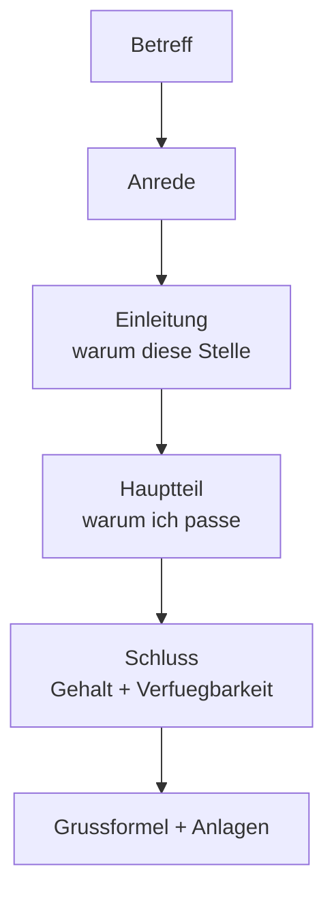

# Phase 5 · Writing — Lebenslauf, Anschreiben & Follow-up

> **Level:** C1 · **Focus:** the tabular German CV, the Anschreiben structure, the follow-up / thank-you email · **Time:** ~5 h
> _After this module you can write a German-standard Lebenslauf, a structured Anschreiben tailored to a job ad, and a polite follow-up email._

German written applications are **formal, structured and convention-bound** — exactly the values from the [Overview](#/phase-5/overview). A CV in the German format signals that you understand the culture before you've said a word. This module gives you the three documents you need, with reusable phrase banks. Build on the formal register from [Phase 4 · Writing](#/phase-4/writing).

## Objectives / Lernziele

- Structure a **tabellarischer Lebenslauf** in reverse-chronological order.
- Write an **Anschreiben** with correct Betreff, Anrede, body and Grußformel.
- Use the standard **formal phrases** for openings and closings.
- Send a concise **follow-up / thank-you email** after the interview.

## 1. Der tabellarische Lebenslauf

The German CV is **tabular** (dates left, content right), **reverse-chronological** (newest first), and factual — no full sentences, no "objective statement".

| Section | German heading | Contents |
|---|---|---|
| Personal data | Persönliche Daten | name, contact, optionally city |
| Work experience | Berufserfahrung | role, company, dates, 2–3 bullet achievements |
| Education | Ausbildung / Studium | degree, institution, dates |
| Skills | Kenntnisse / IT-Kenntnisse | languages, frameworks, tools |
| Languages | Sprachen | e.g. *Deutsch B2, Englisch C1, Vietnamesisch Muttersprache* |

**Modern conventions (know these):**

- A **photo** is optional today and increasingly omitted; date of birth and marital status are **not required** (anti-discrimination law, das AGG). Include them only if you want to.
- Keep it to **1–2 pages**, PDF, with a plain filename like `Lebenslauf_Nguyen.pdf`.
- Use **strong verbs + metrics** in bullets, mirroring the [Stellenanzeige](#/phase-5/reading) wording.

🇩🇪 **Berufserfahrung — Backend-Entwickler, Fintech GmbH (03/2022 – heute):** *Entwicklung und Betrieb von Zahlungs-APIs mit Java und Spring Boot; Latenz um 60 % reduziert; Einführung von CI/CD mit Jenkins.*
*Backend developer … : development and operation of payment APIs with Java and Spring Boot; reduced latency by 60%; introduced CI/CD with Jenkins.*

## 2. Das Anschreiben — structure

The cover letter is one page, five blocks. It answers two questions: **Warum ihr?** (why this company) and **Warum ich?** (why me).



| Block | Purpose | Model phrase |
|---|---|---|
| Betreff | subject line | *Bewerbung als Backend-Entwickler (m/w/d), Kennziffer 4711* |
| Anrede | salutation | *Sehr geehrte Frau Berger,* (named!) / *Sehr geehrte Damen und Herren,* |
| Einleitung | hook + why them | *mit großem Interesse habe ich Ihre Stellenanzeige gelesen …* |
| Hauptteil | evidence you fit the Muss-Kriterien | *In meiner jetzigen Position betreue ich … Dabei konnte ich …* |
| Schluss | availability + salary + CTA | *Ich könnte zum 1. Oktober beginnen; meine Gehaltsvorstellung liegt bei …* |

🇩🇪 **Einleitung:** *Sehr geehrte Frau Berger, mit großem Interesse _habe_ ich Ihre Stellenanzeige für eine:n Backend-Entwickler:in _gelesen_. Ihre Umstellung auf Microservices _spricht_ mich besonders an, weil ich genau das in meinem aktuellen Projekt _begleite_.*
*Dear Ms Berger, I read your job ad for a backend developer with great interest. Your migration to microservices particularly appeals to me, because I'm accompanying exactly that in my current project.* — note the concrete, researched hook from [Reading](#/phase-5/reading).

**The money sentence** uses Konjunktiv II politeness (recall [Grammar §1](#/phase-5/grammar)):

🇩🇪 **Meine _Gehaltsvorstellung_ liegt bei 72.000 € brutto im Jahr. Ich _wäre_ ab dem 1. Oktober _verfügbar_.**
*My salary expectation is €72,000 gross per year. I would be available from October 1st.*

```audio
Sehr geehrte Frau Berger, mit großem Interesse habe ich Ihre Stellenanzeige gelesen. Ich bin überzeugt, dass ich mit meiner Erfahrung in Java und Spring Boot gut zu Ihrem Team passe.
```

## 3. Formal openings & closings — a phrase bank

Get these exactly right; errors here look careless.

| Function | Correct German |
|---|---|
| Named salutation | *Sehr geehrte Frau Berger, / Sehr geehrter Herr Klein,* |
| Unknown recipient | *Sehr geehrte Damen und Herren,* |
| Standard closing | *Mit freundlichen Grüßen* (no comma, name below) |
| Enclosures line | *Anlagen: Lebenslauf, Zeugnisse* |

**Watch out:** after *Sehr geehrte Frau Berger,* the next line starts **lowercase** (*mit großem Interesse …*) — the comma means the sentence continues.

## 4. The follow-up / thank-you email

A short, same-day thank-you after the interview is polite and memorable — keep it to 4–5 lines, no salary talk.

| Block | Model phrase |
|---|---|
| Anrede | *Sehr geehrte Frau Berger,* |
| Thanks | *vielen Dank für das freundliche und aufschlussreiche Gespräch heute.* |
| Reinforce fit | *Unser Austausch über Ihre Microservice-Architektur hat mein Interesse noch verstärkt.* |
| Availability | *Für Rückfragen stehe ich Ihnen gern zur Verfügung.* |
| Close | *Mit freundlichen Grüßen* |

🇩🇪 **Vielen Dank für das aufschlussreiche Gespräch. Ich _freue mich_ über den nächsten Schritt und _stehe_ für Rückfragen gern _zur Verfügung_.**
*Thank you for the insightful conversation. I look forward to the next step and am happy to answer any questions.*

> If you hear nothing after the stated timeframe, one polite Nachfrage is fine: *"Darf ich höflich nach dem Stand meiner Bewerbung fragen?"* — never more than once.

---

## 🧾 Zusammenfassung · Summary

Three documents win the German application. The **tabellarischer Lebenslauf** is tabular, reverse-chronological and factual, with strong verbs and metrics; photo and date of birth are optional (das AGG). The **Anschreiben** runs Betreff → Anrede → Einleitung → Hauptteil → Schluss → Grußformel, answering *Warum ihr?* and *Warum ich?*, closing with a Konjunktiv-II salary and availability sentence. A short, same-day **follow-up email** thanks the interviewer and reinforces fit. Nail the formal phrases — *Sehr geehrte …,* then lowercase; *Mit freundlichen Grüßen*.

## 📇 Vokabel-Checkliste · Vocabulary checklist

| Deutsch | Artikel | Plural | English | VI (if hard) |
|---|---|---|---|---|
| Lebenslauf | der | Lebensläufe | CV / résumé | sơ yếu lý lịch |
| Anschreiben | das | Anschreiben | cover letter | thư xin việc |
| Anrede | die | Anreden | salutation | lời chào đầu thư |
| Betreff | der | Betreffe | subject line | dòng chủ đề |
| Grußformel | die | Grußformeln | closing formula | lời chào cuối thư |
| Anlage | die | Anlagen | enclosure / attachment | tài liệu đính kèm |

→ Drill these and more in [Flashcards](#/@flashcards).

## 🗣️ Sprechübung · Speaking practice

1. Read your Anschreiben **Einleitung** aloud — does it name a concrete, researched reason?
2. Say your **salary + availability** sentence in Konjunktiv II from memory.
3. Read the follow-up model 🔊 below, then adapt it to a company you'd actually apply to.

```audio
Sehr geehrte Frau Berger, vielen Dank für das freundliche Gespräch heute. Der Austausch über Ihre Architektur hat mein Interesse verstärkt. Für Rückfragen stehe ich Ihnen gern zur Verfügung. Mit freundlichen Grüßen.
```

## ❓ Mini-Quiz

1. In which order is the Lebenslauf sorted — oldest or newest first?
2. After *"Sehr geehrte Frau Berger,"*, does the next word start upper- or lowercase?
3. Which mood does the salary sentence use?
4. Name two of the five Anschreiben blocks.

> **Lösungen:** 1) **Reverse-chronological — newest first.** · 2) **Lowercase** (the comma continues the sentence). · 3) **Konjunktiv II** (*Ich wäre … verfügbar; meine Gehaltsvorstellung läge/liegt bei …*). · 4) e.g. **Betreff, Anrede, Einleitung, Hauptteil, Schluss.** Full quiz: [Quizzes](#/@quiz).

## 📝 Hausaufgabe · Homework

- [ ] Write your full **tabellarischer Lebenslauf** (1–2 pages, PDF, metrics in bullets).
- [ ] Write one **Anschreiben** tailored to a real Stellenanzeige, matching its Muss-Kriterien.
- [ ] Draft a **follow-up email** template you can adapt in five minutes.
- [ ] Proof all three for the *Sehr geehrte …,* lowercase rule and *Mit freundlichen Grüßen*.

## 📚 Empfohlene Ressourcen · Recommended resources

- **Formal register:** [Phase 4 · Writing](#/phase-4/writing) for emails and documentation style.
- **Phrase checking:** Duden.de and DWDS.de for correct formal formulas; Linguee for collocations.
- **Textbook:** *Aspekte neu C1* (Klett), *Sicher! C1* (Hueber) — Bewerbung units.
- **Next:** schedule everything with the [Phase 5 · Plan](#/phase-5/plan) and self-check in [Assessment](#/phase-5/assessment).
