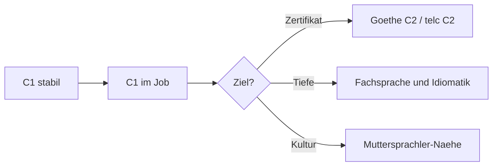

# Phase 6 · Assessment — C1 Maintenance & What Comes After

> **Level:** C1 · **Focus:** a C1 maintenance checklist, an integration self-check, the path beyond C1 · **Time:** ~1 h, then monthly
> _After this module you can judge honestly whether your working German is holding — and you know what "after C1" actually looks like._

This is the last module of the roadmap, so it looks two ways at once: **backward**, to confirm your C1 is stable under real workplace pressure, and **forward**, to the open-ended path toward full fluency. Run the checklists monthly for your first year on the job. The goal is no longer to *pass* a level — it's to keep the language alive and let it deepen into something that feels like your own. Pair this with the routine in [Phase 6 · Plan](#/phase-6/plan).

## Objectives / Lernziele

- Verify your **C1 skills** hold up in a real German workplace.
- Run an honest **integration self-check** on the culture side.
- Understand the realistic **path beyond C1** (toward C2 and near-native).

## 1. C1 maintenance checklist

Tick only what's true **reliably and unprompted** at work:

- [ ] I follow a fast, overlapping **meeting** and catch my action item.
- [ ] I give and take **code-review** feedback smoothly in German.
- [ ] I run an **incident update** calmly: status, impact, next step.
- [ ] I write a clear **status update** and a structured **postmortem**.
- [ ] I use **modal particles** and **Konjunktiv I** without thinking.
- [ ] I switch **du/Sie** and register to fit the situation.
- [ ] I read a **policy / Betriebsvereinbarung** and extract my rights & duties.
- [ ] I handle **HR topics** (Urlaub, Krankmeldung, Feedbackgespräch) confidently.

## 2. Integration self-check

Language is half of it; **fitting the culture** is the other half. Score each 1–3:

| Signal | Not yet (1) | Almost (2) | Solid (3) |
|---|---|---|---|
| Pünktlichkeit | often just on time | usually early | reliably 5 min early |
| Sachlichkeit | takes critique personally | mostly separates it | hears the issue, not a tone |
| Directness | avoids disagreeing | hedges a lot | disagrees constructively |
| Feierabend/Urlaub | over- or under-works | learning the norm | healthy, unapologetic |
| Smalltalk | freezes | manages basics | easy, warm |

Low scores aren't language gaps — they're **calibration**, and they come with weeks on the team. Revisit [Phase 6 · Overview](#/phase-6/overview) for the culture map.

```audio
Ehrlich gesagt fällt mir die direkte Kritik noch schwer. Aber ich merke, dass niemand es persönlich meint. Ich übe, die Sachebene zu hören und selbst klarer zu widersprechen.
```

## 3. Was kommt nach C1?

C1 is a floor, not a ceiling. "Full fluency" is less a certificate than a **direction**:



Three realistic directions:

- **A certificate** — *Goethe-Zertifikat C2* or *telc C2* if you want proof (for citizenship, a title, or your own goal).
- **Depth** — richer idiom, register range, and domain vocabulary beyond IT (law, finance, small talk about football). This comes from **wide reading and real conversation**, not courses.
- **Near-native feel** — the long game: humor, subtext, dialect comprehension, writing that no one flags as non-native. Years, not months — and entirely worth it.

You don't need C2 to thrive as an engineer in Germany. But keeping the [Phase 6 · Plan](#/phase-6/plan) loop running means your German never stops getting better.

## 🧾 Zusammenfassung · Summary

The final check runs on two axes: a **C1 maintenance checklist** (meetings, reviews, incident updates, writing, particles, register, policies, HR) and an **integration self-check** (Pünktlichkeit, Sachlichkeit, directness, work–life norms, Smalltalk). Low culture scores are calibration, not language gaps. Beyond C1 lies an **open path** — an optional C2 certificate, real **depth** in idiom and domain, and the years-long climb toward near-native feel. Keep the [Phase 6 · Plan](#/phase-6/plan) loop turning and re-run this monthly. You've finished the roadmap — congratulations.

## 📇 Vokabel-Checkliste · Vocabulary checklist

| Deutsch | Artikel | Plural | English | VI (if hard) |
|---|---|---|---|---|
| Selbsteinschätzung | die | Selbsteinschätzungen | self-assessment | tự đánh giá |
| Integration | die | Integrationen | integration | sự hòa nhập |
| Fachsprache | die | Fachsprachen | technical / domain language | ngôn ngữ chuyên ngành |
| Muttersprachler | der | Muttersprachler | native speaker | người bản ngữ |
| fließend | — | — | fluent | trôi chảy |
| beherrschen | — | — | to master (a language) | thành thạo |

→ Drill these and more in [Flashcards](#/@flashcards).

## 🗣️ Sprechübung · Speaking practice

1. Talk through the maintenance checklist aloud: for each item, give a real example from your week.
2. Score your **integration** honestly and say one concrete step to raise your lowest signal.
3. State your "after C1" goal — certificate, depth, or near-native — and why. Read the audio first.

```audio
Mein nächstes Ziel ist nicht das C2-Zertifikat, sondern mehr Tiefe: bessere Redewendungen, sicherer Smalltalk und Fachsprache über die IT hinaus. Dafür lese und rede ich einfach jeden Tag weiter Deutsch.
```

## ❓ Mini-Quiz

1. Are weak **integration** scores usually a language problem?
2. Name the two C2 certificates mentioned as an optional next step.
3. Which one grammar pair should feel automatic at maintenance C1?

> **Lösungen:** 1) **No** — they're cultural calibration, fixed by time on the team · 2) **Goethe-Zertifikat C2** and **telc C2** · 3) **modal particles** + **Konjunktiv I** (from [Phase 6 · Grammar](#/phase-6/grammar)). More in [Quizzes](#/@quiz).

## 📝 Hausaufgabe · Homework

- [ ] Complete the **C1 maintenance checklist** and the **integration self-check**.
- [ ] For each unticked item, note the [Phase 6](#/phase-6/overview) module to revisit.
- [ ] Write your **"was kommt nach C1"** goal in one German sentence.
- [ ] Schedule a **monthly** re-run of this assessment for your first year.

## 📚 Empfohlene Ressourcen · Recommended resources

- **Exams (optional):** Goethe-Institut (goethe.de) and telc (telc.net) for C2.
- **Depth:** *Aspekte neu C1* / *Sicher! C1* (Klett/Hueber); wide reading on heise.de, t3n.de.
- **Community:** r/German, r/germany, r/cscareerquestionsEU; Engineering Kiosk Discord.
- **Keep going:** loop the [Phase 6 · Plan](#/phase-6/plan) and revisit any [Phase 6](#/phase-6/overview) module.
