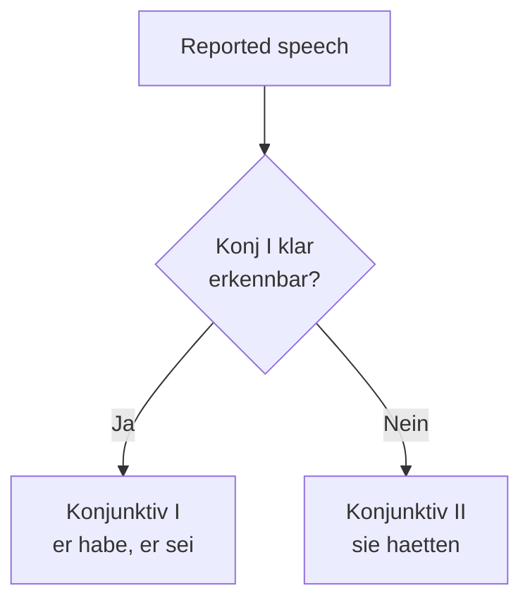

# Phase 6 · Grammar — C1 Maintenance & Idiomatic Polish

> **Level:** C1 · **Focus:** modal particles, indirekte Rede (Konjunktiv I), register nuance · **Time:** ~4 h this module
> _After this module you sound like an insider, not a textbook — softening, hedging and reporting speech the way native colleagues actually do._

At C1 the goal shifts from **acquiring** grammar to **polishing** it. Your sentences are already correct; now they need the tiny, native flavor that separates "grammatically fine" from "one of us". Two features do most of that work: **modal particles** (the little words that carry attitude) and **Konjunktiv I** (the register of reported speech in status reports and news). Add deliberate **register** control and your German stops sounding translated. Recall the Nebensatz and word-order rules from [Phase 1 · Grammar](#/phase-1/grammar) and the Konjunktiv II politeness from [Phase 2 · Grammar](#/phase-2/grammar) — this module builds directly on both.

## Objectives / Lernziele

- Use the modal particles **doch, mal, eben, halt, ja, wohl** naturally and correctly.
- Report speech with **Konjunktiv I** (indirekte Rede), falling back to **Konjunktiv II** when forms collide.
- Control **register** — spoken vs. written, du vs. Sie, hedged vs. blunt.
- Self-diagnose **fossilized** errors so C1 doesn't quietly slide back.

## 1. Modal particles — the flavor of spoken German

**Modalpartikeln** (also *Abtönungspartikeln*) are unstressed little words that add attitude without changing the core meaning. Drop them and you're understood — but you sound flat and foreign. They sit in the **Mittelfeld** (after the verb, before the object).

| Particle | Signals | Standup-ready example | Gloss |
|---|---|---|---|
| **doch** | reminder / mild contradiction | Das haben wir **doch** gestern besprochen. | We *did* discuss this yesterday (you know). |
| **mal** | casual, "just", softens | Kannst du **mal** kurz drüberschauen? | Can you just take a quick look? |
| **eben** | resignation, "simply so" | Dann machen wir es **eben** morgen. | Then we'll just do it tomorrow. |
| **halt** | resignation (colloquial) | Die Pipeline ist **halt** langsam. | The pipeline's just slow, that's how it is. |
| **ja** | shared knowledge / emphasis | Der Build ist **ja** schon wieder rot. | The build is red *again*, as you can see. |
| **wohl** | assumption / probability | Er ist **wohl** noch im Homeoffice. | He's probably still working from home. |

🇩🇪 **Kannst du mir mal eben helfen?** — *Could you just quickly help me?* Two particles stacked (*mal eben* = "real quick") — perfectly native.

> Careful: the **same words** exist as normal adverbs. Stressed *"Ich war **eben** da"* means "I was there *just now*"; unstressed *eben* is the particle. Stress and context decide.

## 2. Stacking & tone

Particles combine in a fairly fixed order and can turn a flat sentence sharp or friendly:

- 🇩🇪 **Das ist doch wohl nicht dein Ernst!** — *You can't possibly be serious!* (indignation)
- 🇩🇪 **Mach das halt mal.** — *Just do it, then.* (casual, slightly resigned)
- 🇩🇪 **Komm doch kurz rüber.** — *Why don't you come over for a sec.* (friendly invitation)

Used well, particles are the cheapest upgrade to your spoken German. Overused, they sound sloppy — aim for one or two per sentence, matched to the mood you actually feel.

## 3. Indirekte Rede — Konjunktiv I

When you **report** what someone said — in a status update, an incident report, or the news — written and formal German uses **Konjunktiv I**. It signals "I'm relaying this, not asserting it myself".

| Infinitiv | Indikativ (er) | **Konjunktiv I (er)** |
|---|---|---|
| sein | ist | **sei** |
| haben | hat | **habe** |
| werden | wird | **werde** |
| können | kann | **könne** |
| deployen | deployt | **deploye** |
| kommen | kommt | **komme** |

🇩🇪 Direkt: **"Ich habe den Bug behoben."**
🇩🇪 Indirekt: **Der Entwickler sagte, er habe den Bug behoben.** — *The developer said he had fixed the bug.*

🇩🇪 Direkt: **"Der Server ist abgestürzt."**
🇩🇪 Indirekt: **Sie berichtete, der Server sei abgestürzt.**

**The collision rule:** when Konjunktiv I looks identical to the Indikativ (mostly the plural: *sie haben* = *sie haben*), switch to **Konjunktiv II** to stay unambiguous.



🇩🇪 **Die Kollegen sagten, sie hätten keine Zeit.** (not *sie haben* → use *hätten*). You met Konjunktiv II first as a politeness tool in [Phase 2 · Grammar](#/phase-2/grammar); here it doubles as the backup for reported speech.

```audio
In der Retro sagte die Teamleiterin, das Release sei stabil gewesen. Ein Kollege meinte, man müsse die Tests noch verbessern, und er habe dafür schon ein Ticket erstellt.
```

## 4. Register nuance — the same request, three ways

C1 means choosing the **register** on purpose. One request, three levels:

| Register | Beispiel |
|---|---|
| Kollegial (du) | **Reviewst du kurz meinen PR?** |
| Höflich neutral | **Könntest du bitte kurz meinen PR anschauen?** |
| Formell (Sie) | **Könnten Sie den Pull Request bei Gelegenheit prüfen?** |

Written work chats compress ("PR-Review noch heute?"); a mail to HR expands and softens ("Ich würde mich freuen, wenn …"). Match the channel: a Slack thread ≠ a formal email. Reach for the formal-register toolkit in [Phase 4 · Grammar](#/phase-4/grammar), and keep particles for the spoken/chat register — they rarely belong in a formal letter.

## 5. Keeping C1 from sliding back

At C1 the danger isn't ignorance, it's **fossilization** — small errors frozen into habits because everyone still understands you. Pick two recurring slips (maybe *Genitiv* after certain prepositions, or *der/das* gender) and hunt them for a week. A quick weekly self-record, compared against the audio here, catches drift early — the routine you'll formalize in [Phase 6 · Plan](#/phase-6/plan).

## 🧾 Zusammenfassung · Summary

C1 grammar is **polish, not new rules**. **Modal particles** (*doch, mal, eben, halt, ja, wohl*) inject native attitude into spoken German — use one or two, matched to mood. **Konjunktiv I** carries reported speech in reports and news (*er habe, der Server sei*), with **Konjunktiv II** as the fallback when forms collide (*sie hätten*). Choose your **register** deliberately per channel, and actively hunt fossilized errors so your level holds. Everything builds on [Phase 1](#/phase-1/grammar), [Phase 2](#/phase-2/grammar) and [Phase 4 · Grammar](#/phase-4/grammar).

## 📇 Vokabel-Checkliste · Vocabulary checklist

| Deutsch | Artikel | Plural | English | VI (if hard) |
|---|---|---|---|---|
| Modalpartikel | die | Modalpartikeln | modal particle | tiểu từ tình thái |
| indirekte Rede | die | — | reported speech | lời nói gián tiếp |
| Konjunktiv | der | Konjunktive | subjunctive mood | thức giả định |
| Aussage | die | Aussagen | statement | |
| Register | das | Register | register (of speech) | |
| Redewendung | die | Redewendungen | idiom / set phrase | thành ngữ |

→ Drill these and more in [Flashcards](#/@flashcards).

## 🗣️ Sprechübung · Speaking practice

1. Take five flat sentences about your day and add **one particle** each (*doch, mal, ja, wohl, halt*).
2. Report three things a colleague said using **Konjunktiv I**: *"Er sagte, er habe …"*.
3. Say one request in all **three registers** (du / höflich / Sie). Record and compare with the audio.

```audio
Kannst du mir mal eben helfen? Der Kollege meinte ja, das sei kein großes Problem — aber er hat wohl den Edge-Case übersehen.
```

## ❓ Mini-Quiz

1. Add a particle so *"Das haben wir besprochen"* means "we *did* discuss this, remember".
2. Konjunktiv I of *sein*, 3rd person singular?
3. Why say *"sie hätten"* instead of *"sie haben"* in reported speech?

> **Lösungen:** 1) *Das haben wir **doch** besprochen.* · 2) **sei** (*er/sie sei*) · 3) Konjunktiv I of *haben* = Indikativ *haben*, so you switch to Konjunktiv II *hätten* to stay unambiguous. More drills in [Quizzes](#/@quiz).

## 📝 Hausaufgabe · Homework

- [ ] Write **6 sentences**, each using a different modal particle, with an English gloss.
- [ ] Rewrite a short standup update as **reported speech** in Konjunktiv I.
- [ ] Record the same request in **three registers** and check the verb forms.
- [ ] List your **two most fossilized errors** and drill them for a week.

## 📚 Empfohlene Ressourcen · Recommended resources

- **Grammar:** deutsch.lingolia.com (Modalpartikeln, Konjunktiv I) and mein-deutschbuch.de.
- **Practice:** Schubert-Verlag online C1 exercises (schubert-verlag.de).
- **Video:** Deutsch mit Marija & Don't Trust The Rabbit — particles and nuance.
- **Next:** [Phase 6 · Vocabulary](#/phase-6/vocabulary).
