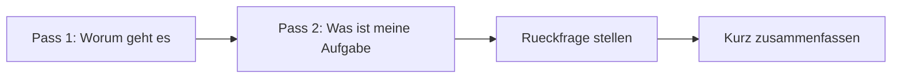

# Phase 6 · Listening — Real Workplace German & Staying Sharp

> **Level:** C1 · **Focus:** authentic meeting speech, accents & Denglisch, an on-the-job input plan · **Time:** ~30 min/day, ongoing
> _After this module you can follow fast, messy, real-world workplace German — and you have a plan to keep improving while you work._

Textbook audio is clean; your colleagues are not. Real workplace German comes fast, overlaps, mixes in Denglisch ("Ich hab den Bug schon ge**merged**"), arrives over a bad call connection, and carries a regional accent. The good news: the **method** from [Phase 1 · Listening](#/phase-1/listening) still holds — gist first, detail later — you just apply it under harder conditions. This module tunes your ear for the workplace and gives you an **ongoing input routine** so C1 keeps climbing instead of quietly plateauing on the job.

## Objectives / Lernziele

- Follow **real meeting speech**: speed, overlap, Denglisch, poor audio.
- Recognize common **regional accents** without panicking.
- Run a two-pass **"catch the ask"** strategy in live calls.
- Keep a lightweight **on-the-job input plan** for years, not weeks.

## 1. Why real workplace audio is hard

Four things textbook audio never prepared you for:

| Challenge | What happens | Fix |
|---|---|---|
| Speed & overlap | people talk over each other | catch the **gist + the ask**, ignore the rest |
| Denglisch | deployen, gemerged, das Standup | learn the hybrid forms as fixed items |
| Bad audio | muffled calls, cutting out | confirm actively: "Kannst du das wiederholen?" |
| Accent | Bayerisch, Schwäbisch, Wienerisch | exposure — see §3 |

🇩🇪 **Sorry, du bist kurz weggebrochen — kannst du den letzten Punkt noch mal sagen?** — *You cut out — can you repeat the last point?* Asking is normal and professional, not a sign of weak German.

## 2. Catch-the-ask listening

In a meeting you don't need every word — you need **the decision and your action item**. Listen in two passes, live:



🇩🇪 **Also, ich fasse kurz zusammen: Ich übernehme das Caching, du kümmerst dich um die Tests — richtig?** Summarizing back confirms you understood and buys thinking time. It's the single highest-value listening move at work.

```audio
Kurz zum Mitschreiben: Wir verschieben das Release auf Donnerstag, du machst das Rollback-Skript fertig, und ich informiere den Kunden. Passt das für alle so?
```

## 3. Accents & Denglisch — expect variety

German at work is not one accent. You'll meet colleagues from across the *DACH* region (Deutschland, Österreich, Schweiz):

| Region | Watch for | Example |
|---|---|---|
| Bayern (München) | softened endings, "Servus" | Servus, passt scho! |
| Baden-Württemberg | Schwäbisch, "-le" endings | Ein bissle langsam heut. |
| Berlin | "ick", "det", fast | Ick guck mir det mal an. |
| Österreich / Schweiz | own words & melody | Grüezi / Grüß Gott |

Don't try to *speak* dialect — just **understand** it. Standard German (Hochdeutsch) stays your active target. Denglisch verbs behave like normal German: *mergen → gemerged/gemergt*, *deployen → deployt* (recall the Partizip rules from [Phase 1 · Grammar](#/phase-1/grammar)).

## 4. Your on-the-job input plan

At work, **comprehensible input** is all around you — turn it into deliberate practice:

- **Meetings** are free listening: after each, write the one decision + your action item in German.
- **German tech podcasts** on the commute: programmier.bar, Working Draft, Engineering Kiosk, heise show.
- **Slow news** to stay broad: DW — *Langsam gesprochene Nachrichten* and *Top-Thema*.
- **One intensive clip/week**: transcript + shadowing, exactly as in [Phase 3 · Listening](#/phase-3/listening).

The trap at C1 is coasting: you understand *enough*, so you stop stretching. Keep one input just above your comfort level each week.

## 🧾 Zusammenfassung · Summary

Real workplace German is fast, overlapping, Denglisch-laced and often on a bad line — so listen for the **gist and the ask**, confirm actively ("Kannst du das wiederholen?"), and **summarize back** to lock in your action item. Expect DACH accents but keep Hochdeutsch as your active target. Turn meetings, [German tech podcasts](#/phase-3/listening) and DW slow news into an **ongoing input routine**, always keeping one source just above comfort so C1 keeps climbing on the job.

## 📇 Vokabel-Checkliste · Vocabulary checklist

| Deutsch | Artikel | Plural | English | VI (if hard) |
|---|---|---|---|---|
| Besprechung | die | Besprechungen | meeting | cuộc họp |
| Rückfrage | die | Rückfragen | follow-up question | câu hỏi làm rõ |
| Mundart | die | Mundarten | dialect | phương ngữ |
| Aussprache | die | Aussprachen | pronunciation | |
| Tonqualität | die | Tonqualitäten | audio quality | |
| zusammenfassen | — | — | to summarize | tóm tắt |

→ Drill these and more in [Flashcards](#/@flashcards).

## 🗣️ Sprechübung · Speaking practice

1. After your next real meeting, say aloud in German: the **one decision** and **your action item**.
2. Ask two polite **Rückfragen** for a bad connection: *"Du bist weggebrochen …"*, *"Kannst du …?"*.
3. Shadow the audio, then summarize it back in your own words.

```audio
Ich glaube, ich habe die Hälfte akustisch nicht verstanden. Fassen wir zusammen: Wer macht was bis wann? Dann bin ich sicher, dass wir dasselbe meinen.
```

## ❓ Mini-Quiz

1. In a fast meeting, what two things must you catch above all?
2. What's the highest-value move after listening, to confirm understanding?
3. Should you learn to *speak* dialect at C1, or just understand it?

> **Lösungen:** 1) the **decision** and **your action item** (gist + ask) · 2) **summarize back** ("Ich fasse kurz zusammen …") · 3) just **understand** it; keep Hochdeutsch active. More in [Quizzes](#/@quiz).

> 🎧 **Jetzt hören.** [Phase 6 · Listening · Übungsteil](#/phase-6/listening-uebungen) — drei Hörtexte
> im echten Meeting-Tempo, 26 Aufgaben zum Heraushören der eigenen Aufgabe und ein Denglisch-Drill.

## 📝 Hausaufgabe · Homework

- [ ] For **5 meetings**, note decision + action item in German afterwards.
- [ ] Listen to **2 German tech-podcast** episodes; harvest 10 words to [Flashcards](#/@flashcards).
- [ ] Watch one Easy German clip with a **regional accent** and note 3 features.
- [ ] Do **one intensive session**: transcript + shadowing of a 2-minute clip.

## 📚 Empfohlene Ressourcen · Recommended resources

- **German tech podcasts:** programmier.bar, Working Draft, Engineering Kiosk, heise show.
- **News (clear):** DW — *Langsam gesprochene Nachrichten*, *Top-Thema*.
- **Accents & everyday speech:** Easy German (YouTube) across German cities.
- **Next:** [Phase 6 · Reading](#/phase-6/reading).
