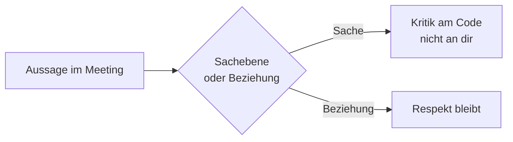

# Phase 6 · Overview — Working in a German IT Company

> **Level:** C1 · **Focus:** work culture — Siezen/Duzen, Pünktlichkeit, Sachlichkeit, Feierabend, Urlaub, Betriebsrat, Fehlerkultur · **Time:** ~1 h to read
> _After this module you can read the unwritten rules of a German engineering team, so a culture slip never undercuts your hard-won C1._

You cleared the interview in [Phase 5](#/phase-5/overview); now the real test begins. Language opened the door — **culture** keeps you in the room. German teams prize *Struktur*, *Verlässlichkeit* and *klare Kommunikation*, and they separate the **issue** from the **person** in a way that can feel blunt to a Vietnamese sense of harmony. This overview maps the cultural terrain so the rest of Phase 6 — [grammar polish](#/phase-6/grammar), [workplace vocabulary](#/phase-6/vocabulary), [standups & reviews](#/phase-6/speaking) — lands in context. Everything here is a well-supported generalization, not a fact about any specific employer; calibrate it against your real team in your first weeks.

## Objectives / Lernziele

- Switch safely between **Siezen** and **Duzen** and read which is expected.
- Understand **Pünktlichkeit**, **Sachlichkeit** and German directness without taking offense.
- Know your rhythms and rights: **Feierabend**, **Urlaub**, and the **Betriebsrat**.
- Recognize German **Fehlerkultur** and feedback culture like an insider.

## 1. Siezen oder Duzen?

The most visible register choice you'll make daily. Most dev teams are internally **per du** — but you wait to be offered it, especially by someone older or senior.

| Situation | Default | Phrase |
|---|---|---|
| New dev team, internal | often **du** | "Wir sind hier alle per du." |
| Manager, first day | start with **Sie** | "Freut mich, Herr/Frau …" |
| External clients, HR letters | **Sie** | "Sehr geehrte Frau …" |
| Someone offers du | accept, don't revert | "Gerne — ich bin [Name]." |

🇩🇪 **Sollen wir uns duzen?** — *Shall we switch to "du"?* Once offered, going back to *Sie* reads as a cold signal. Recall the register basics from [Phase 4 · Grammar](#/phase-4/grammar); here you just apply them live.

## 2. Pünktlichkeit & Struktur

In Germany, **five minutes early is on time**. A 10:00 Daily starts at 10:00, not 10:05. Agendas are followed, decisions are minuted, and "Ich melde mich bis Freitag" is a promise, not a hope.

🇩🇪 **Pünktlichkeit ist keine Höflichkeit, sondern eine Erwartung.** — *Punctuality isn't a courtesy, it's an expectation.* If you'll be late to a call, you send a quick "Ich komme 5 Minuten später" — silence is the real faux pas.

## 3. Sachlichkeit — directness is not rudeness

Germans split a discussion into a **Sachebene** (the issue) and a **Beziehungsebene** (the relationship). Criticism of your code is aimed at the *Sachebene* — it is not a personal attack.



🇩🇪 **"Das ist so nicht korrekt"** means *the approach is wrong* — not *"you're no good"*. A colleague can pull your design apart in a review and grab coffee with you five minutes later, warmly. Learn to hear the **content**, not a tone.

## 4. Feierabend, Urlaub & der Betriebsrat

Work–life balance is culturally protected, not a perk you negotiate for.

- **Feierabend** — when you log off, you're off. Evening messages usually wait until morning; nobody expects a reply at 21:00.
- **Urlaub** — 28–30 days is normal, and you're **expected to take all of it**. Skipping holiday to look dedicated signals poor planning, not heroism.
- **der Betriebsrat** (works council) — elected employees who co-decide working conditions under German *Mitbestimmung*. In larger firms like **SAP** or **Bosch** it's a real institution; a small startup may have none.

```audio
Schönen Feierabend! Ich bin nächste Woche im Urlaub. Bei dringenden Themen wendet euch bitte an Anna oder an den Betriebsrat.
```

## 5. Fehlerkultur & Feedback

A healthy **Fehlerkultur** treats a production incident as a **system** problem to learn from, not a person to blame — the spirit of the blameless postmortem you'll write in [Phase 6 · Writing](#/phase-6/writing). Feedback is **direct and regular**: expect a *Feedbackgespräch* where strengths and weaknesses are named plainly. Say "Danke für das Feedback" and treat it as data, not a verdict.

## 🧾 Zusammenfassung · Summary

German engineering culture rewards **Pünktlichkeit, Struktur and Sachlichkeit**: be on time, follow the agenda, and hear criticism as being about the *issue*, not you. Wait to be offered **du**, protect your **Feierabend**, take your full **Urlaub**, and know the **Betriebsrat** represents you. A blameless **Fehlerkultur** and direct feedback are features, not hostility. Master the language in the rest of Phase 6, but let this culture map keep it in context — start with [Grammar Maintenance](#/phase-6/grammar).

## 📇 Vokabel-Checkliste · Vocabulary checklist

| Deutsch | Artikel | Plural | English | VI (if hard) |
|---|---|---|---|---|
| Feierabend | der | Feierabende | end of the workday | giờ tan làm |
| Pünktlichkeit | die | — | punctuality | sự đúng giờ |
| Sachlichkeit | die | — | objectivity / matter-of-factness | tính khách quan |
| Betriebsrat | der | Betriebsräte | works council | hội đồng lao động |
| Fehlerkultur | die | Fehlerkulturen | culture around mistakes | |
| Mitbestimmung | die | — | co-determination | quyền đồng quyết |
| Vorgesetzte | der/die | Vorgesetzten | superior / line manager | |

→ Drill these and more in [Flashcards](#/@flashcards).

## 🗣️ Sprechübung · Speaking practice

1. Role-play a first day: greet a manager with **Sie**, then accept a colleague's offer of **du**.
2. In German, state your Feierabend boundary: *"Nach 18 Uhr antworte ich normalerweise nicht mehr, weil …"*.
3. Read the audio line aloud, then say when you plan to take Urlaub this year.

```audio
Guten Morgen! Ich sieze Sie noch, aber wenn Sie möchten, können wir gern zum Du wechseln. Und schönen Feierabend später!
```

## ❓ Mini-Quiz

1. Who traditionally offers the switch to **du** — the junior or the senior person?
2. True or false: skipping your Urlaub shows dedication in Germany.
3. What are the two "levels" Germans separate in a discussion?

> **Lösungen:** 1) The senior/older person offers it · 2) **False** — you're expected to take it all · 3) **Sachebene** (issue) and **Beziehungsebene** (relationship). More in [Quizzes](#/@quiz).

## 📝 Hausaufgabe · Homework

- [ ] Write **5 sentences** about your future team using *Pünktlichkeit, Feierabend, Urlaub, Betriebsrat, Fehlerkultur*.
- [ ] Draft a polite *"Wollen wir uns duzen?"* moment and the reply.
- [ ] Note one situation where German directness might feel harsh to you, and reframe it on the *Sachebene*.
- [ ] Skim the rest of the [Phase 6](#/phase-6/overview) modules and bookmark [Grammar](#/phase-6/grammar).

## 📚 Empfohlene Ressourcen · Recommended resources

- **Culture & language:** Easy German (YouTube) street interviews on *Arbeit* and *Alltag*.
- **Podcast:** Engineering Kiosk — German dev-team culture and ways of working.
- **Reading:** t3n.de and heise.de articles on *New Work* and *Unternehmenskultur*.
- **Next:** [Phase 6 · Grammar](#/phase-6/grammar).
