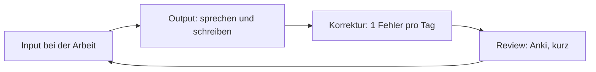

# Phase 6 · Plan — Keeping C1 Sharp on the Job

> **Level:** C1 · **Focus:** a maintenance mindset, a low-effort weekly routine, anti-plateau guardrails · **Time:** ~20–30 min/day, ongoing
> _After this module you have a light, durable routine that keeps your German improving while you work full-time._

The earlier phases were a climb; Phase 6 is a **plateau you have to actively fight**. Once you can do the job in German, the pressure to improve disappears and skills quietly fossilize. The fix isn't two hours a day — you don't have that anymore — it's a **light, deliberate routine** that rides on work you already do. This plan turns your daily job into comprehensible input and turns twenty spare minutes into real maintenance, so C1 holds and even edges toward C2.

## Objectives / Lernziele

- Shift from a **learning** to a **maintenance** mindset.
- Run a **20–30 min/day** routine built on real work.
- Follow a light **Mon–Sun** rhythm you can keep for years.
- Set **guardrails** against plateau and fossilization.

## 1. From learning to maintaining

Acquisition needed volume; maintenance needs **deliberate contact + correction**. The loop shrinks but keeps its shape — the same one from [Phase 1 · Overview](#/phase-1/overview), now powered mostly by your job:



The key addition at C1 is **self-correction**: notice one recurring error a day and fix it consciously. Passive exposure alone lets fossilized mistakes ride along forever.

## 2. The daily 20–30 minutes

Anchor tiny habits to things you already do:

- **Anki, every morning** (~10 min) — keep your "Arbeit & HR" deck from [Phase 6 · Vocabulary](#/phase-6/vocabulary) alive.
- **One meeting = free input** — jot the decision + your action item in German.
- **A podcast on the commute** — a German tech show from [Phase 6 · Listening](#/phase-6/listening).
- **One correction** — log a slip you made and its fix.

```audio
Mein Plan ist einfach: morgens zehn Minuten Anki, unterwegs ein Podcast, und jeden Tag korrigiere ich bewusst einen Fehler. So bleibt mein Deutsch in Bewegung, ohne dass es anstrengend wird.
```

## 3. A light week (Mon–Sun)

Most of this is dead time you already spend; only one evening block asks for focus.

| Day | Micro-input (commute) | Deliberate 15 min |
|:--:|---|---|
| Mo | tech podcast | Anki + log 1 error |
| Di | Easy German clip | write 1 status update in German |
| Mi | DW Top-Thema | 5 sentences with modal particles |
| Do | tech podcast | shadow a 2-min clip |
| Fr | free choice | reported-speech drill (Konj I) |
| Sa | longer podcast/video | read 1 German tech article |
| So | rest / light Anki | review week + plan next |

Keep the **shape** even in a crunch week — five minutes of Anki beats zero. Track it with the [Weekly Study Checklist](#/@checklist).

## 4. Guardrails against plateau

Three habits keep C1 from sliding:

1. **Stretch weekly** — one input just above comfort (a fast podcast, a dense article).
2. **Record monthly** — a 2-minute monologue; compare to last month for drift.
3. **Get corrected** — a language partner, tutor, or a trusted colleague who'll flag errors. Understanding "well enough" is the enemy; deliberate feedback is the cure.

## 🧾 Zusammenfassung · Summary

Phase 6 is about **not sliding back**. Swap the heavy learning schedule for a **20–30 min/day maintenance routine** — morning Anki, meetings as free input, a commute podcast, and one conscious self-correction a day. Follow a light **Mon–Sun** rhythm, keep its shape even when busy, and set **guardrails**: stretch weekly, record monthly, and get corrected regularly. The full loop lives on your job; you just have to keep it deliberate. Measure the result in [Phase 6 · Assessment](#/phase-6/assessment).

## 📇 Vokabel-Checkliste · Vocabulary checklist

| Deutsch | Artikel | Plural | English | VI (if hard) |
|---|---|---|---|---|
| Gewohnheit | die | Gewohnheiten | habit | thói quen |
| Alltag | der | — | daily routine | thường nhật |
| Wiederholung | die | Wiederholungen | review / repetition | sự ôn tập |
| Fortschritt | der | Fortschritte | progress | tiến bộ |
| aufrechterhalten | — | — | to maintain / keep up | duy trì |

→ Drill these and more in [Flashcards](#/@flashcards).

## 🗣️ Sprechübung · Speaking practice

1. Describe your maintenance routine in German: *"Jeden Morgen …, unterwegs …, und einmal am Tag …"*.
2. Name the one recurring error you'll hunt this week and say a correct example.
3. Record a 60-second monologue about your week; read the audio first for a model.

```audio
Diese Woche achte ich besonders auf den Genitiv und auf die Wortstellung im Nebensatz. Ich nehme mich jeden Freitag kurz auf und vergleiche mich mit der letzten Aufnahme.
```

## ❓ Mini-Quiz

1. What single habit does C1 maintenance add that passive exposure lacks?
2. Roughly how much daily time does this plan assume?
3. Name one of the three anti-plateau guardrails.

> **Lösungen:** 1) **self-correction** (one conscious fix a day) · 2) **~20–30 minutes** · 3) stretch weekly / record monthly / get corrected. More in [Quizzes](#/@quiz).

## 📝 Hausaufgabe · Homework

- [ ] Put the **Mon–Sun** rhythm into your calendar as light recurring blocks.
- [ ] Restart daily **Anki** on your "Arbeit & HR" deck.
- [ ] Start an **error log** and record your first monthly monologue.
- [ ] Line up one **corrector** — tutor, partner, or colleague.

## 📚 Empfohlene Ressourcen · Recommended resources

- **Tracking:** the app's [Weekly Study Checklist](#/@checklist) and [Flashcards](#/@flashcards).
- **Input:** German tech podcasts + DW *Top-Thema* (see [Phase 6 · Listening](#/phase-6/listening)).
- **Correction:** a tutor or language partner; communities like r/German, Engineering Kiosk Discord.
- **Next:** [Phase 6 · Assessment](#/phase-6/assessment).
