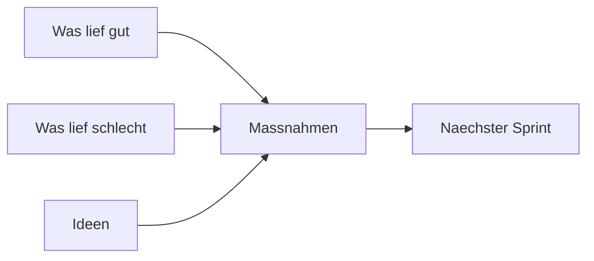

# Phase 6 · Speaking — Standups, Reviews & Difficult Conversations

> **Level:** C1 · **Focus:** dailies, code reviews, retros, incident/on-call calls, Büro-Smalltalk, disagreement · **Time:** ~4 h this module
> _After this module you can run your half of every recurring dev conversation in German — including the awkward ones._

You can present and negotiate after [Phase 4 · Speaking](#/phase-4/speaking); Phase 6 makes the **daily, small, repeated** talk automatic. Nobody prepares slides for a standup — you just need the phrases ready. This module hands you a phrase bank for the five conversations that fill an engineer's week — Daily, Code-Review, Retro, Incident-Call, Smalltalk — plus the hardest skill of all: disagreeing **constructively** in a direct culture. Work the full multi-speaker script in [Dialogue — Daily Standup](#/dialogues/standup) alongside this.

## Objectives / Lernziele

- Deliver a crisp **Daily** update: gestern / heute / Blocker.
- Give and take **code-review** feedback without friction.
- Contribute to a **Retro** and a calm **Incident-Call**.
- Handle **Büro-Smalltalk** and voice **disagreement** on the Sachebene.

## 1. Das Daily — your 30-second update

The standard shape is three beats: **gestern, heute, Blocker**. Keep it factual — Sachlichkeit again.

🇩🇪 **Gestern habe ich den Login-Service refaktoriert. Heute nehme ich mir das Caching vor. Blocker habe ich keine — nur eine Frage ans Team.**

For the full multi-speaker version, study [Dialogue — Daily Standup](#/dialogues/standup) rather than re-reading it here. Handy openers:

| Zweck | Redemittel |
|---|---|
| Start | Von meiner Seite: … / Ich mach mal weiter mit … |
| Blocker | Ich bin blockiert, weil … / Ich hänge an … |
| Ask for help | Kann mir jemand bei … helfen? |
| Hand over | Ich geb weiter an … |

## 2. Code-Review — feedback that lands

Reviews are where directness meets ego. Frame comments about the **code**, offer a path, and use particles (from [Phase 6 · Grammar](#/phase-6/grammar)) to soften.

| Statt (hart) | Besser (kollegial) |
|---|---|
| Das ist falsch. | Hier würde ich es anders lösen — was hältst du von …? |
| Warum so kompliziert? | Geht das vielleicht **auch** einfacher? |
| Fehlt. | Hier fehlt **noch** ein Test, oder? |

🇩🇪 **Sieht insgesamt gut aus! Eine Kleinigkeit: könntest du den Edge-Case noch abfangen?** Receiving feedback: **Guter Punkt, das passe ich an.** Praise first, then the *Kleinigkeit* — very German-team.

## 3. Retro — was lief gut, was verbessern

A retrospective sorts the sprint into **was lief gut / was lief nicht so gut / was nehmen wir uns vor**.



🇩🇪 **Gut lief, dass wir früh deployt haben. Nicht so gut: die Reviews haben sich gestaut. Vorschlag: eine feste Review-Zeit am Vormittag.** Speak in *Ich-* and *Wir-Botschaften*, not blame — a live application of the **Fehlerkultur** from [Phase 6 · Overview](#/phase-6/overview).

## 4. Incident-Call & On-Call

On an incident bridge (der *Bereitschaftsdienst* / "On-Call"), be **calm, structured, and loud-and-clear**. State status, impact, next step — nothing else.

🇩🇪 **Kurzer Stand: Der Checkout ist seit 14:12 gestört, rund 20 Prozent der Nutzer sind betroffen. Ich habe das letzte Deployment zurückgerollt und beobachte die Fehlerrate.**

```audio
Kurzes Update vom Incident: Die Datenbank war überlastet. Ich habe die Verbindungen begrenzt, die Lage stabilisiert sich. Ich melde mich in zehn Minuten wieder.
```

## 5. Büro-Smalltalk & konstruktiver Widerspruch

**Smalltalk** greases the day — safe topics are *Wochenende, Wetter, Kaffee, Urlaub, Sport*. Steer clear of salary, politics and heavy personal stuff.

🇩🇪 **Na, schönes Wochenende gehabt?** — **Ja, danke! Und selbst?**

**Disagreeing constructively** is valued, not rude — but do it on the Sachebene:

| Move | Redemittel |
|---|---|
| Soft opener | Da bin ich anderer Meinung, und zwar … |
| Acknowledge | Ich verstehe den Punkt, **aber** … |
| Propose | Wie wäre es, wenn wir stattdessen …? |
| Park it | Lass uns das offline klären. |

🇩🇪 **Ich sehe das etwas anders — aus Performance-Sicht wäre Caching besser. Können wir das kurz durchgehen?** Disagreement about the *issue*, respect for the *person*. The heavier meeting-management moves (chairing, summarizing, deciding) live in [Phase 4 · Speaking](#/phase-4/speaking).

## 🧾 Zusammenfassung · Summary

Five recurring conversations carry your week: the **Daily** (gestern/heute/Blocker), the **Code-Review** (praise + one Kleinigkeit), the **Retro** (gut / schlecht / Maßnahme in Ich-Botschaften), the **Incident-Call** (status, impact, next step — calm and structured), and **Smalltalk** plus **constructive disagreement** on the Sachebene. Keep the phrase banks above at hand, rehearse the [Standup dialogue](#/dialogues/standup), and lean on [Phase 4 · Speaking](#/phase-4/speaking) for the bigger meetings.

## 📇 Vokabel-Checkliste · Vocabulary checklist

| Deutsch | Artikel | Plural | English | VI (if hard) |
|---|---|---|---|---|
| Daily | das | Dailys | daily standup | |
| Rückmeldung | die | Rückmeldungen | feedback | phản hồi |
| Vorschlag | der | Vorschläge | suggestion / proposal | đề xuất |
| Störung | die | Störungen | disruption / incident | sự cố |
| Maßnahme | die | Maßnahmen | measure / action item | biện pháp |
| Widerspruch | der | Widersprüche | objection / disagreement | sự phản đối |

→ Drill these and more in [Flashcards](#/@flashcards).

## 🗣️ Sprechübung · Speaking practice

1. Record a **30-second Daily** with all three beats — no filler.
2. Turn three blunt review comments into **kollegial** versions with a particle each.
3. Voice one disagreement on the Sachebene, then shadow the audio for tone.

```audio
Ich sehe das ehrlich gesagt etwas anders. Dein Ansatz funktioniert, aber langfristig wäre eine Queue robuster. Sollen wir das nach dem Daily kurz zu zweit besprechen?
```

## ❓ Mini-Quiz

1. Name the three beats of a Daily update.
2. Rewrite "Das ist falsch" as a **kollegial** review comment.
3. Which topics are safe for Büro-Smalltalk, and which two should you avoid?

> **Lösungen:** 1) *gestern, heute, Blocker* · 2) e.g. *"Hier würde ich es anders lösen — was hältst du von …?"* · 3) safe: Wochenende, Wetter, Kaffee, Urlaub, Sport; avoid: Gehalt/Politik. More in [Quizzes](#/@quiz).

## 📝 Hausaufgabe · Homework

- [ ] Record your **Daily** five days running and listen back for filler words.
- [ ] Write a **code-review** comment bank: 6 blunt lines → 6 kollegial versions.
- [ ] Rehearse a **60-second incident update** (status, impact, next step).
- [ ] Practice **three Smalltalk openers** and one polite Widerspruch out loud.

## 📚 Empfohlene Ressourcen · Recommended resources

- **Model dialogue:** [Dialogue — Daily Standup](#/dialogues/standup) in the Reference Library.
- **Podcast:** Engineering Kiosk & programmier.bar — hear real dev-team German.
- **Pronunciation:** forvo.com and YouGlish (German) for tricky terms; the 🔊 TTS here.
- **Next:** [Phase 6 · Listening](#/phase-6/listening).
