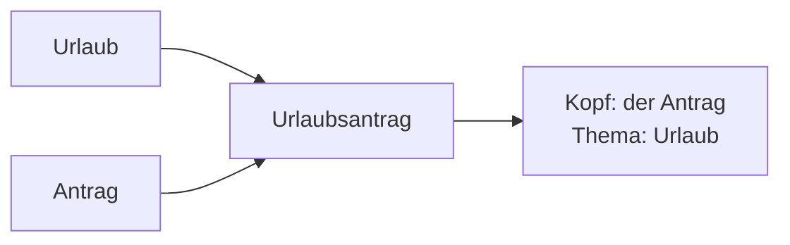

# Phase 6 · Vocabulary — Workplace, HR & Daily Life

> **Level:** C1 · **Focus:** work-time, absence, pay & development, co-determination, HR compounds · **Time:** ~3–4 h this module
> _After this module you can talk about leave, sick notes, overtime, raises and parental leave — the HR German that job ads never teach you._

Your technical German is solid after [Phase 3 · Vocabulary](#/phase-3/vocabulary). What trips up even strong engineers is the **HR and admin layer**: requesting *Urlaub*, filing a *Krankmeldung*, reading a mail from the *Betriebsrat*, or arguing for a *Gehaltserhöhung*. These words are high-frequency, emotionally important, and full of long compounds. This module front-loads the vocabulary you'll actually need in your first months — grouped by real situations, with articles and plurals throughout. Add every card to your [Flashcards](#/@flashcards) as you go.

## Objectives / Lernziele

- Name your **working-time** model: Gleitzeit, Kernzeit, Homeoffice, Überstunden.
- Handle **absence** with the right verbs: Urlaub, Krankmeldung, Elternzeit.
- Discuss **pay & growth**: Gehalt, Gehaltserhöhung, Fortbildung, Feedbackgespräch.
- Decode **co-determination and HR**: Betriebsrat, Personalabteilung, Betriebsvereinbarung.

## 1. Arbeitszeit & Homeoffice — how you work

| Deutsch | Artikel | Plural | English |
|---|---|---|---|
| Gleitzeit | die | — | flextime |
| Kernzeit | die | Kernzeiten | core hours |
| Vertrauensarbeitszeit | die | — | trust-based hours, no clock |
| Homeoffice | das | — | working from home |
| Überstunde | die | Überstunden | overtime hour |

🇩🇪 **Wir haben Gleitzeit, aber die Kernzeit ist von 10 bis 15 Uhr.** — *We have flextime, but core hours are 10–3.*
🇩🇪 **Ich mache heute Homeoffice und habe letzte Woche viele Überstunden gemacht.** Note: *Überstunden* is used mostly in the plural. Overtime is often balanced by *Freizeitausgleich* (time off in lieu) or tracked on a *Gleitzeitkonto*.

## 2. Abwesenheit — when you're not there

The three big absences, each with its ritual verb:

| Deutsch | Artikel | Plural | English | Verb |
|---|---|---|---|---|
| Urlaub | der | Urlaube | (holiday) leave | Urlaub **beantragen / nehmen** |
| Urlaubsantrag | der | Urlaubsanträge | leave request | einen Antrag **stellen** |
| Krankmeldung | die | Krankmeldungen | calling in sick | sich **krankmelden** |
| Krankschreibung | die | Krankschreibungen | doctor's sick certificate | — |
| Elternzeit | die | — | parental leave | Elternzeit **nehmen** |

🇩🇪 **Ich möchte im August zwei Wochen Urlaub nehmen — ich stelle heute den Urlaubsantrag.**
🇩🇪 **Ich bin krank und melde mich krank; die Krankschreibung vom Arzt reiche ich nach.** In Germany you *sich krankmelden* (notify the employer) and submit a *Krankschreibung* (medical certificate). **Elternzeit** can be taken by either parent and protects your job — a normal, respected choice, not a career risk. VI: *Elternzeit* = nghỉ chăm con.

## 3. Geld & Entwicklung — pay and growth

| Deutsch | Artikel | Plural | English |
|---|---|---|---|
| Gehalt | das | Gehälter | salary |
| Gehaltserhöhung | die | Gehaltserhöhungen | pay rise |
| Feedbackgespräch | das | Feedbackgespräche | feedback meeting |
| Mitarbeitergespräch | das | Mitarbeitergespräche | 1:1 / appraisal talk |
| Fortbildung | die | Fortbildungen | professional training |
| Weiterbildung | die | Weiterbildungen | continued education |

🇩🇪 **Im jährlichen Feedbackgespräch möchte ich über eine Gehaltserhöhung sprechen.**
🇩🇪 **Mein Arbeitgeber zahlt eine Fortbildung zu Kubernetes.** *Fortbildung* and *Weiterbildung* overlap; both mean employer-supported learning — a strong benefit worth asking about. A raise is argued with *Argumenten*, calmly and factually (recall **Sachlichkeit** from [Phase 6 · Overview](#/phase-6/overview)).

## 4. Mitbestimmung & Personal — the org around you

| Deutsch | Artikel | Plural | English |
|---|---|---|---|
| Betriebsrat | der | Betriebsräte | works council |
| Personalabteilung | die | Personalabteilungen | HR department |
| Betriebsvereinbarung | die | Betriebsvereinbarungen | works agreement |
| Vorgesetzte | der/die | Vorgesetzten | line manager |
| Probezeit | die | Probezeiten | probation period |

🇩🇪 **Der Betriebsrat hat mit der Geschäftsführung eine Betriebsvereinbarung zum Homeoffice ausgehandelt.** The *Personalabteilung* is often shortened to **HR** even in German firms. During your **Probezeit** (usually six months) notice periods are short on both sides — normal, not ominous.

## 5. Decoding HR Komposita

German bolts nouns together, and HR loves it. Read a compound **right to left** — the last noun is the head; the rest just narrows it.



🇩🇪 **Elternzeit + Antrag → der Elternzeitantrag**; **Gehalt + Verhandlung → die Gehaltsverhandlung**. The gender comes from the **last** word: *der Antrag* → *der Urlaubsantrag*. Break any scary HR word into blocks and it becomes readable — the same Komposita trick from [Phase 1 · Vocabulary](#/phase-1/vocabulary), now on admin nouns.

```audio
Guten Tag, ich hätte eine Frage zu meinem Urlaubsantrag. Außerdem möchte ich im nächsten Mitarbeitergespräch über eine Fortbildung und eine mögliche Gehaltserhöhung sprechen.
```

## 🧾 Zusammenfassung · Summary

Phase 6 vocabulary is the **HR and daily-life layer** on top of your technical German. Describe your working time (**Gleitzeit, Kernzeit, Homeoffice, Überstunden**), manage absence with the right verbs (**Urlaub beantragen, sich krankmelden, Elternzeit nehmen**), discuss growth (**Feedbackgespräch, Gehaltserhöhung, Fortbildung**), and understand the org (**Betriebsrat, Personalabteilung, Betriebsvereinbarung**). Decode long HR compounds right-to-left. Feed every new card into [Flashcards](#/@flashcards) and reuse them live in [Phase 6 · Speaking](#/phase-6/speaking).

## 📇 Vokabel-Checkliste · Vocabulary checklist

| Deutsch | Artikel | Plural | English | VI (if hard) |
|---|---|---|---|---|
| Urlaub | der | Urlaube | (holiday) leave | nghỉ phép |
| Krankmeldung | die | Krankmeldungen | calling in sick / sick note | báo nghỉ ốm |
| Überstunden | die | Überstunden | overtime (usually plural) | giờ làm thêm |
| Feedbackgespräch | das | Feedbackgespräche | feedback meeting | |
| Gehaltserhöhung | die | Gehaltserhöhungen | pay rise | tăng lương |
| Betriebsrat | der | Betriebsräte | works council | |
| Elternzeit | die | — | parental leave | nghỉ chăm con |
| Fortbildung | die | Fortbildungen | professional training | đào tạo nâng cao |
| Homeoffice | das | — | working from home | |

→ Drill these and more in [Flashcards](#/@flashcards).

## 🗣️ Sprechübung · Speaking practice

1. Request leave out loud: *"Ich möchte vom … bis … Urlaub nehmen und stelle den Antrag heute."*
2. Call in sick in one clean sentence, then explain the *Krankschreibung* step.
3. Rehearse a raise opener for a Feedbackgespräch, then read the audio and copy its tone.

```audio
Ich melde mich heute krank und reiche die Krankschreibung morgen nach. Für nächste Woche habe ich schon Urlaub beantragt, das passt hoffentlich.
```

## ❓ Mini-Quiz

1. Which verb goes with *Urlaub* — *stellen* or *beantragen/nehmen*?
2. Give the article + plural of *Gehaltserhöhung*.
3. In *der Elternzeitantrag*, which word decides the gender?

> **Lösungen:** 1) *Urlaub **beantragen / nehmen*** (you *stellen* an *Antrag*) · 2) **die Gehaltserhöhung, die Gehaltserhöhungen** · 3) the last word, *der Antrag*. More in [Quizzes](#/@quiz).

## 📝 Hausaufgabe · Homework

- [ ] Add the **9 checklist words** (plus 6 of your own) to [Flashcards](#/@flashcards) with article + plural.
- [ ] Write a **real Urlaubsantrag** sentence and a **Krankmeldung** message.
- [ ] Break **5 long HR compounds** into blocks and mark the head noun's gender.
- [ ] Draft three points you'd raise in a *Feedbackgespräch*.

## 📚 Empfohlene Ressourcen · Recommended resources

- **Dictionaries:** dict.leo.org and DWDS.de for HR compounds and example sentences.
- **SRS:** [Anki](#/@flashcards) — start a dedicated "Arbeit & HR" deck this week.
- **Reading:** heise.de / t3n.de career pieces on *Gehalt* and *Weiterbildung*.
- **Next:** [Phase 6 · Speaking](#/phase-6/speaking).
