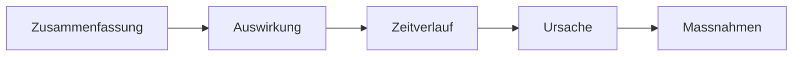

# Phase 6 · Writing — Professional Writing at Work

> **Level:** C1 · **Focus:** status updates, incident postmortem, written feedback, intro & farewell messages · **Time:** ~4 h this module
> _After this module you can write the everyday German that lands in Slack, Confluence and HR inboxes — clear, correct and appropriately toned._

Most of your written German at work is short and high-stakes: a status update your team acts on, a postmortem the whole org reads, written feedback a colleague will remember, a first-day intro that sets your reputation. You learned formal emails and documentation in [Phase 4 · Writing](#/phase-4/writing) and technical writing in [Phase 3 · Writing](#/phase-3/writing); this module drills the **workplace micro-genres** — where getting the structure and tone right matters more than long, elegant sentences.

## Objectives / Lernziele

- Write a crisp async **status update** for chat or a ticket.
- Structure a blameless **incident postmortem** in German.
- Give **written feedback** that is direct but kind.
- Nail your **intro** and **farewell** messages.

## 1. Async status updates

Async writing must be **self-contained** — the reader has no follow-up question ready. Lead with the state, then detail, then the ask.

🇩🇪 **Update Zahlungs-Service: Fix ist deployt und läuft stabil in Prod. Fehlerrate wieder normal. Offen: das Monitoring-Alerting justiere ich morgen. Kein Handeln nötig.** Keep it scannable — one topic, bold the status word if your tool allows. Recall the **TeKaMoLo** mid-field order from [Phase 1 · Grammar](#/phase-1/grammar) so even quick lines read cleanly.

## 2. Incident postmortem — the blameless report

A German postmortem (die *Nachbetrachtung* / *Manöverkritik*, or just "Postmortem") follows a fixed skeleton. Facts, not fault — this is the **Fehlerkultur** from [Phase 6 · Overview](#/phase-6/overview) on paper.

```
## Zusammenfassung
Was ist passiert, in 2 Sätzen.

## Auswirkung
Wer/was war betroffen, wie lange.

## Zeitverlauf
14:12  Alarm ausgelöst
14:20  Ursache eingegrenzt
14:35  Rollback, Dienst stabil

## Ursache
Die eigentliche technische Ursache (Root Cause).

## Maßnahmen
- [ ] Konkrete Aktion, mit Verantwortlichem
```

🇩🇪 **Die Ursache war eine nicht abgefangene Null-Antwort des Caches; ausgelöst durch das Deployment um 14:10.** Note the passive + Nominalstil suit a report. Write in **Konjunktiv I** when relaying what someone reported (from [Phase 6 · Grammar](#/phase-6/grammar)): *"Der Kollege gab an, das Alerting habe nicht ausgelöst."*



## 3. Written feedback

Written feedback outlives the moment, so be **specific, balanced and about behavior**. Use an *Ich-Botschaft* and name the concrete thing:

| Weak | Strong |
|---|---|
| Guter Job. | Dein Refactoring des Auth-Moduls war sehr sauber — besonders die Tests. |
| Das war nicht gut. | Mir ist aufgefallen, dass das Review lange lag; können wir das nächste Mal früher abstimmen? |

🇩🇪 **Danke für deinen Einsatz beim Release! Ein Punkt für nächstes Mal: Lass uns die Doku direkt mitschreiben.** Praise concretely, then one forward-looking *Punkt* — never a pile of criticism.

## 4. Intro & farewell messages

Two rituals you'll write in your first and last weeks:

🇩🇪 **Vorstellung:** *"Hallo zusammen, ich bin Huy, seit heute neu im Backend-Team. Ich komme aus Vietnam und arbeite mit Java und Spring. Ich freue mich auf die Zusammenarbeit — sprecht mich gern jederzeit an!"*

🇩🇪 **Abschied:** *"Liebe Kolleginnen und Kollegen, heute ist mein letzter Tag. Danke für die schöne Zeit und die Unterstützung. Ihr erreicht mich weiterhin unter … Alles Gute!"*

Warm, short, and in the team's register (usually *du*). A good intro invites contact; a good farewell thanks people and leaves a door open.

```audio
Hallo zusammen, ich bin ab heute neu im Team und freue mich sehr auf die Zusammenarbeit. Bei Fragen zu meinen Themen meldet euch jederzeit — ich bin per du.
```

## 🧾 Zusammenfassung · Summary

Workplace writing rewards **structure and tone** over long sentences. Make status updates **self-contained** (state → detail → ask); write postmortems on the fixed **Zusammenfassung → Auswirkung → Zeitverlauf → Ursache → Maßnahmen** skeleton, blameless and in Konjunktiv I where you relay reports; give **written feedback** that is specific, balanced and behavior-focused; and keep **intro/farewell** messages warm and short in the team's register. It all builds on [Phase 3](#/phase-3/writing) and [Phase 4 · Writing](#/phase-4/writing).

## 📇 Vokabel-Checkliste · Vocabulary checklist

| Deutsch | Artikel | Plural | English | VI (if hard) |
|---|---|---|---|---|
| Statusbericht | der | Statusberichte | status report | báo cáo tiến độ |
| Zeitverlauf | der | Zeitverläufe | timeline | dòng thời gian |
| Auswirkung | die | Auswirkungen | impact / effect | tác động |
| Ursache | die | Ursachen | (root) cause | nguyên nhân |
| Maßnahme | die | Maßnahmen | action item / measure | biện pháp |
| Verantwortliche | der/die | Verantwortlichen | owner / person responsible | |

→ Drill these and more in [Flashcards](#/@flashcards).

## 🗣️ Sprechübung · Speaking practice

1. Read your written status update aloud — if it needs a follow-up question, rewrite it.
2. Present your postmortem's **Zeitverlauf** and **Maßnahmen** out loud in 30 seconds.
3. Say your **intro message** naturally, then shadow the audio for warmth and tempo.

```audio
Kurzer Statusbericht: Der Fix ist live, die Fehlerrate ist normal, offene Punkte gibt es keine. Das Postmortem schreibe ich bis morgen, die Maßnahmen ordne ich den jeweiligen Kollegen zu.
```

## ❓ Mini-Quiz

1. Name the five sections of the postmortem skeleton, in order.
2. Rewrite "Gute Arbeit" as **specific** written praise.
3. Which mood relays what a colleague reported in a postmortem?

> **Lösungen:** 1) Zusammenfassung → Auswirkung → Zeitverlauf → Ursache → Maßnahmen · 2) e.g. *"Dein Refactoring des Auth-Moduls war sehr sauber, besonders die Tests."* · 3) **Konjunktiv I** (*"…, das Alerting habe nicht ausgelöst"*). More in [Quizzes](#/@quiz).

## 📝 Hausaufgabe · Homework

- [ ] Write **3 self-contained status updates** (deploy, blocker, done).
- [ ] Write a full **postmortem** for a real or imagined incident on the skeleton.
- [ ] Draft **two feedback notes** (one praise, one improvement) as Ich-Botschaften.
- [ ] Write your **intro** and a **farewell** message in your team's register.

## 📚 Empfohlene Ressourcen · Recommended resources

- **Formal register:** revisit [Phase 4 · Writing](#/phase-4/writing) for emails and documentation.
- **Style & correction:** DWDS.de, Duden.de; deutsch.lingolia.com on Passiv/Nominalstil.
- **Real models:** German engineering blogs on heise.de, t3n.de, Informatik Aktuell.
- **Next:** [Phase 6 · Plan](#/phase-6/plan).
