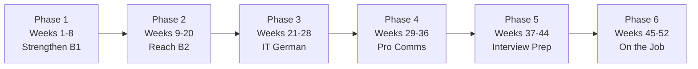

# 52-Week Study Plan · B1 → B2/C1

> **Level:** All · **Focus:** a week-by-week path from B1 to job-ready C1 for a backend engineer · **Time:** ~2.5 h/day
> _After this page you have a concrete plan for every one of the next 52 weeks — what to study, what to say, and the exact can-do outcome to hit._

You are a **Vietnamese backend Java developer** at **B1**, aiming to work as a Software
Engineer in Germany **entirely in German**. Twelve months, six phases, ~2.5 h/day. This plan
turns the [Roadmap Overview](#/roadmap-overview) into **52 checkable weeks**, each with a
single measurable **Ergebnis** (outcome). It weights **speaking + listening** — the skills
that standups, reviews and interviews actually test — while carrying grammar, vocab, reading
and writing alongside. Nothing here is filler: every cell is one week's real work.

## How to use this plan

- **Follow the weekly rows in order.** Each row = one week. Do a little of every column daily
  rather than one column per day — languages reward frequency over cramming.
- **Budget ~2.5 h/day** using the morning/afternoon/evening split from the
  [Roadmap Overview](#/roadmap-overview) (30 min SRS + grammar / 30 min listening / 1–2 h deep
  work). That is the **~17 h/week** shown in the **Std** column.
- **Track every week** in the [Weekly Checklist](#/@checklist), drill vocab in
  [Flashcards](#/@flashcards), and check grammar in [Quizzes](#/@quiz).
- **Open each phase** as you reach it: [Phase 1](#/phase-1/overview) ·
  [Phase 2](#/phase-2/overview) · [Phase 3](#/phase-3/overview) · [Phase 4](#/phase-4/overview)
  · [Phase 5](#/phase-5/overview) · [Phase 6](#/phase-6/overview). The table cells link
  straight to the relevant module.
- **Four milestone mocks** anchor the year: **Week 8** (Phase 1 self-check), **Week 20**
  (telc B2), **Week 44** (full job interview), **Week 51** (Goethe C1). Book them now.
- **Keep an error log.** One line per recurring mistake; review it every Sunday. Progress
  comes from fixing the same 20 errors, not from new rules.



> **How to read the table.** **Std** = target hours *that week* (~17). **Ergebnis** = the one
> thing you can newly *do* by Sunday. If you can't do the Ergebnis, repeat the week before
> moving on — the plan is a spine, not a race.

---

## 📚 Was es zusätzlich gibt — und wann du es benutzt

Die Wochentabellen unten sind das **Gerüst**. Diese Materialien laufen **parallel** dazu und
sind der Teil, in dem tatsächlich geübt wird — nicht nur gelesen.

| Material | Was es ist | Wann |
|---|---|---|
| **Übungsteile** — [P1](#/phase-1/grammar-uebungen) · [P2](#/phase-2/grammar-uebungen) · [P3](#/phase-3/grammar-uebungen) · [P4](#/phase-4/grammar-uebungen) · [P5](#/phase-5/grammar-uebungen) · [P6](#/phase-6/grammar-uebungen) | 36 Workbooks für alle sechs Phasen, **über 1.400 Aufgaben mit Sofortkorrektur**: anklicken, *Prüfen*, Begründung lesen | jede Woche, direkt nach dem Grammatik-/Wortschatzblock |
| **Alltag** — [Café](#/alltag/cafe-baeckerei) · [Mittagspause](#/alltag/mittagspause) · [Kaffeeküche](#/alltag/kaffeekueche) · [Feierabend](#/alltag/feierabend) | Small Talk, Modalpartikeln, Team-Abend | **Wochen 1–8**, je ein Modul pro Woche |
| **Alltag · Behörden & Leben** — [Wohnung](#/alltag/wohnungsbesichtigung) · [Anmeldung](#/alltag/anmeldung) · [Arzt](#/alltag/beim-arzt) · [Supermarkt](#/alltag/supermarkt-pfand) · [Bahn](#/alltag/bahn-verspaetung) · [Telefon](#/alltag/telefon-bank-vertrag) | die Situationen, in denen Fehler Geld kosten | **Wochen 9–16**, oder sofort bei echtem Bedarf |
| **Hörtexte im Modul** — [P1](#/phase-1/listening-uebungen) · [P3](#/phase-3/listening-uebungen) · [P5](#/phase-5/listening-uebungen) · [P6](#/phase-6/listening-uebungen) | 27 Hörtexte mit verstecktem Transkript, Diktate, Shadowing | statt „irgendwas hören": 2× pro Woche intensiv |
| **Prüfungsvorbereitung** — [Überblick](#/exams/overview) · [Lesen](#/exams/telc-b2-lesen-sprachbausteine) · [Hören](#/exams/telc-b2-hoeren) · [Schreiben](#/exams/telc-b2-schreiben) · [Sprechen](#/exams/telc-b2-sprechen) | telc-B2-Format, Strategie, interaktive Drills | **Wochen 13–20** — Termin schon in Woche 12 buchen |
| **[Prüfungs-Redemittel](#/exams/pruefungs-redemittel)** | 120+ feste Sätze + Abruftraining | **täglich 10 Minuten** ab Woche 13 |
| **Goethe C1** — [Lesen & Hören](#/exams/goethe-c1-lesen-hoeren) · [Schreiben](#/exams/goethe-c1-schreiben) · [Sprechen](#/exams/goethe-c1-sprechen) | vier einzeln bestehbare Module, Strategie und Musterlösungen | **Wochen 45–51** — Termin in Woche 44 buchen |
| **Vorlagen** — [E-Mail](#/templates/emails) · [Ticket](#/templates/tickets) · [PR](#/templates/pull-requests) · [Protokoll & Incident](#/templates/protokoll-incident) | fertige Textbausteine für den Arbeitsalltag | **ab Woche 29**, sobald du auf Deutsch schreibst |
| **Bewerbung** — [Prozess](#/bewerbung/prozess) · [Lebenslauf](#/bewerbung/lebenslauf) · [Anschreiben](#/bewerbung/anschreiben) · [E-Mails](#/bewerbung/mails) · [LinkedIn & Xing](#/bewerbung/linkedin-xing) | das komplette Bewerbungspaket auf Deutsch | **Wochen 37–44**, parallel zur Interviewvorbereitung |
| **Interview-Banken** — [Backend](#/interviews/backend) · [DevOps](#/interviews/devops) · [Spring](#/interviews/spring-microservices) · [HR & Behavioral](#/interviews/hr-behavioral) · [System Design](#/interviews/system-design) · [Live-Coding](#/interviews/live-coding) · [Gehalt & Vertrag](#/interviews/gehalt-vertrag) | sieben Q&A-Banken mit Musterantworten | **Wochen 37–44**, eine pro Woche |
| **Bürodialoge** — [Onboarding](#/dialogues/onboarding) · [Krankmeldung](#/dialogues/krankmeldung) · [Standup](#/dialogues/standup) · [Pair Programming](#/dialogues/pair-programming) | echte Arbeitssituationen mit Redemitteln | passend zur Woche, siehe Tabellen unten |
| **Bewertete Prüfungen** — [Phase 1](#/phase-1/assessment) (100 P.) · [Phase 2](#/phase-2/assessment) (telc-Modelltest) · [Phase 5](#/phase-5/assessment) · [Phase 6](#/phase-6/assessment) | mit Punkteschema und **Fehler → Modul**-Tabelle | **Wochen 8, 20, 44 und 52** |

> **Die wichtigste Änderung gegenüber dem ursprünglichen Plan:** Grammatik „durchnehmen" reicht
> nicht. Nach jedem Grammatikblock gehört der passende **Übungsteil** — dort bekommst du sofort
> gesagt, ob du es kannst, und warum die Antwort so lautet. Ohne diesen Schritt merkst du erst
> im Mock, dass etwas fehlt.

---

## Phase 1 — Weeks 1–8 · Strengthen B1 (B1 → B1+)

Goal: fix the word order, cases, Perfekt and modal verbs that carry 80% of B1, and survive a
slow standup. All grammar links go to [Phase 1 · Grammar](#/phase-1/grammar), vocab to
[Phase 1 · Vocabulary](#/phase-1/vocabulary).

| Woche | Grammatik | Vokabeln & IT | Hören/Sprechen | Lesen/Schreiben | Projekt/Mock | Std | Ergebnis |
|---|---|---|---|---|---|---|---|
| 1 | Wortstellung: Verb-2 + Nebensatz + TeKaMoLo · [Grammar](#/phase-1/grammar) | 40 core dev nouns with der/die/das + Plural · [Vocabulary](#/phase-1/vocabulary) | Easy German slow clips; 3-min daily self-intro recording | Read a short Lebenslauf; write 8 sentences about your project | Self-intro: "Ich bin Backend-Entwickler…" 60 s | 17 | Introduce yourself and your stack in correct word order |
| 2 | Die 4 Fälle + Artikeltabelle; Dativ-Verben | 40 nouns: der Server, die Datenbank, der Dienst… | Shadow Easy German; describe your desk and tools (Wo? → Dativ) | Label the case of every noun in 5 own sentences | Mini-standup "gestern/heute" in 3 sentences | 17 | Use Nom/Akk/Dativ correctly when talking about tools and tasks |
| 3 | Präpositionen: Akk/Dat/Wechsel; Bewegung vs. Ort | Motion verbs: pushen, ziehen, verschieben, ablegen | Slow German (Annik Rubens) 1 episode; narrate a git flow | Read a README intro; write "wo Code liegt vs. wohin er geht" | Explain a git push/pull flow aloud | 17 | Pick the right case after prepositions in a workflow |
| 4 | Perfekt: haben/sein + Partizip II | 40 verbs as participles: deployt, behoben, getestet | Coffee Break German; say your whole "gestern" in Perfekt | Write a 5-line "Was ich gestern gemacht habe" | Standup "gestern" part fully in Perfekt | 17 | Report what you did yesterday accurately in Perfekt |
| 5 | Modalverben: können, müssen, sollen, wollen, dürfen, möchten | Task/priority vocab: die Aufgabe, die Frist, die Priorität | Easy German (work topics); polite asks with "könntest du…?" | Write today's plan using 6 modal verbs | Standup "heute + Blocker" with modals | 17 | State plans, obligations and polite requests with modals |
| 6 | Trennbare Verben + Negation nicht/kein | Agile & standup phrases: der Blocker, das Ticket, das Daily | Listen to the [standup dialogue](#/dialogues/standup); role-play both roles | Write your 3-part standup script | Deliver a full slow standup: gestern/heute/Blocker | 17 | Give a complete slow standup including a blocker |
| 7 | W-Fragen + Satzverbindung und/aber/weil/dass | Review all 200 nouns via [Flashcards](#/@flashcards); recall ≥90% | [Phase 1 · Listening](#/phase-1/listening); ask and answer 10 work questions | [Phase 1 · Writing](#/phase-1/writing): short email to a colleague | Q&A ping-pong with a partner or the TTS | 17 | Ask and answer everyday work questions without freezing |
| 8 | Phase 1 grammar review + start an error log | Gap-fill weak words; clean up your personal IT deck | [Phase 1 · Speaking](#/phase-1/speaking): 5-min monologue about your work | [Phase 1 · Assessment](#/phase-1/assessment) writing task | Mock A: self-intro + slow standup + 5 Q&A, self-graded | 16 | Pass the Phase 1 self-check; solid B1+ foundation |


> **Parallel in Phase 1 (Wochen 1–8):** nach jedem Grammatikblock den
> [Grammar-Übungsteil](#/phase-1/grammar-uebungen) (69 Aufgaben), dazu
> [Vocabulary](#/phase-1/vocabulary-uebungen) · [Speaking](#/phase-1/speaking-uebungen) ·
> [Listening](#/phase-1/listening-uebungen) · [Reading](#/phase-1/reading-uebungen) ·
> [Writing](#/phase-1/writing-uebungen). Je eine Woche ein **Alltag**-Modul:
> [Café](#/alltag/cafe-baeckerei), [Mittagspause](#/alltag/mittagspause),
> [Kaffeeküche](#/alltag/kaffeekueche), [Feierabend](#/alltag/feierabend). Woche 1 zusätzlich:
> [Dialogue · Onboarding](#/dialogues/onboarding) und [Krankmeldung & Urlaub](#/dialogues/krankmeldung).

---

## Phase 2 — Weeks 9–20 · Reach B2 (B1+ → B2)

The longest phase: the grammar that separates B1 from B2 (Präteritum, Konjunktiv II, Passiv,
connectors, relative clauses) plus argumentation, ending in a full **telc B2** mock. Grammar
links go to [Phase 2 · Grammar](#/phase-2/grammar).

| Woche | Grammatik | Vokabeln & IT | Hören/Sprechen | Lesen/Schreiben | Projekt/Mock | Std | Ergebnis |
|---|---|---|---|---|---|---|---|
| 9 | Präteritum: war/hatte/konnte + regular & irregular · [Grammar](#/phase-2/grammar) | Incident & report verbs; news vocabulary | DW *Langsam gesprochene Nachrichten*; retell one item | Read a short heise news item; write a 6-line recap in Präteritum | Tell a past-project story | 17 | Narrate past events in written Präteritum |
| 10 | Konjunktiv II: würde/hätte/könnte/wäre | Hedging & politeness phrases; die Bitte, der Vorschlag | Easy German; make polite suggestions meeting-style | Rewrite 10 blunt sentences as polite ones | Write diplomatic PR-review comments | 17 | Soften requests and pose hypotheticals with Konjunktiv II |
| 11 | Vorgangspassiv: werden + Partizip II (all tenses) | Process & pipeline vocab: der Ablauf, der Schritt | Describe your CI pipeline in the passive, aloud | Read passive-heavy tool docs; write deployment steps passively | Explain "how a release is built" in passive | 17 | Describe automated processes in the passive voice |
| 12 | Zustandspassiv + Passiv mit Modalverb; man-Alternative | Config & state vocab: aktiviert, deaktiviert, gesperrt | Describe system states: "Der Dienst ist deaktiviert" | Write a runbook step: "muss neu gestartet werden" | State-of-system status update | 17 | Express states and obligations passively; swap man/Passiv |
| 13 | Zweiteilige Konnektoren: je…desto, zwar…aber, entweder…oder, weder…noch | Comparison & trade-off vocab: der Vorteil, der Nachteil | Argue a tech trade-off aloud for 2 min | Write a pros/cons paragraph | Kafka vs. RabbitMQ: 2-min opinion | 17 | Link ideas and weigh trade-offs with two-part connectors |
| 14 | Relativsätze: all cases + prepositional + Genitiv | Definition vocabulary; der Begriff, die Bedeutung | Define IT terms aloud with relative clauses | Write 8 definitions: "Ein Cache ist ein Speicher, der…" | Build a glossary of 10 stack terms | 17 | Define and describe things precisely with relative clauses |
| 15 | Adjektivdeklination: definite / indefinite / no article | Quality attributes: skalierbar, robust, wartbar, ausfallsicher | Describe good vs. bad code aloud | Write a quality paragraph with rich adjectives | Describe your ideal architecture | 17 | Add correct adjective endings under time pressure |
| 16 | Verben mit fester Präposition + da-/wo-Komposita | Collaboration verbs: warten auf, sich kümmern um, achten auf | Discuss dependencies: "Ich warte auf das Review" | Write 12 fixed-preposition sentences | Dependency-status monologue | 17 | Use verb+preposition combos and da-/wo- compounds naturally |
| 17 | Genitiv (wegen/während/trotz) + n-Deklination + Nominalstil | Formal & report vocabulary | DW *Top-Thema*; retell it in a formal register | Rewrite verbal → nominal style for a report | One-paragraph formal status report | 17 | Produce formal written German with Genitiv and nominal style |
| 18 | Meinungsstrukturen: "Ich bin der Meinung, dass…", "es sei denn" | Redemittel für Diskussion und Widerspruch | [Phase 2 · Speaking](#/phase-2/speaking): a structured debate | Write a 150-word Stellungnahme | 3-min stance: "Remote vs. Büro" | 17 | Defend a position with structured arguments at B2 |
| 19 | Sprachbausteine: exam grammar review | Exam collocations; keyword transformation | [Phase 2 · Listening](#/phase-2/listening): telc B2 Hörteil, timed | [Phase 2 · Reading](#/phase-2/reading): telc B2 Leseteil, timed | telc B2 Lesen + Sprachbausteine section | 18 | Handle telc B2 reading and listening within exam time |
| 20 | Fix top error patterns from the mock | Consolidate weak vocabulary | telc B2 paired oral: present, discuss, plan together | telc B2 Schreiben (formal email / Beschwerde), 30 min | Full telc B2 mock, self-scored; [Phase 2 · Assessment](#/phase-2/assessment) | 18 | Score B2 on a full telc mock — B2 reached |


> **Parallel in Phase 2 (Wochen 9–20):** die sechs
> [Phase-2-Übungsteile](#/phase-2/grammar-uebungen) — Konjunktiv II, Passiv, Relativsätze,
> Konnektoren, n-Deklination, insgesamt 292 Aufgaben mit Sofortkorrektur.
> **Ab Woche 13** die Prüfungsmodule: [Überblick](#/exams/overview),
> [Lesen & Sprachbausteine](#/exams/telc-b2-lesen-sprachbausteine),
> [Hören](#/exams/telc-b2-hoeren), [Schreiben](#/exams/telc-b2-schreiben),
> [Sprechen](#/exams/telc-b2-sprechen) — und täglich zehn Minuten
> [Prüfungs-Redemittel](#/exams/pruefungs-redemittel).
> **Behörden-Alltag** (Wohnung, Anmeldung, Arzt, Bahn, Bank) passt in die Wochen 9–16.
> Woche 20 = [telc-B2-Modelltest](#/phase-2/assessment), 2 Stunden, 100 Punkte.

---

## Phase 3 — Weeks 21–28 · German for Software Engineers (B2)

Now the German becomes technical: read real docs, use precise IT vocabulary, and explain your
architecture auf Deutsch. Vocab links go to [Phase 3 · Vocabulary](#/phase-3/vocabulary).

| Woche | Grammatik | Vokabeln & IT | Hören/Sprechen | Lesen/Schreiben | Projekt/Mock | Std | Ergebnis |
|---|---|---|---|---|---|---|---|
| 21 | Komposita bilden + Fugen-s: die Datenbankverbindung | 60 architecture terms · [Vocabulary](#/phase-3/vocabulary) | programmier.bar segment; summarize it in 5 sentences | Read a German system overview; write a component list | Describe your system's building blocks | 17 | Name architecture components with correct compounds |
| 22 | Passiv + Nominalstil as they appear in docs | Doc verbs: konfigurieren, bereitstellen, einbinden | Engineering Kiosk episode; note 10 new terms | [Phase 3 · Reading](#/phase-3/reading): a real heise/Golem article, summarized | 5-bullet summary of a German tool doc | 17 | Read German docs and tech news and extract key points |
| 23 | Kausal- & Konsekutivsätze: sodass, deshalb, daher | API & microservice vocab: die Schnittstelle, der Endpunkt | [Phase 3 · Speaking](#/phase-3/speaking): explain a request flow | Write an API description | Whiteboard your microservice flow auf Deutsch | 17 | Explain a REST/microservice flow end to end |
| 24 | Vergleich & Steigerung: schneller als, am schnellsten | DB vocab: die Abfrage, der Index, die Transaktion, die Sperre | Discuss "SQL oder NoSQL?" and justify a choice | Write a query explanation + schema notes | Explain a slow-query fix | 17 | Talk about databases, queries and performance in German |
| 25 | Temporalsätze: bevor, nachdem, sobald, während | Pipeline/container vocab: der Behälter, die Orchestrierung | [Phase 3 · Listening](#/phase-3/listening): a heise show segment | Write your deployment pipeline steps | Narrate a deploy from commit to prod | 17 | Describe CI/CD and container workflows with time clauses |
| 26 | Berichten + indirekte Rede (Konjunktiv I preview) | Error & log vocab: die Ausnahme, der Absturz, das Protokoll | Describe a past outage aloud | [Phase 3 · Writing](#/phase-3/writing): write a bug report | Root-cause mini-postmortem, spoken | 17 | Report a bug or incident with cause and fix clearly |
| 27 | Höfliche Kritik & Vorschläge (Konjunktiv II applied) | Review vocab: die Änderung, die Anmerkung, die Konvention | Role-play a code-review discussion | Write a PR description + 6 review comments | Give a full review, spoken and written | 17 | Write PR text and give diplomatic review feedback |
| 28 | Presentation connectors + phase consolidation | Presentation vocab; grow personal IT deck to 300+ | Deliver a 6-min architecture talk | Write slide notes / a one-pager | Architecture presentation + Q&A; [Phase 3 · Assessment](#/phase-3/assessment) | 17 | Present your architecture auf Deutsch and field questions |

---

## Phase 4 — Weeks 29–36 · Professional Communication (B2 → C1)

The workplace-writing and meeting phase: emails, tickets, meetings, presentations, feedback,
calls. Module links go to [Phase 4](#/phase-4/overview).

| Woche | Grammatik | Vokabeln & IT | Hören/Sprechen | Lesen/Schreiben | Projekt/Mock | Std | Ergebnis |
|---|---|---|---|---|---|---|---|
| 29 | Formal register: höfliche Floskeln + indirekte Fragen | Email phrases: die Anrede, die Grußformel, das Anliegen | Dictate an email aloud, then compare | [Phase 4 · Writing](#/phase-4/writing): write 3 formal Sie-emails | Reply to a tricky stakeholder email | 17 | Write clear, correctly-registered formal emails |
| 30 | Imperativ + Infinitiv mit um…zu for instructions | Ticket vocab: die Anforderung, das Akzeptanzkriterium, der Aufwand | Refine a ticket in a mock grooming call | Write 3 Jira tickets + acceptance criteria | Write a concise RFC/Konzept section | 17 | Write actionable tickets and short docs in German |
| 31 | Moderationssprache: Redeübergaben, Rückfragen | Meeting vocab: die Tagesordnung, das Protokoll, der Beschluss | [Phase 4 · Listening](#/phase-4/listening): follow a fast meeting | Write an agenda + minutes (Protokoll) | Moderate a 10-min mock meeting | 17 | Chair and contribute to a meeting; write the Protokoll |
| 32 | Signposting, Betonung, rhetorical structures | Presentation Redemittel; der Überblick, das Fazit | [Phase 4 · Speaking](#/phase-4/speaking): deliver a talk with slides | Write speaker notes + a handout | 8-min tech talk + handle 3 questions | 17 | Give a structured technical presentation with clear signposting |
| 33 | Ich-Botschaften + Konjunktiv II for soft feedback | Feedback vocab: das Lob, die Kritik, die Verbesserung | Role-play a 1:1 feedback conversation | Write a balanced written feedback note | Give and receive feedback in a mock 1:1 | 17 | Deliver and take feedback constructively in German |
| 34 | Umgangssprache + Partikeln: halt, doch, mal, eh | Küchen- & Kaffee small-talk topics | Easy German street interviews; mirror the small talk | Write a casual Slack/Teams thread | 5-min coffee-kitchen small talk | 17 | Handle informal workplace small talk and particles |
| 35 | Telefon-Redemittel + Rückfragen bei schlechtem Ton | On-call vocab: der Bereitschaftsdienst, die Störung, die Eskalation | Simulate an incident call | Write an incident status update + handover | Lead a mock on-call bridge call | 17 | Communicate clearly on calls, incidents and handovers |
| 36 | Consolidation of professional registers | Review the pro-comms deck | Run a full mock meeting end to end | Write the follow-up report + emails | Meeting + Protokoll + report bundle; [Phase 4 · Assessment](#/phase-4/assessment) | 17 | Run a meeting and document it end to end at near-C1 |

---

## Phase 5 — Weeks 37–44 · Job Interview Preparation (C1)

Everything that stands between you and an offer: application docs, HR and technical rounds,
system design, negotiation. Uses [Phase 5](#/phase-5/overview) and the
[interview Q&A](#/interviews/backend) library.

| Woche | Grammatik | Vokabeln & IT | Hören/Sprechen | Lesen/Schreiben | Projekt/Mock | Std | Ergebnis |
|---|---|---|---|---|---|---|---|
| 37 | C1 formal written style; Nominalstil, precise verbs | Application vocab: die Stellenanzeige, das Anschreiben, die Qualifikation | Read your CV aloud, fluently | [Phase 5 · Writing](#/phase-5/writing): write a German Lebenslauf + Anschreiben | Tailor the CV to a real Stellenanzeige | 17 | Have a polished German CV and cover letter |
| 38 [^iv] | Fluent self-narrative + motivation phrasing | HR vocab: der Werdegang, die Stärke, die Schwäche | [Phase 5 · Speaking](#/phase-5/speaking): a 2-min self-presentation | Write answers to 10 HR questions | HR screening role-play | 17 | Deliver a compelling 2-min self-presentation |
| 39 | Past narration mix (Perfekt/Präteritum) + result framing | Behavioral vocab: die Herausforderung, der Konflikt, das Ergebnis | Answer 8 behavioral questions using STAR | Write 5 STAR stories | Behavioral round role-play | 17 | Answer behavioral questions with clear STAR structure |
| 40 | Thinking-aloud connectors + hypotheticals | Algorithm vocab: die Laufzeit, die Komplexität, der Ansatz | Solve a coding task talking through it in German | [interview Q&A](#/interviews/backend): study + write model answers | Live-coding narration in German | 18 | Narrate your problem-solving live in German |
| 41 | Structuring long turns + trade-off language (Phase 2 recap) | Scaling vocab: die Lastverteilung, die Ausfallsicherheit, der Durchsatz | [Phase 5 · Listening](#/phase-5/listening): a design discussion | Write a design one-pager | 25-min system-design mock: "Design a URL shortener" | 18 | Run a system-design discussion and justify trade-offs |
| 42 | Negotiation Konjunktiv II + diplomatic firmness | Comp vocab: das Gehalt, die Zusatzleistungen, der Spielraum | Role-play a salary conversation | Write a counter-offer email | Negotiation role-play with pushback | 17 | Negotiate salary and benefits diplomatically |
| 43 | Sharp questions + polite probing | Culture vocab: die Arbeitsweise, die Teamkultur, die Erwartung | Ask 12 smart reverse-interview questions | Write a post-interview thank-you email | Reverse-interview the "hiring manager" | 17 | Ask sharp questions and signal culture fit |
| 44 | Fix residual interview error patterns | Consolidate the interview deck | Full HR + technical mock, recorded | Self-review the transcript + action list | Full mock interview: HR + tech + design; [Phase 5 · Assessment](#/phase-5/assessment) | 18 | Pass an end-to-end German interview simulation |

---

> [^iv]: Ab Woche 38 gehört pro Woche eine **Interview-Bank** dazu:
> [HR & Behavioral](#/interviews/hr-behavioral), [System Design](#/interviews/system-design),
> [Live-Coding](#/interviews/live-coding) und [Gehalt & Vertrag](#/interviews/gehalt-vertrag) —
> dazu das [Bewerbungspaket](#/bewerbung/prozess) für Lebenslauf, Anschreiben und die E-Mails.

## Phase 6 — Weeks 45–52 · Working in a German IT Company (C1)

The last stretch makes German your default working language: real-speed dailies, review
debates, incidents, ceremonies, culture — capped by a **Goethe C1** mock. Module links go to
[Phase 6](#/phase-6/overview).

| Woche | Grammatik | Vokabeln & IT | Hören/Sprechen | Lesen/Schreiben | Projekt/Mock | Std | Ergebnis |
|---|---|---|---|---|---|---|---|
| 45 | Fluent spontaneous speech + natural fillers | Agile daily vocab · [standup dialogue](#/dialogues/standup) | [Phase 6 · Speaking](#/phase-6/speaking): a real-speed daily | Write an async standup, Slack-style | Give a real-speed standup + react to updates | 17 | Keep up in a full-speed daily and contribute spontaneously |
| 46 | Defending and conceding a point live | Review + design vocab recap | [Phase 6 · Listening](#/phase-6/listening): a review discussion | Write a nuanced review thread | Live-defend a PR under critique | 17 | Discuss and defend code decisions in real time |
| 47 | Concise imperative + status updates under pressure | Incident vocab: die Störung, der Schweregrad, die Eskalation | Simulate a Sev-1 bridge call | [Phase 6 · Writing](#/phase-6/writing): a postmortem + Zeitleiste | Lead an incident and write the postmortem | 17 | Coordinate an incident and document a postmortem |
| 48 | Estimation + facilitation language | Agile vocab: die Schätzung, der Aufwand, die Retrospektive | Participate in a planning + retro | Write retro notes + action items | Facilitate a retro | 17 | Contribute meaningfully to planning and retrospectives |
| 49 | Register-switching dev↔business + Nominalstil recap | Stakeholder vocab: der Fachbereich, die Abstimmung, die Priorisierung | Explain tech to non-tech stakeholders | Write a stakeholder update | Align with a "product" stakeholder | 17 | Translate between technical and business audiences |
| 50 | Diplomatic conflict language + de-escalation | Culture vocab: die Fehlerkultur, die Pünktlichkeit, die Verbindlichkeit | Role-play resolving a disagreement | Write a considerate conflict email | Resolve a team-conflict scenario | 17 | Navigate conflict and German work culture confidently |
| 51 [^c1] | C1 exam grammar review | Exam collocations | Goethe C1 Sprechen: paired presentation + discussion | Goethe C1 Lesen / Hören / Schreiben, timed | Full Goethe C1 mock, ≥60/100 per module | 18 | Score C1 on a full Goethe mock |
| 52 | Error log → personal maintenance rules | Finalize the master deck; set a maintenance SRS | [Phase 6 · Speaking](#/phase-6/speaking): a 10-min free talk | [Phase 6 · Assessment](#/phase-6/assessment): final writing task | Capstone: a full working-day simulation in German | 16 | Operate a full German workday; set an ongoing maintenance plan |

> [^c1]: Für Woche 51 stehen die drei C1-Module bereit:
> [Lesen & Hören](#/exams/goethe-c1-lesen-hoeren), [Schreiben](#/exams/goethe-c1-schreiben) und
> [Sprechen](#/exams/goethe-c1-sprechen). Denk daran: Die vier Goethe-Module sind **einzeln**
> bestehbar und einzeln wiederholbar — bereite alle vor, optimiere aber das schwächste.

---

## 🧾 Zusammenfassung · Summary

This plan sequences **52 weeks** across the six roadmap phases: **Weeks 1–8** rebuild the B1
core (word order, cases, Perfekt, modals) up to a slow standup; **Weeks 9–20** climb to **B2**
(Präteritum, Konjunktiv II, Passiv, connectors, relative clauses) and end in a **telc B2**
mock; **Weeks 21–28** turn German technical (docs, IT vocab, architecture talks); **Weeks
29–36** cover professional communication (emails, tickets, meetings, feedback); **Weeks
37–44** drill the full **job interview** (HR, technical, system design, negotiation) to a
final mock; **Weeks 45–52** make German your working default and finish with a **Goethe C1**
mock. Roughly **17 h/week ≈ 850 h/year** — the budget the [Roadmap Overview](#/roadmap-overview)
shows is enough to move B1 → C1. Hit each week's single **Ergebnis**, log your errors, and
review every Sunday. Track it all in the [Weekly Checklist](#/@checklist).

## 📇 Vokabel-Checkliste · Vocabulary checklist

| Deutsch | Artikel | Plural | English | VI (if hard) |
|---|---|---|---|---|
| Wochenplan | der | Wochenpläne | weekly plan | |
| Wiederholung | die | Wiederholungen | review / repetition | sự ôn tập |
| Meilenstein | der | Meilensteine | milestone | cột mốc |
| Lernziel | das | Lernziele | learning objective | |
| Fortschritt | der | Fortschritte | progress | |
| Gewohnheit | die | Gewohnheiten | habit | thói quen |
| Prüfung | die | Prüfungen | exam | |
| Wortschatz | der | Wortschätze | vocabulary | vốn từ |
| Ergebnis | das | Ergebnisse | result / outcome | |

→ Drill these and your IT deck in [Flashcards](#/@flashcards).

## 🗣️ Sprechübung · Speaking practice

1. **Read your plan aloud.** Say this week's Ergebnis as a goal: *"Diese Woche kann ich einen
   Standup auf Deutsch halten."* (*This week I can give a standup in German.*)
2. **Plan in German.** Describe your day using the time budget: *"Morgens wiederhole ich
   Vokabeln, abends übe ich Sprechen."*
3. **Report progress.** Every Sunday, record a 2-min review: *"Mein Meilenstein diese Woche
   war…, nächste Woche will ich…"*. Compare with the 🔊 below.

```audio
Mein Ziel ist ein Job als Softwareentwickler in Deutschland. Jede Woche habe ich einen Meilenstein. Morgens wiederhole ich Vokabeln, mittags höre ich einen Podcast, und abends übe ich Sprechen und Schreiben. Am Sonntag prüfe ich meinen Fortschritt.
```

## ❓ Mini-Quiz

1. In which week do you sit the **telc B2** mock?
2. Which phase and week covers the **system-design interview**?
3. What is the plural of **der Meilenstein**?
4. True or false: the **Std** column means *daily* hours.
5. Polite request form of **können** in Konjunktiv II?

> **Lösungen:** 1) **Week 20** (Phase 2 finale). · 2) **Phase 5, Week 41** ("Design a URL
> shortener"). · 3) **die Meilensteine**. · 4) **False** — Std is *weekly* hours (~17). ·
> 5) **könnten** — *"Könnten Sie…?"* / *"Könntest du…?"*. More checks in [Quizzes](#/@quiz).

## 📝 Hausaufgabe · Homework

- [ ] Block **2.5 h/day for the next 4 weeks** in your calendar (morning/afternoon/evening).
- [ ] Copy **Weeks 1–4** into your [Weekly Checklist](#/@checklist) and start **Week 1** today.
- [ ] Set up your personal **IT [Flashcards](#/@flashcards) deck**; add 10 cards from Week 1.
- [ ] Schedule the **four milestone mocks** now: Week 8, Week 20 (telc B2), Week 44
  (interview), Week 51 (Goethe C1).
- [ ] Start an **error log** — one line per recurring mistake, reviewed every Sunday.

## 📚 Empfohlene Ressourcen · Recommended resources

- **Placement & exams:** telc B2 Übungstests (telc.net), Goethe C1 Modellsatz (goethe.de).
- **Habit / SRS:** Anki + the "Master German Vocabulary A1–C1" decks; keep a personal IT deck.
- **Daily input:** Easy German + Easy German Podcast; DW *Langsam gesprochene Nachrichten*.
- **Tech listening:** programmier.bar, Engineering Kiosk, heise show, Working Draft.
- **Exam textbooks:** *Aspekte neu B2/C1* (Klett), *Sicher! B2/C1* (Hueber), *So geht's noch
  besser* (telc trainer).
- **Grammar & practice:** mein-deutschbuch.de, deutsch.lingolia.com, Schubert-Verlag.
- **Next:** open [Phase 1 · Overview](#/phase-1/overview) and begin **Week 1** now.
