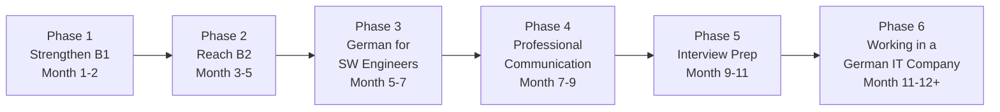
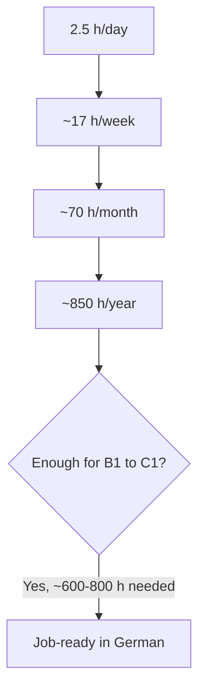

# Roadmap Overview · B1 → B2/C1 in 12 Months

> **Level:** All · **Focus:** the big picture & how the 6 phases fit together · **Time:** ~30 min read
> _After this page you'll know exactly what you're doing for the next 12 months and why._

You are a **backend Java developer** with **B1 German** aiming to **work as a Software
Engineer in Germany, entirely in German**. That means four hard skills, in order of
difficulty for most engineers: **speaking spontaneously**, **listening in fast meetings**,
**writing professionally**, and **reading docs** (usually the easiest for us). This roadmap
attacks all four, but weights **speaking + listening**, because that's what standups, code
reviews and interviews demand.

## The 12-month arc

The phases overlap on purpose — you start learning IT German (Phase 3) while still
polishing B2 grammar (Phase 2). Language is not linear.

## What each phase delivers

| # | Phase | CEFR | Months | You will be able to… |
|---|-------|:----:|:------:|----------------------|
| 1 | Strengthen B1 | B1→B1+ | 1–2 | Speak in correct word order, use the 4 cases, tell what you did (Perfekt), survive a slow standup |
| 2 | Reach B2 | B1+→B2 | 3–5 | Argue a point, use Konjunktiv II & Passiv, follow normal-speed conversation, pass a telc B2 mock |
| 3 | German for Software Engineers | B2 | 5–7 | Read German docs, use precise IT vocabulary, explain your architecture auf Deutsch |
| 4 | Professional Communication | B2→C1 | 7–9 | Run/attend meetings, write clean emails & tickets, present, give & take feedback |
| 5 | Job Interview Preparation | C1 | 9–11 | Nail HR + technical interviews in German, negotiate, ask sharp questions |
| 6 | Working in a German IT Company | C1 | 11–12+ | Operate day-to-day in German: dailies, reviews, incidents, small talk, culture |

## Time budget — the math

The daily plan assumes **~2.5 h/day**:

| Slot | Time | Typical use |
|------|------|-------------|
| Morning | 30 min | Flashcards (SRS) + grammar point |
| Afternoon | 30 min | Listening / shadowing (podcast, Easy German) |
| Evening | 1–2 h | Deep work: reading, writing, speaking practice, this app |

That's roughly **17 h/week ≈ 70 h/month ≈ 850 h/year**. As a rule of thumb, moving up one
CEFR level takes ~150–200 guided hours, so **B1 → C1 (~two levels) ≈ 600–800 h** — which is
exactly why 12 months is realistic *if* you keep the daily habit.

## How this app supports each phase

- **Roadmap modules** (this section, per phase): objectives, grammar, vocab, the 4 skills,
  weekly milestones, daily plan, monthly assessment.
- **[Flashcards](#/@flashcards)** — spaced-repetition IT + general vocabulary.
- **[Quizzes](#/@quiz)** — check grammar & vocab; instant feedback.
- **[Weekly Checklist](#/@checklist)** — tick off each week's tasks.
- **Reference Library** — real [workplace dialogues](#/dialogues/standup) and
  [interview Q&A](#/interviews/backend).

## The golden rules

1. **Speak from day one.** Record yourself daily, even 3 minutes. Use the 🔊 TTS to compare.
2. **Learn nouns with `der/die/das` + plural**, always. Wrong gender = the #1 tell of a
   non-native. (Shortcut taught in [Phase 1 · Vocabulary](#/phase-1/vocabulary).)
3. **Comprehensible input daily.** Listen to German slightly above your level, with
   transcripts.
4. **Output > input for fluency.** Watching is not studying.
5. **Track it.** What gets measured gets done — use the progress bar and monthly assessments.

## 🧾 Zusammenfassung · Summary

Six overlapping phases move you from B1 to C1 over 12 months at ~2.5 h/day (~850 h/year),
weighted toward speaking and listening, ending in full German-language job readiness. Use
the roadmap modules plus flashcards, quizzes and the checklist, and above all **produce
German every single day**.

## 📝 Hausaufgabe · Homework

- [ ] Take a free placement test (Goethe/telc online) and record your starting level.
- [ ] Block **2.5 h/day** in your calendar for the next 2 weeks (morning/afternoon/evening).
- [ ] Open [Phase 1 · Objectives](#/phase-1/overview) and read it today.
- [ ] Install **Anki** and start the [Flashcards](#/@flashcards) habit tomorrow morning.

## 📚 Empfohlene Ressourcen · Recommended resources

- **Placement test:** Goethe-Institut Einstufungstest, telc Übungstests (telc.net).
- **Habit/SRS:** Anki (spaced repetition).
- **Daily input:** Easy German (YouTube) + Easy German Podcast.
- **Method inspiration:** *Fluent Forever* (learning method), the "comprehensible input"
  idea (Krashen) — apply, don't just read about it.
