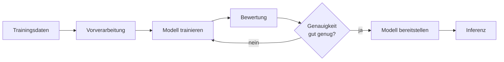

# KI & Maschinelles Lernen — IT-Vokabular

> **Level:** B2/C1 · **Focus:** AI/ML basics, models & training, datasets & features, neural networks, LLMs & prompting · **Time:** ~1.5 h
> _After this module you can talk about AI and machine learning in German — models, training, predictions and language models — with the right article and plural, even if you don't build them yourself._

Even as a backend developer you increasingly integrate AI: a *Sprachmodell* behind a chat feature, a *Vorhersage* endpoint, an *Einbettung* for search. German has clean words for all of it — often a native term **and** an anglicism. In meetings you'll hear both *das maschinelle Lernen* and *„Machine Learning"*. This module gives you the vocabulary to follow an ML discussion and describe an integration. Gender heuristics from [Phase 3 · Vocabulary](#/phase-3/vocabulary) apply: `-ung` → **die**, `-modell`/`-netz` → **das**.

## Objectives / Lernziele

- Name the **core AI/ML concepts** (model, training, dataset, prediction) with article + plural.
- Talk about **data and features** — labels, training vs. test data, preprocessing.
- Describe a **neural network** and its parts in German.
- Discuss **language models, prompting and their limits** (hallucination, bias).

## 1. KI-Grundbegriffe · Core AI concepts

| Deutsch | Artikel | Plural | English | Beispiel |
|---|---|---|---|---|
| Intelligenz | die | — | intelligence | Die künstliche **Intelligenz** unterstützt die Suche. |
| Lernen | das | — | learning | Das maschinelle **Lernen** erkennt Muster in Daten. |
| Modell | das | Modelle | model | Das **Modell** trifft die Vorhersage in Millisekunden. |
| Training | das | Trainings | training | Das **Training** dauerte mehrere Stunden auf der GPU. |
| Vorhersage | die | Vorhersagen | prediction | Die **Vorhersage** hat eine Genauigkeit von 94 Prozent. |
| Genauigkeit | die | — | accuracy | Die **Genauigkeit** sank bei neuen Daten. |
| Inferenz | die | — | inference | Die **Inferenz** läuft direkt im Dienst. |
| Muster | das | Muster | pattern | Das Modell erkennt ein wiederkehrendes **Muster**. |

> „KI" = **die künstliche Intelligenz**; „ML" = **das maschinelle Lernen**. Both abbreviations are common in German writing; say the full form in a presentation, the abbreviation in chat.

## 2. Daten & Merkmale · Data & features

| Deutsch | Artikel | Plural | English | Beispiel |
|---|---|---|---|---|
| Datensatz | der | Datensätze | dataset / record | Der **Datensatz** umfasst eine Million Beispiele. |
| Trainingsdaten | die | (Plural) | training data | Die **Trainingsdaten** müssen sauber und ausgewogen sein. |
| Merkmal | das | Merkmale | feature | Jedes **Merkmal** beschreibt eine Eigenschaft der Daten. |
| Beschriftung | die | Beschriftungen | label | Die **Beschriftung** gibt die richtige Antwort vor. |
| Vorverarbeitung | die | — | preprocessing | Die **Vorverarbeitung** entfernt fehlerhafte Werte. |
| Verzerrung | die | Verzerrungen | bias | Eine **Verzerrung** in den Daten führt zu unfairen Ergebnissen. |
| Überanpassung | die | — | overfitting | Bei **Überanpassung** lernt das Modell die Daten auswendig. |
| Wahrscheinlichkeit | die | Wahrscheinlichkeiten | probability | Das Modell gibt für jede Klasse eine **Wahrscheinlichkeit** aus. |

> **VI:** *die Beschriftung* (label) = nhãn dữ liệu, *die Vorverarbeitung* = tiền xử lý, *die Überanpassung* (overfitting) = quá khớp, *die Verzerrung* (bias) = thiên lệch. In the office people also say *das Label*, *das Feature* and *der Bias* — know both, as in [Phase 3 · Vocabulary](#/phase-3/vocabulary).

## 3. Neuronale Netze · Neural networks

| Deutsch | Artikel | Plural | English | Beispiel |
|---|---|---|---|---|
| Netz | das | Netze | network (neural) | Das neuronale **Netz** hat mehrere verborgene Schichten. |
| Schicht | die | Schichten | layer | Jede **Schicht** verarbeitet die Ausgabe der vorherigen. |
| Neuron | das | Neuronen | neuron | Jedes **Neuron** gewichtet seine Eingaben. |
| Gewicht | das | Gewichte | weight | Beim Training passen sich die **Gewichte** an. |
| Parameter | der | Parameter | parameter | Das Modell hat sieben Milliarden **Parameter**. |
| Verlustfunktion | die | Verlustfunktionen | loss function | Die **Verlustfunktion** misst den Fehler des Modells. |
| Einbettung | die | Einbettungen | embedding | Die **Einbettung** stellt Text als Vektor dar. |
| Aktivierungsfunktion | die | Aktivierungsfunktionen | activation function | Die **Aktivierungsfunktion** entscheidet, ob ein Neuron feuert. |



🇩🇪 **Aus den Trainingsdaten trainieren wir das Modell, bewerten es, und erst bei ausreichender Genauigkeit stellen wir es für die Inferenz bereit.**
*From the training data we train the model, evaluate it, and only when the accuracy is sufficient do we deploy it for inference.*

## 4. Sprachmodelle & Prompting · Language models & prompting

| Deutsch | Artikel | Plural | English | Beispiel |
|---|---|---|---|---|
| Sprachmodell | das | Sprachmodelle | language model | Das große **Sprachmodell** beantwortet die Anfrage in natürlicher Sprache. |
| Token | das | Token | token | Das Modell verarbeitet den Text in einzelne **Token**. |
| Eingabeaufforderung | die | Eingabeaufforderungen | prompt | Eine klare **Eingabeaufforderung** verbessert die Antwort. |
| Feinabstimmung | die | Feinabstimmungen | fine-tuning | Die **Feinabstimmung** passt das Modell an unsere Daten an. |
| Halluzination | die | Halluzinationen | hallucination | Eine **Halluzination** ist eine erfundene, falsche Antwort. |
| Rechenleistung | die | — | compute power | Das Training braucht viel **Rechenleistung**. |
| Grafikprozessor | der | Grafikprozessoren | GPU | Der **Grafikprozessor** beschleunigt das Training enorm. |
| Erkennung | die | Erkennungen | recognition | Die Sprach**erkennung** wandelt Audio in Text um. |

> **Prompt** is used directly too: **der Prompt, die Prompts**. In careful writing you may see *die Eingabeaufforderung*; in practice everyone says *der Prompt*.

## Verben & Kollokationen

| Verb / Kollokation | English | Beispiel |
|---|---|---|
| ein Modell **trainieren** | train a model | Wir **trainieren** das Modell mit einer Million Beispielen. |
| Daten **beschriften** | label data | Zuerst müssen wir die Daten **beschriften**. |
| eine Vorhersage **treffen** | make a prediction | Das Modell **trifft** eine Vorhersage für jeden Kunden. |
| ein Modell **bereitstellen** | deploy a model | Wir **stellen** das Modell als Dienst **bereit**. |
| ein Modell **feinabstimmen** | fine-tune a model | Wir **stimmen** das Modell auf unsere Daten **fein ab**. |
| die Genauigkeit **messen** | measure accuracy | Wir **messen** die Genauigkeit auf den Testdaten. |
| Merkmale **extrahieren** | extract features | Die Pipeline **extrahiert** die wichtigsten Merkmale. |
| Daten **vorverarbeiten** | preprocess data | Wir **verarbeiten** die Rohdaten zuerst **vor**. |
| ein Modell **bewerten** | evaluate a model | Wir **bewerten** das Modell mit einer Verlustfunktion. |
| einen Prompt **formulieren** | craft a prompt | Ich **formuliere** den Prompt so präzise wie möglich. |

```audio
Wir beschriften zuerst die Daten, verarbeiten sie vor und trainieren dann das Modell. Danach messen wir die Genauigkeit auf den Testdaten und stellen das Modell als Dienst für die Inferenz bereit.
```

---

## 🧾 Zusammenfassung · Summary

AI German splits into four systems. **Core:** *das Modell, das Training, die Vorhersage, die Genauigkeit, die Inferenz*. **Data:** *der Datensatz, die Trainingsdaten, das Merkmal, die Beschriftung, die Vorverarbeitung* — plus the risks *Überanpassung* and *Verzerrung*. **Neural networks:** *das Netz, die Schicht, das Neuron, das Gewicht, die Verlustfunktion, die Einbettung*. **Language models:** *das Sprachmodell, das Token, die Eingabeaufforderung/der Prompt, die Feinabstimmung, die Halluzination*. Every concept has a native term and an accepted anglicism — write the German, speak either. The training pipeline mirrors the deployment ideas in [Architecture & System Design](#/vocabulary/architecture-system-design); data quality connects to [Databases & SQL](#/vocabulary/database-sql).

## 📇 Vokabel-Checkliste · Vocabulary checklist

| Deutsch | Artikel | Plural | English | VI (if hard) |
|---|---|---|---|---|
| Modell | das | Modelle | model | mô hình |
| Training | das | Trainings | training | |
| Vorhersage | die | Vorhersagen | prediction | dự đoán |
| Datensatz | der | Datensätze | dataset | tập dữ liệu |
| Merkmal | das | Merkmale | feature | đặc trưng |
| Beschriftung | die | Beschriftungen | label | nhãn |
| Netz | das | Netze | neural network | mạng nơ-ron |
| Überanpassung | die | — | overfitting | quá khớp |
| Sprachmodell | das | Sprachmodelle | language model | mô hình ngôn ngữ |
| Halluzination | die | Halluzinationen | hallucination | ảo giác (bịa) |

→ Drill these with audio in [Flashcards](#/@flashcards).

## 🗣️ Sprechübung · Speaking practice

1. Describe the **ML pipeline** in German: label → preprocess → train → evaluate → deploy.
2. Explain what a **Sprachmodell** does and one of its limits (*Halluzination* or *Verzerrung*).
3. Describe an AI feature you'd add to your backend: *„Ich würde ein Modell bereitstellen, das …"*. Compare with the 🔊 below.

```audio
Unser Suchdienst nutzt Einbettungen aus einem Sprachmodell. Für jede Anfrage trifft das Modell eine Vorhersage. Wir müssen aber auf Halluzinationen und Verzerrungen in den Trainingsdaten achten.
```

## ❓ Mini-Quiz

1. Article + plural of *Modell*? And of *Sprachmodell*?
2. What is *die Überanpassung* in English, and why is it a problem?
3. Fill the gap: *„Wir ___ das Modell mit einer Million Beispielen."* (trainieren / beschriften / bewerten?)
4. Guess the article: *Vorhersage*, *Netz*, *Grafikprozessor*.

> **Lösungen:** 1) **das** Modell, **die** Modelle · **das** Sprachmodell, **die** Sprachmodelle. · 2) **overfitting** — the model memorizes the training data and generalizes poorly to new data. · 3) **trainieren**. · 4) **die** Vorhersage (-ung-like → die), **das** Netz, **der** Grafikprozessor (-or → der). More: [Quizzes](#/@quiz).

## 📝 Hausaufgabe · Homework

- [ ] Describe the **ML pipeline** for one use case in 5 German sentences (one verb each).
- [ ] Explain **Überanpassung** and **Verzerrung** in your own German words.
- [ ] Sketch an **AI feature** for your backend in Konjunktiv II (*„Ich würde …"*).
- [ ] Add the checklist terms to [Flashcards](#/@flashcards) and do the [Quiz](#/@quiz).

## 📚 Empfohlene Ressourcen · Recommended resources

- **Confirm articles/plurals:** DWDS.de, dict.leo.org, Duden.de.
- **AI in German:** heise.de (heise online / c't), Golem.de, t3n.de, Podcast *programmier.bar*.
- **SRS:** [Flashcards](#/@flashcards) + personal IT deck (Anki „Master German Vocabulary A1–C1").
- **Next:** back to [Architecture & System Design](#/vocabulary/architecture-system-design) · review all [Phase 3 · Vocabulary](#/phase-3/vocabulary).
