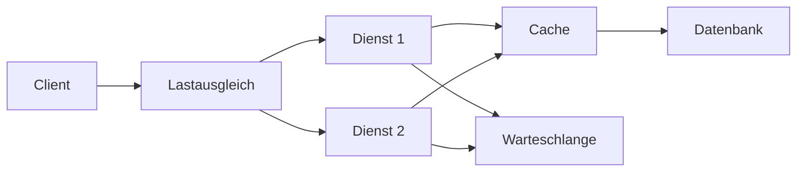

# Architektur & Systemdesign — IT-Vokabular

> **Level:** C1 · **Focus:** architecture styles, quality attributes (latency, throughput, availability), scaling, caching, decoupling, design patterns · **Time:** ~1.5 h
> _After this module you can defend a system design in German — argue about latency vs. throughput, scaling and trade-offs — with the precise nouns a senior interview expects._

System-design German is where you sound **senior** or junior. In a C1 interview at a company like Zalando or Celonis you'll be asked *„Wie würden Sie das skalieren?"* and expected to reason about *Latenz, Durchsatz, Verfügbarkeit* and *Zielkonflikte* (trade-offs). This module gives you that precise vocabulary. Build on the microservice words from [Phase 3 · Vocabulary](#/phase-3/vocabulary) — here we go deeper into **quality attributes** and **patterns**. Use Konjunktiv II (*würde, könnte*) for hypotheticals, as introduced in [Phase 1 · Grammar](#/phase-1/grammar).

## Objectives / Lernziele

- Name **architecture styles and building blocks** (layer, component, monolith, microservice).
- Discuss **quality attributes** — *Latenz, Durchsatz, Verfügbarkeit, Skalierbarkeit* — precisely.
- Explain **scaling, caching and load balancing** in German.
- Argue **trade-offs** (*Zielkonflikte*) like a senior engineer.

## 1. Architektur & Bausteine · Architecture & building blocks

| Deutsch | Artikel | Plural | English | Beispiel |
|---|---|---|---|---|
| Architektur | die | Architekturen | architecture | Unsere **Architektur** ist in Schichten aufgebaut. |
| Schicht | die | Schichten | layer | Jede **Schicht** kennt nur die darunterliegende. |
| Komponente | die | Komponenten | component | Diese **Komponente** ist unabhängig deploybar. |
| Baustein | der | Bausteine | building block | Der Cache ist ein zentraler **Baustein** des Systems. |
| Monolith | der | Monolithen | monolith | Wir zerlegen den **Monolithen** schrittweise. |
| Mikrodienst | der | Mikrodienste | microservice | Jeder **Mikrodienst** hat seine eigene Datenbank. |
| Schnittstelle | die | Schnittstellen | interface | Die **Schnittstelle** bleibt trotz Umbau stabil. |
| Entwurfsmuster | das | Entwurfsmuster | design pattern | Das **Entwurfsmuster** löst ein wiederkehrendes Problem. |

## 2. Qualitätsmerkmale · Quality attributes

These are the nouns a system-design interview turns on. Learn them cold:

| Deutsch | Artikel | Plural | English | Beispiel |
|---|---|---|---|---|
| Latenz | die | Latenzen | latency | Die **Latenz** liegt im Durchschnitt unter 50 Millisekunden. |
| Durchsatz | der | — | throughput | Der **Durchsatz** beträgt 5.000 Anfragen pro Sekunde. |
| Verfügbarkeit | die | — | availability | Die **Verfügbarkeit** liegt bei 99,9 Prozent. |
| Skalierbarkeit | die | — | scalability | Die **Skalierbarkeit** war die wichtigste Anforderung. |
| Zuverlässigkeit | die | — | reliability | Die **Zuverlässigkeit** hat für Zahlungen oberste Priorität. |
| Wartbarkeit | die | — | maintainability | Klare Schnittstellen erhöhen die **Wartbarkeit**. |
| Ausfallsicherheit | die | — | resilience | Die **Ausfallsicherheit** verhindert einen Totalausfall. |
| Konsistenz | die | — | consistency | Bei verteilten Systemen ist starke **Konsistenz** teuer. |

> **VI:** *der Durchsatz* = thông lượng, *die Verfügbarkeit* = tính sẵn sàng, *die Ausfallsicherheit* = khả năng chịu lỗi. Note the split: **Latenz** = time per request; **Durchsatz** = requests per second. Interviewers love this distinction.

## 3. Skalierung, Caching & Entkopplung · Scaling, caching & decoupling

| Deutsch | Artikel | Plural | English | Beispiel |
|---|---|---|---|---|
| Skalierung | die | Skalierungen | scaling | Die horizontale **Skalierung** fügt weitere Knoten hinzu. |
| Zwischenspeicherung | die | — | caching | Die **Zwischenspeicherung** entlastet die Datenbank. |
| Lastausgleich | der | — | load balancing | Der **Lastausgleich** verteilt die Anfragen gleichmäßig. |
| Last | die | Lasten | load | Die **Last** steigt am Abend stark an. |
| Engpass | der | Engpässe | bottleneck | Der **Engpass** liegt bei der Datenbank. |
| Entkopplung | die | — | decoupling | Die **Entkopplung** über eine Queue erhöht die Robustheit. |
| Warteschlange | die | Warteschlangen | queue | Die **Warteschlange** puffert Lastspitzen ab. |
| Replikation | die | Replikationen | replication | Die **Replikation** hält eine zweite Kopie bereit. |



🇩🇪 **Der Lastausgleich verteilt die Anfragen auf mehrere Dienste, ein Cache senkt die Latenz, und eine Warteschlange entkoppelt die langsamen Arbeitsschritte.**
*The load balancer distributes requests across several services, a cache lowers latency, and a queue decouples the slow steps.*

## 4. Kompromisse & Entwurf · Trade-offs & design

| Deutsch | Artikel | Plural | English | Beispiel |
|---|---|---|---|---|
| Zielkonflikt | der | Zielkonflikte | trade-off | Zwischen Konsistenz und Verfügbarkeit gibt es einen **Zielkonflikt**. |
| Kompromiss | der | Kompromisse | compromise | Wir gehen einen bewussten **Kompromiss** ein. |
| Abhängigkeit | die | Abhängigkeiten | dependency | Wir reduzieren die **Abhängigkeit** zwischen den Diensten. |
| Redundanz | die | Redundanzen | redundancy | **Redundanz** schützt vor dem Ausfall eines Knotens. |
| Beobachtbarkeit | die | — | observability | Die **Beobachtbarkeit** hilft, Probleme früh zu erkennen. |
| Metrik | die | Metriken | metric | Die wichtigste **Metrik** ist die Antwortzeit. |
| Kohäsion | die | — | cohesion | Hohe **Kohäsion** und lose Kopplung sind das Ziel. |
| Kopplung | die | Kopplungen | coupling | Lose **Kopplung** macht Änderungen einfacher. |

> The senior design mantra in German: **hohe Kohäsion, lose Kopplung** (high cohesion, loose coupling). Say it in a review and you signal experience.

## Verben & Kollokationen

Use Konjunktiv II for design proposals — *„Ich würde … skalieren"* — it sounds measured and senior.

| Verb / Kollokation | English | Beispiel |
|---|---|---|
| horizontal **skalieren** | scale horizontally | Bei Lastspitzen **skalieren** wir horizontal. |
| Ergebnisse **zwischenspeichern** | cache results | Wir **speichern** die Ergebnisse für fünf Minuten **zwischen**. |
| die Last **verteilen** | distribute load | Der Lastausgleich **verteilt** die Last auf drei Knoten. |
| einen Engpass **beseitigen** | remove a bottleneck | Wir **beseitigen** den Engpass an der Datenbank. |
| Dienste **entkoppeln** | decouple services | Eine Queue **entkoppelt** die beiden Dienste. |
| die Latenz **senken** | lower latency | Ein Cache **senkt** die Latenz spürbar. |
| den Durchsatz **steigern** | increase throughput | Mehr Knoten **steigern** den Durchsatz. |
| ein Muster **anwenden** | apply a pattern | Wir **wenden** das Muster „Circuit Breaker" **an**. |
| einen Zielkonflikt **abwägen** | weigh a trade-off | Wir **wägen** den Zielkonflikt sorgfältig **ab**. |
| die Verfügbarkeit **erhöhen** | increase availability | Redundanz **erhöht** die Verfügbarkeit. |

```audio
Bei Lastspitzen würde ich das System horizontal skalieren, die Ergebnisse zwischenspeichern und die langsamen Schritte über eine Warteschlange entkoppeln. So senke ich die Latenz und erhöhe die Verfügbarkeit.
```

---

## 🧾 Zusammenfassung · Summary

System-design German lives in four groups. **Structure:** *die Architektur, die Schicht, die Komponente, der Monolith, der Mikrodienst, das Entwurfsmuster*. **Quality attributes:** the pair *Latenz* (time per request) vs. *Durchsatz* (requests per second), plus *Verfügbarkeit, Skalierbarkeit, Zuverlässigkeit, Ausfallsicherheit*. **Techniques:** *Skalierung, Zwischenspeicherung, Lastausgleich, Entkopplung, Replikation*. **Reasoning:** *Zielkonflikt, Kompromiss, Kohäsion, Kopplung*, argued in Konjunktiv II. Say *hohe Kohäsion, lose Kopplung* and you sound senior. This builds on the microservice basics in [Phase 3 · Vocabulary](#/phase-3/vocabulary); availability ties into [Security & Auth](#/vocabulary/security-auth), and the data layer into [Databases & SQL](#/vocabulary/database-sql).

## 📇 Vokabel-Checkliste · Vocabulary checklist

| Deutsch | Artikel | Plural | English | VI (if hard) |
|---|---|---|---|---|
| Architektur | die | Architekturen | architecture | kiến trúc |
| Latenz | die | Latenzen | latency | độ trễ |
| Durchsatz | der | — | throughput | thông lượng |
| Verfügbarkeit | die | — | availability | tính sẵn sàng |
| Skalierbarkeit | die | — | scalability | khả năng mở rộng |
| Entkopplung | die | — | decoupling | tách rời |
| Engpass | der | Engpässe | bottleneck | điểm nghẽn |
| Zwischenspeicherung | die | — | caching | lưu đệm |
| Zielkonflikt | der | Zielkonflikte | trade-off | đánh đổi |
| Ausfallsicherheit | die | — | resilience | chịu lỗi |

→ Drill these with audio in [Flashcards](#/@flashcards).

## 🗣️ Sprechübung · Speaking practice

1. Explain the difference *Latenz vs. Durchsatz* in two German sentences.
2. Propose a scaling plan in Konjunktiv II: *„Ich würde horizontal skalieren und einen Cache einführen …"*.
3. Argue one trade-off: *„Zwischen Konsistenz und Verfügbarkeit würde ich …, weil …"*. Compare with the 🔊 below.

```audio
Der Engpass liegt bei der Datenbank. Ich würde die häufigen Abfragen zwischenspeichern, den Dienst horizontal skalieren und die Schreiblast über eine Warteschlange entkoppeln. Der Zielkonflikt ist mehr Komplexität gegen mehr Durchsatz.
```

## ❓ Mini-Quiz

1. Which is "requests per second" — *Latenz* or *Durchsatz*? And its article?
2. Article + plural of *Engpass*? And of *Zielkonflikt*?
3. Fill the gap: *„Ein Cache ___ die Latenz."* (senkt / steigert / verteilt?)
4. Complete the senior mantra: *„hohe ___, lose ___."*

> **Lösungen:** 1) **der Durchsatz** = requests per second; Latenz = time per request. · 2) **der** Engpass, **die** Engpässe · **der** Zielkonflikt, **die** Zielkonflikte. · 3) **senkt** (die Latenz senken). · 4) *hohe **Kohäsion**, lose **Kopplung***. More: [Quizzes](#/@quiz).

## 📝 Hausaufgabe · Homework

- [ ] Write a **1-paragraph design** of your service in German (Bausteine + quality attributes).
- [ ] Explain **2 trade-offs** in Konjunktiv II (*„Ich würde …, weil …"*).
- [ ] Describe how you'd **scale it** using *skalieren / zwischenspeichern / entkoppeln*.
- [ ] Add the checklist terms to [Flashcards](#/@flashcards) and do the [Quiz](#/@quiz).

## 📚 Empfohlene Ressourcen · Recommended resources

- **Confirm articles/plurals:** DWDS.de, dict.leo.org, Duden.de.
- **Architecture in German:** Informatik Aktuell, heise Developer (heise.de), Podcasts *Engineering Kiosk* & *programmier.bar*.
- **SRS:** [Flashcards](#/@flashcards) + personal IT deck (Anki „Master German Vocabulary A1–C1").
- **Next:** [AI & Machine Learning](#/vocabulary/ai-ml) · practice in [Interview · Backend](#/interviews/backend).
