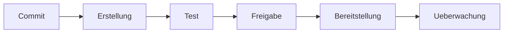

# CI/CD, Git & DevOps — IT-Vokabular

> **Level:** B2 · **Focus:** delivery in German — die Pipeline, der Zweig, die Zusammenführung, das Repository, die Auslieferung, der Bereitschaftsdienst, die Überwachung · **Time:** ~1.5 h
> _After this module you can talk through your delivery process in German — branches, merges, pipelines, releases, on-call and monitoring — with correct articles._

This is the module you will use every single day: every commit, branch, merge and pipeline run has a German word, and German teams mix them freely with the English originals. You will *type* `git merge` but *say* "zusammenführen"; you will *read* "die Auslieferung" in a release note but *hear* "das Release" in the *Daily*. Mastering this vocabulary lets you write clean commit messages, follow a *Pull-Request-Diskussion*, and describe your **Bereitschaftsdienst** rotation. It closes the loop from [Docker & Kubernetes](#/vocabulary/docker-kubernetes) and connects to [Testing, Agile & Scrum](#/vocabulary/testing-agile).

## Objectives / Lernziele

- Name the Git objects — Zweig, Zusammenführung, Repository, Übergabe — with article + plural.
- Describe a **CI/CD pipeline** stage by stage in German.
- Talk about **releases, rollbacks, on-call and monitoring**.
- Write a German commit message and read a German pipeline log.

## Git-Grundbegriffe · Git basics

| Deutsch | Artikel | Plural | English | Beispiel |
|---|---|---|---|---|
| Repository | das | Repositories | repository | Das Repository liegt bei einem GitLab-Server. |
| Zweig | der | Zweige | branch | Für jedes Feature erstelle ich einen neuen Zweig. |
| Übergabe | die | Übergaben | commit | Jede Übergabe braucht eine aussagekräftige Nachricht. |
| Zusammenführung | die | Zusammenführungen | merge | Die Zusammenführung war ohne Konflikt möglich. |
| Konflikt | der | Konflikte | (merge) conflict | Beim Mergen ist ein Konflikt in der Datei entstanden. |
| Pull Request | der | Pull Requests | pull request | Ich habe einen Pull Request aufgemacht. |
| Freigabe | die | Freigaben | approval | Die Freigabe des Reviewers fehlt noch. |
| Änderung | die | Änderungen | change | Der Pull Request enthält zwölf Änderungen. |
| Markierung | die | Markierungen | tag | Wir setzen bei jedem Release eine Markierung. |
| Versionsverwaltung | die | — | version control | Git ist unsere Versionsverwaltung. |

## Pipeline, Auslieferung & Betrieb

The delivery and operations vocabulary — from build to on-call.

| Deutsch | Artikel | Plural | English | Beispiel |
|---|---|---|---|---|
| Pipeline | die | Pipelines | pipeline | Die Pipeline läuft bei jeder Übergabe automatisch. |
| Stufe | die | Stufen | stage | Die Pipeline hat drei Stufen: Bauen, Testen, Ausliefern. |
| Erstellung | die | Erstellungen | build | Die Erstellung schlägt wegen eines Fehlers fehl. |
| Artefakt | das | Artefakte | artifact | Das Artefakt wird in die Registrierung hochgeladen. |
| Auslieferung | die | Auslieferungen | delivery / release | Die Auslieferung erfolgt automatisch nach dem Test. |
| Bereitstellung | die | Bereitstellungen | deployment | Die Bereitstellung in Produktion braucht eine Freigabe. |
| Auslöser | der | Auslöser | trigger | Der Auslöser der Pipeline ist ein Push auf den Hauptzweig. |
| Bereitschaftsdienst | der | Bereitschaftsdienste | on-call | Diese Woche habe ich Bereitschaftsdienst. |
| Überwachung | die | — | monitoring | Die Überwachung meldet einen Anstieg der Fehlerrate. |
| Warnung | die | Warnungen | alert | Die Warnung kam mitten in der Nacht. |
| Vorfall | der | Vorfälle | incident | Wir dokumentieren jeden Vorfall im Nachhinein. |

> Canonical glossary (recall the style guide): *der Pull Request*, *zusammenführen / mergen*, *das Release / die Auslieferung*, *der Bereitschaftsdienst / On-Call*, *das Rollback / das Zurückrollen*. Write German, speak the anglicism.

## Die Pipeline · The pipeline flow



🇩🇪 **Jede Übergabe löst die Pipeline aus: erst die Erstellung, dann die Tests, nach der Freigabe die Bereitstellung und danach die Überwachung.**
*Every commit triggers the pipeline: first the build, then the tests, after approval the deployment, and then monitoring.*

A German commit message and a small CI config:

```bash
git checkout -b feature/login        # einen Zweig erstellen
git add . && git commit -m "Anmeldung ueber E-Mail hinzugefuegt"
git push origin feature/login        # den Zweig hochladen
git merge feature/login              # den Zweig zusammenfuehren
```

```yaml
stages:
  - build       # die Erstellung
  - test        # der Test
  - deploy      # die Bereitstellung
```

```audio
Ich habe einen Zweig für das neue Feature erstellt, meine Änderungen übergeben und einen Pull Request aufgemacht. Nach der Freigabe führen wir den Zweig zusammen, und die Pipeline liefert die neue Version automatisch aus.
```

## Verben & Kollokationen

*hochladen*, *zurückrollen*, *auschecken* and *aufmachen* are **separable**.

| Deutsch | Artikel | Plural | English | Beispiel |
|---|---|---|---|---|
| übergeben | — | — | to commit | Ich übergebe meine Änderungen mit einer klaren Nachricht. |
| zusammenführen | — | — | to merge | Wir führen den Zweig in den Hauptzweig zusammen. |
| klonen | — | — | to clone | Ich klone das Repository auf meinen Rechner. |
| auschecken | — | — | to check out | Ich checke den Hauptzweig aus. |
| auslösen | — | — | to trigger | Ein Push löst die Pipeline aus. |
| bauen | — | — | to build | Die Pipeline baut das Artefakt automatisch. |
| ausliefern | — | — | to ship / release | Wir liefern die neue Version freitags aus. |
| freigeben | — | — | to approve / release | Der Reviewer gibt den Pull Request frei. |
| zurückrollen | — | — | to roll back | Bei einem Vorfall rollen wir das Release zurück. |
| überwachen | — | — | to monitor | Wir überwachen die Fehlerrate in Produktion. |

In a *Daily* at a GitLab-using **Mittelstand** company you might say: *"Ich habe den **Zweig** **zusammengeführt**, die **Pipeline** ist grün, die **Auslieferung** läuft — und ab morgen habe ich **Bereitschaftsdienst**."* — four of today's words, one sentence.

---

## 🧾 Zusammenfassung · Summary

Delivery has a German word for every step: you work on a **Zweig**, make **Übergaben**, open a **Pull Request**, and after a **Freigabe** perform the **Zusammenführung**. That triggers a **Pipeline** — **Erstellung → Test → Bereitstellung → Überwachung** — producing an **Artefakt** and an **Auslieferung**. When something breaks, the person on **Bereitschaftsdienst** gets a **Warnung**, handles the **Vorfall**, and may **zurückrollen**. Write the German term, speak the anglicism. This closes the loop with [Docker & Kubernetes](#/vocabulary/docker-kubernetes) and [Testing, Agile & Scrum](#/vocabulary/testing-agile).

## 📇 Vokabel-Checkliste · Vocabulary checklist

| Deutsch | Artikel | Plural | English | VI (if hard) |
|---|---|---|---|---|
| Zweig | der | Zweige | branch | nhánh |
| Übergabe | die | Übergaben | commit | lần commit |
| Zusammenführung | die | Zusammenführungen | merge | hợp nhất |
| Pipeline | die | Pipelines | pipeline | |
| Auslieferung | die | Auslieferungen | delivery / release | phát hành |
| Bereitstellung | die | Bereitstellungen | deployment | triển khai |
| Bereitschaftsdienst | der | Bereitschaftsdienste | on-call | trực hệ thống |
| Überwachung | die | — | monitoring | giám sát |
| Freigabe | die | Freigaben | approval | phê duyệt |
| Vorfall | der | Vorfälle | incident | sự cố |

→ Add these to [Flashcards](#/@flashcards) with article + plural.

## 🗣️ Sprechübung · Speaking practice

1. Describe your Git flow in German: *"Ich erstelle einen Zweig, übergebe meine Änderungen, mache einen Pull Request auf …"*.
2. Walk through the four pipeline stages (*Erstellung → Test → Bereitstellung → Überwachung*).
3. Read the audio line, then describe your last **Vorfall** during **Bereitschaftsdienst**.

```audio
Letzte Woche hatte ich Bereitschaftsdienst. Um drei Uhr nachts kam eine Warnung: Die Überwachung meldete eine hohe Fehlerrate. Ich habe den Vorfall analysiert und das Release zurückgerollt.
```

## ❓ Mini-Quiz

1. Article + plural of *Zweig*, *Übergabe* and *Zusammenführung*?
2. Which two nouns have **no plural**: *Überwachung*, *Auslieferung*, *Versionsverwaltung*, *Freigabe*?
3. Fill the separable verb: *"Bei einem Vorfall ___ wir das Release ___."* (to roll back)
4. German verb for *to merge* and noun for *on-call*?

> **Lösungen:** 1) **der** Zweig/**die** Zweige · **die** Übergabe/**die** Übergaben · **die** Zusammenführung/**die** Zusammenführungen. · 2) No plural: *die Überwachung*, *die Versionsverwaltung*. · 3) *Bei einem Vorfall **rollen** wir das Release **zurück**.* · 4) *zusammenführen*; *der **Bereitschaftsdienst***. More: [Quizzes](#/@quiz).

## 📝 Hausaufgabe · Homework

- [ ] Write **5 German commit messages** for real changes in your project (imperative, concise).
- [ ] Describe your **CI/CD pipeline** in 4 sentences, one per stage.
- [ ] Write a short **Vorfall** report in German (3 sentences: Warnung, Analyse, Zurückrollen).
- [ ] Add the checklist to [Flashcards](#/@flashcards); verify articles on DWDS.de.

## 📚 Empfohlene Ressourcen · Recommended resources

- **Confirm articles/plurals:** DWDS.de, dict.leo.org, Duden.de.
- **Read in German:** heise Developer (heise.de), Golem.de, Informatik Aktuell (DevOps).
- **Podcast:** Engineering Kiosk (Betrieb & On-Call), programmier.bar.
- **Next:** [Testing, Agile & Scrum](#/vocabulary/testing-agile) → back to [Software Development](#/vocabulary/software-development).
