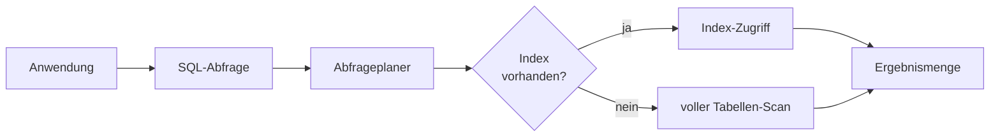

# Datenbanken & SQL — IT-Vokabular

> **Level:** B2 · **Focus:** relational databases, SQL, schema & migrations, transactions, performance · **Time:** ~1.5 h
> _After this module you can talk about your data layer in German — describe a query, a migration, an index or a transaction — with the correct article and plural every time._

As a backend Java developer you spend half your day near a database — writing queries, tuning indexes, versioning the schema with Flyway or Liquibase. This module gives you the German words for exactly that work. Learn one table per sitting, say each noun **with its article and plural** out loud, and reuse the example sentences in your next stand-up. The gender heuristics from [Phase 3 · Vocabulary](#/phase-3/vocabulary) still apply: `-ung`/`-tion`/`-heit` → **die**, agent nouns in `-er` → **der**, gerund-like loanwords → **das**.

## Objectives / Lernziele

- Name the **core building blocks** of a relational database (table, row, column, key) with article + plural.
- Describe **SQL operations** and query results in a full German sentence.
- Talk about **schema, migrations and integrity** the way a German team documents them.
- Explain a **transaction** and basic **performance** tuning (index, connection pool, caching).

## 1. Kern-Datenbankbegriffe · Core database terms

| Deutsch | Artikel | Plural | English | Beispiel |
|---|---|---|---|---|
| Datenbank | die | Datenbanken | database | Unsere **Datenbank** läuft auf PostgreSQL. |
| Tabelle | die | Tabellen | table | Ich habe die **Tabelle** „benutzer" neu angelegt. |
| Datensatz | der | Datensätze | record / row | Jeder **Datensatz** hat eine eindeutige ID. |
| Zeile | die | Zeilen | row | Die Abfrage liefert 200 **Zeilen** zurück. |
| Spalte | die | Spalten | column | Die **Spalte** „email" darf nicht null sein. |
| Datentyp | der | Datentypen | data type | Der **Datentyp** dieser Spalte ist „integer". |
| Beziehung | die | Beziehungen | relationship | Zwischen Bestellung und Kunde besteht eine 1:n-**Beziehung**. |
| Ergebnismenge | die | Ergebnismengen | result set | Die **Ergebnismenge** wird seitenweise geladen. |

## 2. SQL-Operationen & Abfragen · SQL operations & queries

| Deutsch | Artikel | Plural | English | Beispiel |
|---|---|---|---|---|
| Abfrage | die | Abfragen | query | Diese **Abfrage** ist zu langsam. |
| Verbund | der | Verbünde | join | Der **Verbund** verknüpft Kunden mit ihren Bestellungen. |
| Aggregation | die | Aggregationen | aggregation | Die **Aggregation** zählt die Bestellungen pro Kunde. |
| Sicht | die | Sichten | view | Die **Sicht** fasst mehrere Tabellen zusammen. |
| Prozedur | die | Prozeduren | stored procedure | Die gespeicherte **Prozedur** berechnet den Rabatt. |
| Ergebnis | das | Ergebnisse | result | Das **Ergebnis** wird an den Dienst zurückgegeben. |
| Filter | der | Filter | filter | Der **Filter** in der WHERE-Klausel schränkt die Zeilen ein. |
| Sortierung | die | Sortierungen | sorting / order | Die **Sortierung** erfolgt nach dem Datum absteigend. |

```sql
SELECT k.name, COUNT(b.id) AS anzahl
FROM kunde k
JOIN bestellung b ON b.kunde_id = k.id
GROUP BY k.name
ORDER BY anzahl DESC;
```

🇩🇪 **Diese Abfrage verknüpft zwei Tabellen und aggregiert die Bestellungen pro Kunde.**
*This query joins two tables and aggregates the orders per customer.*

## 3. Schema, Schlüssel & Integrität · Schema, keys & integrity

| Deutsch | Artikel | Plural | English | Beispiel |
|---|---|---|---|---|
| Schema | das | Schemata | schema | Wir versionieren das **Schema** mit Flyway. |
| Migration | die | Migrationen | migration | Die **Migration** fügt eine neue Spalte hinzu. |
| Primärschlüssel | der | Primärschlüssel | primary key | Der **Primärschlüssel** ist eine UUID. |
| Fremdschlüssel | der | Fremdschlüssel | foreign key | Der **Fremdschlüssel** verweist auf die Tabelle „kunde". |
| Index | der | Indizes | index | Ein **Index** auf „email" beschleunigt die Suche. |
| Einschränkung | die | Einschränkungen | constraint | Eine **Einschränkung** stellt sicher, dass das Alter positiv ist. |
| Normalisierung | die | — | normalization | Durch **Normalisierung** vermeiden wir doppelte Daten. |
| Integrität | die | — | integrity | Fremdschlüssel schützen die referenzielle **Integrität**. |

> **VI:** *der Fremdschlüssel* = khóa ngoại, *der Primärschlüssel* = khóa chính, *die Einschränkung* (constraint) = ràng buộc. These three come up in every schema review.

## 4. Transaktionen & Performance · Transactions & performance

| Deutsch | Artikel | Plural | English | Beispiel |
|---|---|---|---|---|
| Transaktion | die | Transaktionen | transaction | Die **Transaktion** wird bei einem Fehler zurückgerollt. |
| Sperre | die | Sperren | lock | Die Transaktion hält eine **Sperre** auf der Zeile. |
| Verbindung | die | Verbindungen | connection | Jede **Verbindung** zur Datenbank kostet Ressourcen. |
| Verbindungspool | der | Verbindungspools | connection pool | Der **Verbindungspool** begrenzt die offenen Verbindungen. |
| Zwischenspeicherung | die | — | caching | Die **Zwischenspeicherung** senkt die Last auf der Datenbank. |
| Konsistenz | die | — | consistency | Die Datenbank garantiert die **Konsistenz** der Daten. |
| Sicherung | die | Sicherungen | backup | Wir erstellen jede Nacht eine **Sicherung** der Datenbank. |
| Wiederherstellung | die | Wiederherstellungen | restore / recovery | Die **Wiederherstellung** dauerte zwei Stunden. |

## Verben & Kollokationen

The database verbs you actually type map cleanly onto SQL keywords. Note the separable verbs (`an·legen`, `ein·fügen`) — recall the verb-position rule from [Phase 1 · Grammar](#/phase-1/grammar).

| Verb / Kollokation | English | Beispiel |
|---|---|---|
| eine Abfrage **ausführen** | run a query | Ich **führe** die Abfrage im Testsystem **aus**. |
| einen Index **anlegen** | create an index | Wir **legen** einen Index auf die Spalte **an**. |
| einen Datensatz **einfügen** | insert a record | Der Dienst **fügt** einen neuen Datensatz **ein**. |
| Daten **aktualisieren** | update data | Das Skript **aktualisiert** die alten Datensätze. |
| einen Datensatz **löschen** | delete a record | Wir **löschen** den Datensatz endgültig. |
| eine Transaktion **festschreiben** | commit a transaction | Erst am Ende wird die Transaktion **festgeschrieben**. |
| eine Transaktion **zurückrollen** | roll back a transaction | Bei einem Fehler wird die Transaktion **zurückgerollt**. |
| das Schema **migrieren** | migrate the schema | Vor dem Deployment **migrieren** wir das Schema. |
| Tabellen **verknüpfen** | join tables | Der Verbund **verknüpft** beide Tabellen. |
| eine Abfrage **optimieren** | optimize a query | Der DBA hat die langsame Abfrage **optimiert**. |



🇩🇪 **Wenn ein passender Index vorhanden ist, nutzt der Abfrageplaner ihn; sonst liest er die ganze Tabelle.**
*If a matching index exists, the query planner uses it; otherwise it reads the whole table.*

```audio
Diese Abfrage ist zu langsam. Wir legen einen Index auf die Spalte E-Mail an und führen die Migration zuerst in der Testumgebung aus.
```

---

## 🧾 Zusammenfassung · Summary

A relational database in German breaks into four word-systems: the **structure** (*die Tabelle, die Spalte, der Datensatz*), the **queries** (*die Abfrage, der Verbund, die Sicht*), the **schema and its keys** (*das Schema, die Migration, der Primär- und Fremdschlüssel, der Index*), and **runtime concerns** (*die Transaktion, die Sperre, der Verbindungspool, die Zwischenspeicherung*). Say every noun with its article and plural — the gender colours in this app depend on it. The verbs mirror SQL: *ausführen, anlegen, einfügen, aktualisieren, löschen, festschreiben, zurückrollen, migrieren*. Related runtime and access topics live in [Networking & Linux](#/vocabulary/networking-linux) and [Security & Auth](#/vocabulary/security-auth).

## 📇 Vokabel-Checkliste · Vocabulary checklist

| Deutsch | Artikel | Plural | English | VI (if hard) |
|---|---|---|---|---|
| Datenbank | die | Datenbanken | database | |
| Abfrage | die | Abfragen | query | truy vấn |
| Datensatz | der | Datensätze | record / row | bản ghi |
| Fremdschlüssel | der | Fremdschlüssel | foreign key | khóa ngoại |
| Index | der | Indizes | index | |
| Migration | die | Migrationen | migration | |
| Transaktion | die | Transaktionen | transaction | |
| Einschränkung | die | Einschränkungen | constraint | ràng buộc |
| Verbund | der | Verbünde | join | phép nối |
| Sicherung | die | Sicherungen | backup | |

→ Drill these with audio in [Flashcards](#/@flashcards).

## 🗣️ Sprechübung · Speaking practice

1. Describe your project's data model: *„Die Tabelle … hat einen Fremdschlüssel auf …"*.
2. Explain one slow query and your fix: *„Die Abfrage war langsam, deshalb habe ich einen Index angelegt."*
3. Walk through a transaction out loud: begin, write, commit or roll back. Then compare with the 🔊 below.

```audio
In unserer Datenbank hat jede Bestellung einen Fremdschlüssel auf den Kunden. Die Transaktion schreibt beide Datensätze zusammen fest, sonst wird sie zurückgerollt.
```

## ❓ Mini-Quiz

1. Article + plural of *Abfrage*? And of *Index*?
2. Fill the gap: *„Wir legen einen ___ auf die Spalte an."* (Sperre / Index / Sicht?)
3. Which verb pair means commit vs. roll back a transaction?
4. Guess the article by heuristic: *Normalisierung*, *Verbindungspool*, *Schema*.

> **Lösungen:** 1) **die** Abfrage, **die** Abfragen · **der** Index, **die** Indizes. · 2) **Index** (ein Index beschleunigt die Suche). · 3) eine Transaktion **festschreiben** ↔ **zurückrollen**. · 4) **die** Normalisierung (-ung → die), **der** Verbindungspool (-er/Pool → der), **das** Schema (Greek neuter). More: [Quizzes](#/@quiz).

## 📝 Hausaufgabe · Homework

- [ ] Write a **German glossary of your own schema**: 10 tables/columns with article + plural.
- [ ] Describe **one real migration** you shipped in 3 German sentences (Perfekt).
- [ ] Explain a **slow query and your index fix** out loud; record and check every article.
- [ ] Add the checklist terms to [Flashcards](#/@flashcards) and do the [Quiz](#/@quiz) — aim ≥ 4/5.

## 📚 Empfohlene Ressourcen · Recommended resources

- **Confirm articles/plurals:** DWDS.de, dict.leo.org, Duden.de.
- **Terms in context:** heise Developer (heise.de), Informatik Aktuell, Golem.de.
- **SRS:** [Flashcards](#/@flashcards) + a personal IT deck (Anki „Master German Vocabulary A1–C1").
- **Next:** [Networking & Linux](#/vocabulary/networking-linux) · [Architecture & System Design](#/vocabulary/architecture-system-design).
