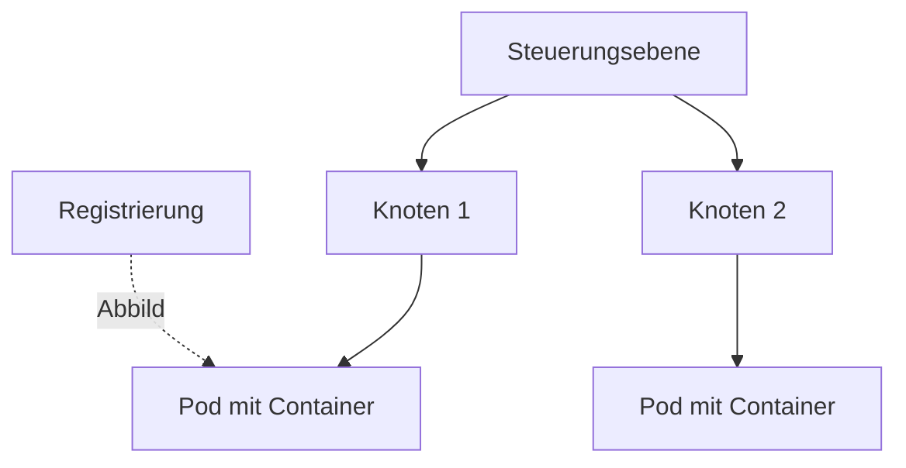

# Docker & Kubernetes — IT-Vokabular

> **Level:** B2 · **Focus:** containers in German — der Container, das Abbild, der Knoten, der Pod, die Instanz, das Volume, die Orchestrierung · **Time:** ~1.5 h
> _After this module you can explain how your app is containerised and orchestrated in German — images, pods, nodes, volumes and deployments — with correct articles._

Your Spring services (see [Spring Boot](#/vocabulary/spring-boot)) ship as **containers**, and Kubernetes schedules them across a cluster. This layer is anglicism-heavy — everyone says *der Pod*, *das Image*, *der Cluster* — but the German words exist and appear in docs and books: *das Abbild*, *der Knoten*, *die Orchestrierung*. Knowing both lets you read a German Kubernetes tutorial, write a clear `kubectl` runbook comment, and explain your deployment in a review. This module pairs tightly with [CI/CD, Git & DevOps](#/vocabulary/cicd-git-devops), where these deployments get automated.

## Objectives / Lernziele

- Name the container building blocks — Container, Abbild, Pod, Knoten — with article + plural.
- Explain **orchestration and scaling** (*Orchestrierung*, *Replikat*) in German.
- Describe **volumes, namespaces and health checks**.
- Read a `Dockerfile`, a `docker` command and a Kubernetes manifest out loud.

## Kernbegriffe · Container basics

Gender note: agent nouns in **-er** are **der** (*der Container, der Cluster, der Knoten*); the German words for image and secret are neuter (*das Abbild, das Geheimnis*).

| Deutsch | Artikel | Plural | English | Beispiel |
|---|---|---|---|---|
| Container | der | Container | container | Der Container startet in wenigen Sekunden. |
| Abbild | das | Abbilder | image | Wir bauen aus dem Dockerfile ein Abbild. |
| Registrierung | die | Registrierungen | registry | Wir laden das Abbild in die Registrierung hoch. |
| Cluster | der | Cluster | cluster | Der Cluster besteht aus fünf Knoten. |
| Knoten | der | Knoten | node | Auf jedem Knoten laufen mehrere Pods. |
| Pod | der | Pods | pod | Ein Pod enthält einen oder mehrere Container. |
| Instanz | die | Instanzen | instance | Wir starten drei Instanzen des Dienstes. |
| Replikat | das | Replikate | replica | Der Controller hält immer drei Replikate am Leben. |
| Namensraum | der | Namensräume | namespace | Jedes Team arbeitet in einem eigenen Namensraum. |
| Manifest | das | Manifeste | manifest | Das Manifest beschreibt den gewünschten Zustand. |

## Orchestrierung, Speicher & Zustand

The words for keeping containers alive, connected and stateful.

| Deutsch | Artikel | Plural | English | Beispiel |
|---|---|---|---|---|
| Orchestrierung | die | — | orchestration | Die Orchestrierung übernimmt Kubernetes. |
| Steuerungsebene | die | Steuerungsebenen | control plane | Die Steuerungsebene plant die Pods auf die Knoten. |
| Volume | das | Volumes | volume | Das Volume speichert die Daten über Neustarts hinweg. |
| Datenträger | der | Datenträger | volume / storage (German) | Der Datenträger bleibt beim Neustart erhalten. |
| Ressource | die | Ressourcen | resource | Jeder Container bekommt begrenzte Ressourcen. |
| Auslastung | die | Auslastungen | utilization / load | Bei hoher Auslastung startet der Cluster neue Pods. |
| Geheimnis | das | Geheimnisse | secret | Das Passwort liegt in einem Geheimnis, nicht im Abbild. |
| Zustand | der | Zustände | state | Kubernetes gleicht den Ist-Zustand an den Soll-Zustand an. |
| Zustandsprüfung | die | Zustandsprüfungen | health check | Die Zustandsprüfung erkennt einen kranken Container. |
| Portweiterleitung | die | Portweiterleitungen | port forwarding | Mit einer Portweiterleitung teste ich den Pod lokal. |

> Office anglicisms: *das Image*, *der Node*, *das Deployment*, *das Volume*, *das Secret*, *das Rollout*. In writing you may prefer *das Abbild*, *der Knoten*, *die Bereitstellung*, *der Datenträger* — but everyone will understand the English.

## Vom Abbild zum Pod · From image to pod

Build an image, push it, and let Kubernetes schedule it:

```bash
docker build -t konten-service:1.0 .          # ein Abbild bauen
docker push registry.local/konten-service:1.0  # in die Registrierung hochladen
kubectl apply -f deployment.yaml               # das Manifest anwenden
kubectl scale deployment konten-service --replicas=3  # die Replikate skalieren
```

```yaml
apiVersion: apps/v1
kind: Deployment            # die Bereitstellung
metadata:
  name: konten-service
spec:
  replicas: 3               # die Replikate
  template:
    spec:
      containers:
        - name: app         # der Container
          image: konten-service:1.0   # das Abbild
```



🇩🇪 **Die Steuerungsebene verteilt die Pods auf die Knoten und zieht das Abbild aus der Registrierung.**
*The control plane schedules the pods onto the nodes and pulls the image from the registry.*

```audio
Wir bauen aus dem Dockerfile ein Abbild und laden es in die Registrierung hoch. Kubernetes plant die Pods auf die Knoten, prüft ihren Zustand und startet bei einem Ausfall automatisch ein neues Replikat.
```

## Verben & Kollokationen

*hochladen*, *einbinden* and *ausrollen* are **separable** (*ich lade das Abbild **hoch***).

| Deutsch | Artikel | Plural | English | Beispiel |
|---|---|---|---|---|
| bauen | — | — | to build | Wir bauen das Abbild aus dem Dockerfile. |
| hochladen | — | — | to push / upload | Ich lade das Abbild in die Registrierung hoch. |
| starten | — | — | to start | Wir starten den Container mit einem Befehl. |
| bereitstellen | — | — | to deploy | Wir stellen die Anwendung im Cluster bereit. |
| orchestrieren | — | — | to orchestrate | Kubernetes orchestriert alle Container. |
| skalieren | — | — | to scale | Wir skalieren die Replikate auf fünf. |
| einbinden | — | — | to mount | Wir binden ein Volume in den Pod ein. |
| ausrollen | — | — | to roll out | Wir rollen die neue Version schrittweise aus. |
| zurückrollen | — | — | to roll back | Bei einem Fehler rollen wir das Deployment zurück. |
| überwachen | — | — | to monitor | Wir überwachen die Auslastung jedes Knotens. |

A deployment update at a company like **HelloFresh** or **DB Systel** sounds like: *"Wir **bauen** das neue **Abbild**, **laden** es in die **Registrierung** **hoch** und **rollen** das **Deployment** schrittweise **aus** — die **Zustandsprüfung** entscheidet, ob wir **zurückrollen**."*

---

## 🧾 Zusammenfassung · Summary

An app is packaged as an **Abbild**, run as a **Container** inside a **Pod**, scheduled by the **Steuerungsebene** onto **Knoten** in a **Cluster**. Kubernetes keeps the desired number of **Replikate** alive, mounts **Volumes** for state, isolates teams with **Namensräume**, and uses **Zustandsprüfungen** to detect failures — that whole job is the **Orchestrierung**. Agent nouns in *-er* are *der*; the German image/secret words are *das Abbild / das Geheimnis*. Write German, speak the anglicism. Automate all of it in [CI/CD, Git & DevOps](#/vocabulary/cicd-git-devops).

## 📇 Vokabel-Checkliste · Vocabulary checklist

| Deutsch | Artikel | Plural | English | VI (if hard) |
|---|---|---|---|---|
| Container | der | Container | container | |
| Abbild | das | Abbilder | image | ảnh (image) |
| Knoten | der | Knoten | node | nút |
| Pod | der | Pods | pod | |
| Instanz | die | Instanzen | instance | thực thể / bản chạy |
| Volume | das | Volumes | volume | |
| Orchestrierung | die | — | orchestration | điều phối |
| Replikat | das | Replikate | replica | bản sao |
| Namensraum | der | Namensräume | namespace | không gian tên |
| Zustandsprüfung | die | Zustandsprüfungen | health check | kiểm tra sức khỏe |

→ Add these to [Flashcards](#/@flashcards) with article + plural.

## 🗣️ Sprechübung · Speaking practice

1. Narrate a deployment: *"Wir bauen ein Abbild, laden es hoch und rollen das Deployment aus."*
2. Explain the difference between **Container**, **Pod** and **Knoten** in German.
3. Read the audio line, then describe how *your* cluster reacts when a pod fails.

```audio
Unsere Steuerungsebene plant die Pods auf die Knoten. Wenn ein Container die Zustandsprüfung nicht besteht, startet Kubernetes automatisch ein neues Replikat, damit die gewünschte Anzahl erhalten bleibt.
```

## ❓ Mini-Quiz

1. Article + plural of *Container*, *Abbild* and *Knoten*?
2. Guess the article by heuristic: *Container*, *Orchestrierung*, *Cluster*.
3. Fill the separable verb: *"Ich ___ das Abbild in die Registrierung ___."* (to push)
4. German word for *image* and for *node*?

> **Lösungen:** 1) **der** Container/**die** Container · **das** Abbild/**die** Abbilder · **der** Knoten/**die** Knoten. · 2) **der** Container & **der** Cluster (-er → der), **die** Orchestrierung (-ung → die). · 3) *Ich **lade** das Abbild in die Registrierung **hoch**.* · 4) *das **Abbild***, *der **Knoten***. More: [Quizzes](#/@quiz).

## 📝 Hausaufgabe · Homework

- [ ] Comment your own `Dockerfile` and `deployment.yaml` with the **German term** for each object.
- [ ] Write **4 sentences** describing how Kubernetes keeps replicas alive (*Zustand*, *Replikat*, *Zustandsprüfung*).
- [ ] Explain **rollout vs. rollback** in German in 3 sentences.
- [ ] Add the checklist to [Flashcards](#/@flashcards); confirm articles on DWDS.de.

## 📚 Empfohlene Ressourcen · Recommended resources

- **Confirm articles/plurals:** DWDS.de, dict.leo.org, Duden.de.
- **Read in German:** heise.de, Golem.de, Informatik Aktuell (Container & Kubernetes).
- **Podcast:** Engineering Kiosk, programmier.bar (DevOps-Folgen).
- **Next:** [CI/CD, Git & DevOps](#/vocabulary/cicd-git-devops) → [Microservices & Cloud](#/vocabulary/microservices-cloud).
