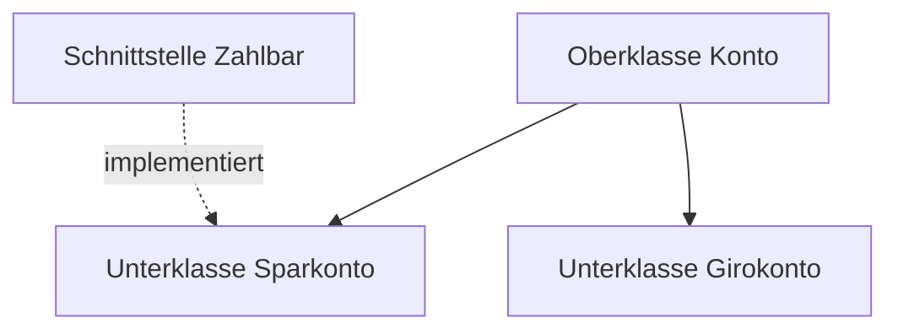

# Java — IT-Vokabular

> **Level:** B2 · **Focus:** the Java language in German — Klasse, Methode, Vererbung, Schnittstelle, Ausnahme, Generics, Speicherbereinigung, Nebenläufigkeit · **Time:** ~1.5 h
> _After this module you can explain your Java code in German — object model, exceptions, memory and threads — with the right article and the right verb._

You already think in classes, methods and exceptions. This module gives each of those concepts its German name so you can explain a design in a review, read a German Javadoc, or answer *"Wie funktioniert Vererbung?"* in an interview. Most nouns here are **feminine** (*die Klasse, die Methode, die Vererbung, die Ausnahme*) — the object-oriented core of the language is a **die**-world. Build on the general terms from [Software Development](#/vocabulary/software-development); the framework layer follows in [Spring Boot](#/vocabulary/spring-boot).

## Objectives / Lernziele

- Describe the **object model** (Klasse, Objekt, Methode, Attribut) in German with article + plural.
- Explain **inheritance, interfaces and exceptions** using the correct verbs (*erben, implementieren, werfen, abfangen*).
- Talk about **memory and concurrency** — Speicherbereinigung, Thread, Nebenläufigkeit.
- Read a German Javadoc without a dictionary.

## Kernbegriffe · The object model

| Deutsch | Artikel | Plural | English | Beispiel |
|---|---|---|---|---|
| Klasse | die | Klassen | class | Jede Klasse gehört zu genau einem Paket. |
| Objekt | das | Objekte | object | Aus der Klasse erzeugen wir ein Objekt. |
| Methode | die | Methoden | method | Diese Methode gibt eine Liste zurück. |
| Attribut | das | Attribute | field / attribute | Das Attribut ist als privat deklariert. |
| Variable | die | Variablen | variable | Die Variable wird im Konstruktor gesetzt. |
| Datentyp | der | Datentypen | data type | Welchen Datentyp hat dieser Parameter? |
| Wert | der | Werte | value | Die Methode liefert den Wert null zurück. |
| Konstruktor | der | Konstruktoren | constructor | Der Konstruktor erwartet zwei Argumente. |
| Paket | das | Pakete | package | Alle Klassen liegen im selben Paket. |
| Schnittstelle | die | Schnittstellen | interface | Die Klasse implementiert die Schnittstelle Zahlbar. |

## Vererbung, Ausnahmen & Typen

The concepts an interviewer will ask about. Note **die Vererbung**, **die Kapselung** and **die Polymorphie** have no plural — they are properties, not countable things.

| Deutsch | Artikel | Plural | English | Beispiel |
|---|---|---|---|---|
| Vererbung | die | — | inheritance | Vererbung vermeidet doppelten Code. |
| Kapselung | die | — | encapsulation | Kapselung schützt den internen Zustand. |
| Polymorphie | die | — | polymorphism | Dank Polymorphie rufen wir dieselbe Methode auf. |
| Oberklasse | die | Oberklassen | superclass | Die Oberklasse definiert das gemeinsame Verhalten. |
| Unterklasse | die | Unterklassen | subclass | Die Unterklasse überschreibt die Methode. |
| Ausnahme | die | Ausnahmen | exception | Die Methode wirft eine Ausnahme bei ungültiger Eingabe. |
| Sammlung | die | Sammlungen | collection | Eine Sammlung speichert mehrere Elemente. |
| Generics | die (Pl.) | — | generics | Mit Generics vermeiden wir Typumwandlungen. |
| Signatur | die | Signaturen | signature | Die Signatur der Methode hat sich geändert. |
| Überschreibung | die | Überschreibungen | overriding | Die Überschreibung ersetzt die Methode der Oberklasse. |

> Anglicisms you will still hear in the office: *der Getter*, *der Setter*, *das Interface*, *die Exception*, *das Generic*. Write the German term in docs, use whichever the team speaks.

## Speicher & Nebenläufigkeit

Memory and threads — the topics behind performance questions.

| Deutsch | Artikel | Plural | English | Beispiel |
|---|---|---|---|---|
| Speicher | der | Speicher | memory | Der Speicher wird automatisch verwaltet. |
| Speicherbereinigung | die | — | garbage collection | Die Speicherbereinigung gibt ungenutzte Objekte frei. |
| Stapelspeicher | der | Stapelspeicher | stack | Lokale Variablen liegen im Stapelspeicher. |
| Heap | der | Heaps | heap | Objekte werden auf dem Heap angelegt. |
| Nebenläufigkeit | die | — | concurrency | Nebenläufigkeit erhöht die Komplexität des Codes. |
| Thread | der | Threads | thread | Jeder Thread hat einen eigenen Stapelspeicher. |
| Sperre | die | Sperren | lock | Eine Sperre schützt den gemeinsamen Zustand. |
| Verklemmung | die | Verklemmungen | deadlock | Zwei Sperren in falscher Reihenfolge führen zur Verklemmung. |

Here is the object model in code, with each German term as a comment:

```java
public class Konto {                 // die Klasse
    private double kontostand;       // das Attribut

    public Konto(double start) {     // der Konstruktor
        this.kontostand = start;
    }

    public void einzahlen(double betrag) {   // die Methode
        if (betrag < 0) {
            throw new IllegalArgumentException(); // eine Ausnahme werfen
        }
        this.kontostand += betrag;
    }
}
```



🇩🇪 **Die Unterklasse Sparkonto erbt von der Oberklasse Konto und implementiert die Schnittstelle Zahlbar.**
*The subclass Sparkonto inherits from the superclass Konto and implements the interface Zahlbar.*

```audio
Diese Klasse erbt von einer Oberklasse und überschreibt zwei Methoden. Wenn die Eingabe ungültig ist, wirft sie eine Ausnahme.
```

## Verben & Kollokationen

The verbs that turn nouns into explanations. *aufrufen* and *abfangen* are **separable**; *überschreiben*, *überladen* and *erben* are **inseparable**.

| Deutsch | Artikel | Plural | English | Beispiel |
|---|---|---|---|---|
| erben | — | — | to inherit | Die Unterklasse erbt von der Oberklasse. |
| ableiten | — | — | to derive | Wir leiten eine neue Klasse von List ab. |
| implementieren | — | — | to implement | Diese Klasse implementiert zwei Schnittstellen. |
| überschreiben | — | — | to override | Ich überschreibe die Methode toString. |
| überladen | — | — | to overload | Wir überladen den Konstruktor mit drei Varianten. |
| aufrufen | — | — | to call | Ich rufe die Methode mit zwei Argumenten auf. |
| werfen | — | — | to throw | Die Methode wirft eine Ausnahme. |
| abfangen | — | — | to catch | Wir fangen die Ausnahme im Aufrufer ab. |
| instanziieren | — | — | to instantiate | Wir instanziieren das Objekt mit new. |
| zuweisen | — | — | to assign | Ich weise der Variablen einen Wert zu. |

In a design review at a firm like **SAP** or **Celonis** you might say: *"Wir **leiten** eine Unterklasse **ab**, **überschreiben** die Methode `berechne` und **fangen** die Ausnahme im Service **ab**."* — three today's verbs, correctly separated.

---

## 🧾 Zusammenfassung · Summary

The Java object model is a **die**-world: *die Klasse, die Methode, die Vererbung, die Schnittstelle, die Ausnahme*. Concept nouns (*Vererbung, Kapselung, Polymorphie, Nebenläufigkeit, Speicherbereinigung*) have **no plural**. The load-bearing verbs are *erben von*, *implementieren*, *überschreiben*, *werfen* and *abfangen* — mind which ones separate. Write the German term in your Javadoc; the office anglicisms (*Interface, Exception, Getter*) stay spoken. Next, see these classes wired together in [Spring Boot](#/vocabulary/spring-boot).

## 📇 Vokabel-Checkliste · Vocabulary checklist

| Deutsch | Artikel | Plural | English | VI (if hard) |
|---|---|---|---|---|
| Klasse | die | Klassen | class | lớp |
| Methode | die | Methoden | method | phương thức |
| Vererbung | die | — | inheritance | kế thừa |
| Schnittstelle | die | Schnittstellen | interface | giao diện / interface |
| Ausnahme | die | Ausnahmen | exception | ngoại lệ |
| Nebenläufigkeit | die | — | concurrency | tính đồng thời |
| Speicherbereinigung | die | — | garbage collection | thu gom rác |
| Vererbung überschreiben | — | — | to override (a method) | ghi đè |
| Konstruktor | der | Konstruktoren | constructor | hàm khởi tạo |
| Thread | der | Threads | thread | luồng |

→ Add these to [Flashcards](#/@flashcards) with article + plural.

## 🗣️ Sprechübung · Speaking practice

1. Explain **inheritance vs. interface** in German: *"Eine Klasse erbt von …, aber sie implementiert …"*.
2. Describe one exception in your code: *when* it is thrown and *where* it is caught (*werfen* / *abfangen*).
3. Read the audio line, then explain your own class hierarchy using *Oberklasse* / *Unterklasse*.

```audio
In unserem Projekt erbt jede Entität von einer gemeinsamen Oberklasse. Die Methoden sind überschreibbar, und ungültige Eingaben werfen eine Ausnahme, die wir im Service abfangen.
```

## ❓ Mini-Quiz

1. Article + plural of *Klasse*, *Objekt* and *Ausnahme*?
2. Which verb pairs go together: *eine Ausnahme ___* / *___* (throw / catch)?
3. *Vererbung* — does it have a plural?
4. Separable or not: *aufrufen*, *überschreiben*? Show the present-tense split of *aufrufen*.

> **Lösungen:** 1) **die** Klasse/**die** Klassen · **das** Objekt/**die** Objekte · **die** Ausnahme/**die** Ausnahmen. · 2) *eine Ausnahme **werfen*** / *eine Ausnahme **abfangen***. · 3) No — *die Vererbung* is uncountable. · 4) *aufrufen* is **separable** → *ich **rufe** die Methode **auf***; *überschreiben* is **inseparable** → *ich **überschreibe** die Methode*. More: [Quizzes](#/@quiz).

## 📝 Hausaufgabe · Homework

- [ ] Comment one of your real Java classes with the **German term** for each construct (Klasse, Attribut, Methode, Konstruktor).
- [ ] Write **4 sentences** about exceptions using *werfen* and *abfangen*.
- [ ] Explain **garbage collection** in 3 German sentences (*Speicher*, *Heap*, *Speicherbereinigung*).
- [ ] Add the checklist to [Flashcards](#/@flashcards); verify every article on DWDS.de.

## 📚 Empfohlene Ressourcen · Recommended resources

- **Confirm articles/plurals:** DWDS.de, dict.leo.org, Duden.de.
- **Read Java in German:** heise Developer (heise.de), Informatik Aktuell, entwickler.de.
- **Grammar of separable verbs:** [Phase 1 · Grammar](#/phase-1/grammar), mein-deutschbuch.de.
- **Next:** [Spring Boot](#/vocabulary/spring-boot) — how these classes become Beans and Controller.
