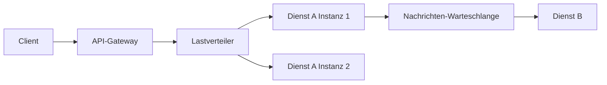

# Microservices & Cloud — IT-Vokabular

> **Level:** B2 · **Focus:** distributed systems in German — der Dienst, die Nachricht, die Warteschlange, der Lastverteiler, die Ausfallsicherheit, die Skalierung, das Gateway · **Time:** ~1.5 h
> _After this module you can describe a distributed system in German — services, messaging, load balancing, resilience and scaling — with correct articles._

Once your Spring services (see [Spring Boot](#/vocabulary/spring-boot)) leave a single machine, a new layer of vocabulary appears: gateways route requests, load balancers spread them, queues decouple services, and the whole thing must stay available when parts fail. German architecture reviews use these words constantly, and many are clean German compounds (*die Ausfallsicherheit*, *der Lastverteiler*) rather than anglicisms. This module gives you the language of **verteilte Systeme** so you can hold your own in a design discussion at a scale-up like **Zalando** or **Delivery Hero**.

## Objectives / Lernziele

- Name the building blocks of a distributed system — Dienst, Gateway, Lastverteiler, Warteschlange — with article + plural.
- Explain **resilience and scaling** (*Ausfallsicherheit*, *Skalierung*) in German.
- Describe **messaging** — publish, subscribe, queue, retry, timeout.
- Read a German architecture doc and follow a request through the system.

## Kernbegriffe · Building blocks

| Deutsch | Artikel | Plural | English | Beispiel |
|---|---|---|---|---|
| Dienst | der | Dienste | service | Jeder Dienst hat eine eigene Datenbank. |
| Mikrodienst | der | Mikrodienste | microservice | Wir schneiden die Anwendung in kleine Mikrodienste. |
| Gateway | das | Gateways | gateway | Das Gateway nimmt alle Anfragen von außen entgegen. |
| Lastverteiler | der | Lastverteiler | load balancer | Der Lastverteiler verteilt die Anfragen auf drei Instanzen. |
| Instanz | die | Instanzen | instance | Wir starten bei Last eine zusätzliche Instanz. |
| Nachricht | die | Nachrichten | message | Der Dienst schickt eine Nachricht an die Warteschlange. |
| Warteschlange | die | Warteschlangen | queue | Die Warteschlange puffert die Nachrichten bei Spitzenlast. |
| Nachrichtenbroker | der | Nachrichtenbroker | message broker | Der Nachrichtenbroker verteilt die Ereignisse. |
| Endpunkt | der | Endpunkte | endpoint | Jeder Dienst stellt mehrere Endpunkte bereit. |
| Vertrag | der | Verträge | (API) contract | Der Vertrag zwischen den Diensten darf sich nicht brechen. |

## Ausfallsicherheit & Skalierung

The quality attributes an architect is judged on. Most are uncountable **die**-nouns.

| Deutsch | Artikel | Plural | English | Beispiel |
|---|---|---|---|---|
| Ausfallsicherheit | die | — | resilience / fault tolerance | Ausfallsicherheit erreichen wir durch Redundanz. |
| Skalierung | die | Skalierungen | scaling | Die horizontale Skalierung ist einfacher als die vertikale. |
| Skalierbarkeit | die | — | scalability | Die Skalierbarkeit ist ein zentrales Entwurfsziel. |
| Verfügbarkeit | die | — | availability | Wir garantieren eine Verfügbarkeit von 99,9 Prozent. |
| Latenz | die | Latenzen | latency | Die Latenz steigt bei jeder Netzwerkgrenze. |
| Durchsatz | der | — | throughput | Der Durchsatz liegt bei tausend Anfragen pro Sekunde. |
| Entkopplung | die | — | decoupling | Die Warteschlange sorgt für die Entkopplung der Dienste. |
| Zeitüberschreitung | die | Zeitüberschreitungen | timeout | Nach einer Zeitüberschreitung bricht der Aufruf ab. |
| Wiederholungsversuch | der | Wiederholungsversuche | retry | Nach einem Fehler starten wir einen Wiederholungsversuch. |
| Schutzschalter | der | Schutzschalter | circuit breaker | Der Schutzschalter unterbricht Aufrufe an einen kranken Dienst. |
| Mandant | der | Mandanten | tenant | Jeder Mandant sieht nur seine eigenen Daten. |

> Common anglicisms in speech: *der Service*, *das Load Balancing*, *der Circuit Breaker*, *der Throughput*. Write *der Dienst*, *die Lastverteilung*, *der Schutzschalter*, *der Durchsatz* — speak whichever the team uses.

## Der Anfragefluss · Request flow



🇩🇪 **Die Anfrage erreicht das Gateway, der Lastverteiler wählt eine Instanz, und die Antwort wird über eine Nachricht an den nächsten Dienst entkoppelt.**
*The request reaches the gateway, the load balancer picks an instance, and the response is decoupled to the next service via a message.*

```audio
Der Client schickt seine Anfrage an das Gateway. Der Lastverteiler verteilt sie auf mehrere Instanzen, und bei Spitzenlast puffert die Warteschlange die Nachrichten, damit kein Dienst überlastet wird.
```

## Verben & Kollokationen

*weiterleiten*, *ausfallen* and *ausrollen* are **separable**; *ausfallen* takes **sein** in the Perfekt (*der Dienst **ist** ausgefallen*).

| Deutsch | Artikel | Plural | English | Beispiel |
|---|---|---|---|---|
| skalieren | — | — | to scale | Wir skalieren den Dienst horizontal. |
| verteilen | — | — | to distribute | Der Lastverteiler verteilt die Last gleichmäßig. |
| entkoppeln | — | — | to decouple | Die Warteschlange entkoppelt Sender und Empfänger. |
| weiterleiten | — | — | to route / forward | Das Gateway leitet die Anfrage an den Dienst weiter. |
| veröffentlichen | — | — | to publish | Der Dienst veröffentlicht ein Ereignis auf dem Thema. |
| abonnieren | — | — | to subscribe | Zwei Dienste abonnieren dieselbe Nachricht. |
| ausfallen | — | — | to fail / go down | Wenn ein Dienst ausfällt, übernimmt eine Replik. |
| wiederholen | — | — | to retry | Wir wiederholen die Anfrage nach kurzer Wartezeit. |
| überwachen | — | — | to monitor | Wir überwachen die Latenz jedes Dienstes. |
| bereitstellen | — | — | to provision | Die Cloud stellt neue Ressourcen in Sekunden bereit. |

A resilience sentence you might present: *"Fällt der Zahlungsdienst **aus**, öffnet der **Schutzschalter**, wir starten einen **Wiederholungsversuch**, und die **Warteschlange** puffert die Nachrichten — so bleibt die **Verfügbarkeit** hoch."*

---

## 🧾 Zusammenfassung · Summary

A distributed system is built from **Dienste** behind a **Gateway** and a **Lastverteiler**, talking through **Nachrichten** and **Warteschlangen** to stay decoupled. Its quality is measured in **Ausfallsicherheit, Verfügbarkeit, Latenz, Durchsatz** and **Skalierbarkeit** — mostly uncountable *die*-nouns. Resilience patterns bring **Zeitüberschreitung, Wiederholungsversuch** and **Schutzschalter**. Write the German compound, speak the anglicism. Deploy all of this with [Docker & Kubernetes](#/vocabulary/docker-kubernetes); go deeper on trade-offs in [Architecture & System Design](#/vocabulary/architecture-system-design).

## 📇 Vokabel-Checkliste · Vocabulary checklist

| Deutsch | Artikel | Plural | English | VI (if hard) |
|---|---|---|---|---|
| Dienst | der | Dienste | service | dịch vụ |
| Warteschlange | die | Warteschlangen | queue | hàng đợi |
| Lastverteiler | der | Lastverteiler | load balancer | bộ cân bằng tải |
| Ausfallsicherheit | die | — | resilience | khả năng chịu lỗi |
| Skalierung | die | Skalierungen | scaling | mở rộng quy mô |
| Verfügbarkeit | die | — | availability | tính sẵn sàng |
| Gateway | das | Gateways | gateway | |
| Latenz | die | Latenzen | latency | độ trễ |
| Entkopplung | die | — | decoupling | tách rời / giảm phụ thuộc |
| Zeitüberschreitung | die | Zeitüberschreitungen | timeout | hết thời gian chờ |

→ Add these to [Flashcards](#/@flashcards) with article + plural.

## 🗣️ Sprechübung · Speaking practice

1. Trace a request through **Gateway → Lastverteiler → Dienst → Warteschlange** in German.
2. Explain how you achieve **Ausfallsicherheit**: *Wiederholungsversuch*, *Schutzschalter*, *Redundanz*.
3. Read the audio line, then describe how *your* system scales under load.

```audio
Bei hoher Last skalieren wir den Dienst horizontal und starten weitere Instanzen. Der Lastverteiler verteilt die Anfragen, und die Warteschlange entkoppelt die Dienste, damit die Latenz niedrig bleibt.
```

## ❓ Mini-Quiz

1. Article + plural of *Dienst*, *Warteschlange* and *Gateway*?
2. Which of these have **no plural**: *Ausfallsicherheit*, *Latenz*, *Verfügbarkeit*, *Skalierung*?
3. Perfekt of *ausfallen*: *"Der Zahlungsdienst ___ gestern ___."* (haben/sein?)
4. German compound for *load balancer* and for *circuit breaker*?

> **Lösungen:** 1) **der** Dienst/**die** Dienste · **die** Warteschlange/**die** Warteschlangen · **das** Gateway/**die** Gateways. · 2) No plural: *Ausfallsicherheit*, *Verfügbarkeit* (Latenz → Latenzen, Skalierung → Skalierungen do have plurals). · 3) *ist … ausgefallen* (change of state → **sein**). · 4) *der **Lastverteiler***, *der **Schutzschalter***. More: [Quizzes](#/@quiz).

## 📝 Hausaufgabe · Homework

- [ ] Draw your system and label every box in German (Gateway, Lastverteiler, Dienst, Warteschlange).
- [ ] Write **4 sentences** on resilience using *Ausfallsicherheit*, *Wiederholungsversuch* and *Schutzschalter*.
- [ ] Explain **horizontal vs. vertical scaling** in German in 3 sentences.
- [ ] Add the checklist to [Flashcards](#/@flashcards); verify articles on DWDS.de.

## 📚 Empfohlene Ressourcen · Recommended resources

- **Confirm articles/plurals:** DWDS.de, dict.leo.org, Duden.de.
- **Read in German:** heise.de, Golem.de, Informatik Aktuell (Architektur-Artikel).
- **Podcast:** Engineering Kiosk (verteilte Systeme), programmier.bar.
- **Next:** [Docker & Kubernetes](#/vocabulary/docker-kubernetes) → [Architecture & System Design](#/vocabulary/architecture-system-design).
