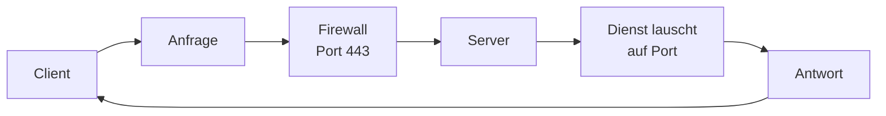

# Netzwerk & Linux — IT-Vokabular

> **Level:** B2 · **Focus:** networking basics, the request/response cycle, ports & firewalls, the Linux shell, files & permissions · **Time:** ~1.5 h
> _After this module you can describe how a request travels the network and operate a Linux server in German — from `ssh` login to `chmod`, with the right article and plural._

Every backend service lives on a Linux box and talks over a network. When a German colleague says *„Der Dienst lauscht auf Port 8080"* or *„Setz mal die Berechtigungen richtig"*, you want to answer without switching to English. This module covers the two worlds you touch daily — **das Netzwerk** and **die Shell** — with the exact German a German ops team uses. The gender rules from [Phase 3 · Vocabulary](#/phase-3/vocabulary) hold: `-ung` → **die**, agent nouns in `-er` → **der**.

## Objectives / Lernziele

- Describe the **request/response cycle** (client, server, connection, protocol) in German.
- Talk about **ports, firewalls and services** the way an ops team does.
- Navigate the **Linux shell** — directories, files, paths, processes — out loud.
- Explain **permissions and ownership** (user, group, rights) correctly.

## 1. Netzwerk-Grundlagen · Networking basics

| Deutsch | Artikel | Plural | English | Beispiel |
|---|---|---|---|---|
| Netzwerk | das | Netzwerke | network | Der Dienst ist nur im internen **Netzwerk** erreichbar. |
| Anfrage | die | Anfragen | request | Die **Anfrage** erreicht den Server über HTTPS. |
| Antwort | die | Antworten | response | Die **Antwort** enthält den Statuscode 200. |
| Server | der | Server | server | Der **Server** läuft in einem Rechenzentrum in Frankfurt. |
| Client | der | Clients | client | Der **Client** wiederholt die Anfrage nach einem Fehler. |
| Verbindung | die | Verbindungen | connection | Die **Verbindung** wird nach 30 Sekunden getrennt. |
| Protokoll | das | Protokolle | protocol | Das **Protokoll** legt fest, wie die Daten übertragen werden. |
| Paket | das | Pakete | packet | Ein verlorenes **Paket** wird erneut gesendet. |
| Latenz | die | Latenzen | latency | Die **Latenz** zwischen den Rechenzentren ist gering. |
| Bandbreite | die | Bandbreiten | bandwidth | Die **Bandbreite** reicht für den Video-Stream. |

## 2. Ports, Dienste & Firewall · Ports, services & firewall

| Deutsch | Artikel | Plural | English | Beispiel |
|---|---|---|---|---|
| Anschluss | der | Anschlüsse | port | Der Dienst nutzt den **Anschluss** 8080. |
| Firewall | die | Firewalls | firewall | Die **Firewall** blockiert alle anderen Ports. |
| Dienst | der | Dienste | service / daemon | Der **Dienst** startet beim Hochfahren automatisch. |
| Host | der | Hosts | host | Der **Host** ist über seinen Namen erreichbar. |
| Adresse | die | Adressen | address | Die IP-**Adresse** ist statisch vergeben. |
| Namensauflösung | die | — | name resolution / DNS | Die **Namensauflösung** ordnet den Namen einer IP zu. |
| Schnittstelle | die | Schnittstellen | interface | Die Netzwerk-**Schnittstelle** hat zwei Adressen. |
| Weiterleitung | die | Weiterleitungen | forwarding / redirect | Die **Weiterleitung** schickt den Verkehr an den Proxy. |

> „Port" is also used directly: **der Port, die Ports**. In writing you may see *der Anschluss*; in the office everyone says *Port*. Know both, as with the anglicisms in [Phase 3 · Vocabulary](#/phase-3/vocabulary).

## 3. Linux-Shell · The Linux shell

| Deutsch | Artikel | Plural | English | Beispiel |
|---|---|---|---|---|
| Shell | die | Shells | shell | Ich öffne die **Shell** und melde mich per SSH an. |
| Befehl | der | Befehle | command | Der **Befehl** listet alle laufenden Prozesse auf. |
| Verzeichnis | das | Verzeichnisse | directory | Ich wechsle in das **Verzeichnis** „/var/log". |
| Ordner | der | Ordner | folder | Der **Ordner** enthält die Konfigurationsdateien. |
| Datei | die | Dateien | file | Die **Datei** ist schreibgeschützt. |
| Pfad | der | Pfade | path | Der absolute **Pfad** beginnt mit einem Schrägstrich. |
| Prozess | der | Prozesse | process | Der **Prozess** verbraucht zu viel Speicher. |
| Skript | das | Skripte | script | Das **Skript** sichert die Datenbank jede Nacht. |
| Ausgabe | die | Ausgaben | output | Ich leite die **Ausgabe** in eine Datei um. |
| Umgebungsvariable | die | Umgebungsvariablen | environment variable | Die **Umgebungsvariable** enthält den Datenbank-Pfad. |

```bash
cd /var/log
grep -i "fehler" app.log | tail -n 20 > fehler.txt
```

🇩🇪 **Ich wechsle in das Log-Verzeichnis, suche nach „Fehler" und leite die letzten 20 Zeilen in eine Datei um.**
*I change into the log directory, search for "error" and redirect the last 20 lines into a file.*

## 4. Berechtigungen & Benutzer · Permissions & users

| Deutsch | Artikel | Plural | English | Beispiel |
|---|---|---|---|---|
| Berechtigung | die | Berechtigungen | permission | Ohne die richtige **Berechtigung** kannst du die Datei nicht öffnen. |
| Zugriffsrecht | das | Zugriffsrechte | access right | Das **Zugriffsrecht** erlaubt nur Lesen. |
| Benutzer | der | Benutzer | user | Der **Benutzer** gehört zur Gruppe „entwickler". |
| Gruppe | die | Gruppen | group | Jede **Gruppe** hat eigene Rechte. |
| Eigentümer | der | Eigentümer | owner | Der **Eigentümer** der Datei ist „root". |
| Zugriff | der | Zugriffe | access | Der **Zugriff** auf das Verzeichnis ist gesperrt. |
| Aktualisierung | die | Aktualisierungen | update | Die **Aktualisierung** der Pakete braucht Root-Rechte. |
| Paketmanager | der | Paketmanager | package manager | Der **Paketmanager** installiert die Abhängigkeiten. |

> **VI:** *die Berechtigung* / *das Zugriffsrecht* = quyền truy cập, *der Eigentümer* = chủ sở hữu. Permissions come up in every deployment; more on this in [Security & Auth](#/vocabulary/security-auth).

## Verben & Kollokationen

Many shell verbs are separable (`um·leiten`, `an·melden`, `frei·geben`). Recall the verb-to-the-end rule in subordinate clauses from [Phase 1 · Grammar](#/phase-1/grammar).

| Verb / Kollokation | English | Beispiel |
|---|---|---|
| eine Verbindung **herstellen** | establish a connection | Der Client **stellt** eine sichere Verbindung **her**. |
| eine Anfrage **senden** | send a request | Die App **sendet** die Anfrage an das Gateway. |
| eine Antwort **erhalten** | receive a response | Der Client **erhält** eine Antwort mit den Daten. |
| auf einen Port **lauschen** | listen on a port | Der Dienst **lauscht** auf Port 8080. |
| einen Port **freigeben** | open / expose a port | Die Firewall **gibt** nur Port 443 **frei**. |
| einen Dienst **neu starten** | restart a service | Nach der Änderung **starte** ich den Dienst **neu**. |
| sich per SSH **anmelden** | log in via SSH | Ich **melde** mich per SSH am Server **an**. |
| die Ausgabe **umleiten** | redirect the output | Ich **leite** die Ausgabe in eine Datei **um**. |
| die Berechtigungen **setzen** | set the permissions | Ich **setze** die Berechtigungen mit `chmod`. |
| einen Prozess **beenden** | kill / stop a process | Ich **beende** den hängenden Prozess. |
| ein Paket **installieren** | install a package | Der Paketmanager **installiert** das Paket. |



🇩🇪 **Die Anfrage passiert die Firewall, erreicht den Server und der Dienst schickt eine Antwort zurück.**
*The request passes the firewall, reaches the server, and the service sends a response back.*

```audio
Ich melde mich per SSH am Server an, wechsle in das Log-Verzeichnis und starte den Dienst neu, weil er auf dem falschen Port lauscht.
```

---

## 🧾 Zusammenfassung · Summary

Two worlds, one vocabulary set. On the **network** side: *die Anfrage → die Verbindung → der Server → die Antwort*, controlled by *das Protokoll, der Anschluss/Port* and *die Firewall*. On the **Linux** side: you work in *der Shell* with *Befehle*, move through *Verzeichnisse* and *Pfade*, manage *Prozesse* and *Dateien*, and control *Berechtigungen* for each *Benutzer* and *Gruppe*. The verbs are mostly separable — *anmelden, umleiten, freigeben, neu starten* — so watch verb position. Permissions connect directly to [Security & Auth](#/vocabulary/security-auth); the request path continues in [Architecture & System Design](#/vocabulary/architecture-system-design).

## 📇 Vokabel-Checkliste · Vocabulary checklist

| Deutsch | Artikel | Plural | English | VI (if hard) |
|---|---|---|---|---|
| Netzwerk | das | Netzwerke | network | |
| Anfrage | die | Anfragen | request | |
| Antwort | die | Antworten | response | |
| Verbindung | die | Verbindungen | connection | |
| Anschluss | der | Anschlüsse | port | cổng |
| Verzeichnis | das | Verzeichnisse | directory | thư mục |
| Datei | die | Dateien | file | tệp |
| Berechtigung | die | Berechtigungen | permission | quyền |
| Dienst | der | Dienste | service / daemon | dịch vụ nền |
| Eigentümer | der | Eigentümer | owner | chủ sở hữu |

→ Drill these with audio in [Flashcards](#/@flashcards).

## 🗣️ Sprechübung · Speaking practice

1. Narrate a request: *„Die Anfrage geht vom Client über die Firewall zum Server …"*.
2. Talk through a live-debug session: log in, change directory, tail the log, restart the service.
3. Explain a permission problem: *„Der Benutzer hat keine Berechtigung, deshalb …"*. Then compare with the 🔊 below.

```audio
Der Dienst antwortet nicht. Ich melde mich am Server an, prüfe die Ausgabe im Log-Verzeichnis und stelle fest, dass die Firewall den Port blockiert.
```

## ❓ Mini-Quiz

1. Article + plural of *Anschluss*? And of *Verzeichnis*?
2. Fill the gap: *„Der Dienst ___ auf Port 8080."* (lauscht / sendet / beendet?)
3. Which verb means "redirect the output"?
4. Guess the article by heuristic: *Namensauflösung*, *Server*, *Netzwerk*.

> **Lösungen:** 1) **der** Anschluss, **die** Anschlüsse · **das** Verzeichnis, **die** Verzeichnisse. · 2) **lauscht** (auf einen Port lauschen). · 3) die Ausgabe **umleiten**. · 4) **die** Namensauflösung (-ung → die), **der** Server (-er → der), **das** Netzwerk. More: [Quizzes](#/@quiz).

## 📝 Hausaufgabe · Homework

- [ ] Write **8 shell steps** you did today, each as a German sentence with the right verb.
- [ ] Describe your service's **network path** in 3 sentences (client → firewall → server → response).
- [ ] Explain a **permission fix** (`chmod`/owner/group) out loud; check every article.
- [ ] Add the checklist terms to [Flashcards](#/@flashcards) and do the [Quiz](#/@quiz).

## 📚 Empfohlene Ressourcen · Recommended resources

- **Confirm articles/plurals:** DWDS.de, dict.leo.org, Duden.de.
- **Terms in context:** heise.de (heise Security / c't), Golem.de, Informatik Aktuell.
- **SRS:** [Flashcards](#/@flashcards) + personal IT deck (Anki „Master German Vocabulary A1–C1").
- **Next:** [Security & Auth](#/vocabulary/security-auth) · back to [Databases & SQL](#/vocabulary/database-sql).
