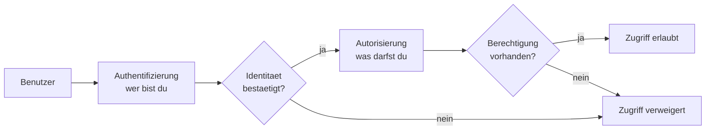

# Sicherheit & Authentifizierung — IT-Vokabular

> **Level:** B2/C1 · **Focus:** encryption, authentication vs. authorization, tokens & certificates, vulnerabilities & attacks, data protection (DSGVO) · **Time:** ~1.5 h
> _After this module you can discuss security in German — who may do what, how data is protected, where the risks are — with the right article and plural, and the vocabulary a German team expects around the DSGVO._

Security German matters more in Germany than almost anywhere, because of the **DSGVO** (GDPR). Every design review touches *Verschlüsselung, Berechtigungen, Datenschutz*. The trickiest pair for learners is **Authentifizierung** (who are you?) vs. **Autorisierung** (what may you do?) — get them straight and you'll sound senior. This module gives you the words for identity, secrets and threats. Gender heuristics from [Phase 3 · Vocabulary](#/phase-3/vocabulary) still guide you: `-ung`/`-heit`/`-keit` → **die**.

## Objectives / Lernziele

- Separate **Authentifizierung** from **Autorisierung** and use each correctly.
- Talk about **encryption, keys, tokens and certificates** with article + plural.
- Name **vulnerabilities, threats and attacks** and how to close them.
- Discuss **data protection (Datenschutz / DSGVO)** in a German work context.

## 1. Verschlüsselung & Schlüssel · Encryption & keys

| Deutsch | Artikel | Plural | English | Beispiel |
|---|---|---|---|---|
| Verschlüsselung | die | Verschlüsselungen | encryption | Die **Verschlüsselung** schützt die Daten bei der Übertragung. |
| Entschlüsselung | die | — | decryption | Ohne den Schlüssel ist keine **Entschlüsselung** möglich. |
| Schlüssel | der | Schlüssel | key | Der private **Schlüssel** wird sicher aufbewahrt. |
| Zertifikat | das | Zertifikate | certificate | Das **Zertifikat** ist noch drei Monate gültig. |
| Signatur | die | Signaturen | signature | Die digitale **Signatur** beweist die Echtheit. |
| Hashwert | der | Hashwerte | hash | Das Passwort wird nur als **Hashwert** gespeichert. |
| Prüfsumme | die | Prüfsummen | checksum | Die **Prüfsumme** erkennt veränderte Dateien. |
| Vertraulichkeit | die | — | confidentiality | Die **Vertraulichkeit** der Daten hat oberste Priorität. |

## 2. Authentifizierung & Autorisierung · Authentication & authorization

This is the pair everyone confuses. Keep them apart:

| Deutsch | Artikel | Plural | English | Beispiel |
|---|---|---|---|---|
| Authentifizierung | die | Authentifizierungen | authentication | Die **Authentifizierung** prüft, wer der Benutzer ist. |
| Autorisierung | die | Autorisierungen | authorization | Die **Autorisierung** prüft, was der Benutzer darf. |
| Berechtigung | die | Berechtigungen | permission | Ohne die nötige **Berechtigung** wird der Zugriff verweigert. |
| Anmeldung | die | Anmeldungen | login | Nach drei Fehlversuchen wird die **Anmeldung** gesperrt. |
| Token | das | Token | token | Das **Token** läuft nach einer Stunde ab. |
| Sitzung | die | Sitzungen | session | Die **Sitzung** endet beim Abmelden. |
| Rolle | die | Rollen | role | Jede **Rolle** hat einen festen Satz an Rechten. |
| Zugangsdaten | die | (Plural) | credentials | Die **Zugangsdaten** werden niemals im Klartext gespeichert. |

> **Merksatz:** *Authentifizierung* = **wer** bist du? · *Autorisierung* = **was** darfst du? · The permissions themselves are *Berechtigungen* — the same word you met in [Networking & Linux](#/vocabulary/networking-linux). **VI:** *die Zugangsdaten* = thông tin đăng nhập.



🇩🇪 **Zuerst kommt die Authentifizierung, dann die Autorisierung — erst danach ist der Zugriff erlaubt.**
*First comes authentication, then authorization — only after that is access granted.*

## 3. Schwachstellen, Bedrohungen & Angriffe · Vulnerabilities, threats & attacks

| Deutsch | Artikel | Plural | English | Beispiel |
|---|---|---|---|---|
| Schwachstelle | die | Schwachstellen | vulnerability | Die **Schwachstelle** wurde mit einem Patch geschlossen. |
| Sicherheitslücke | die | Sicherheitslücken | security hole | Eine kritische **Sicherheitslücke** wurde gemeldet. |
| Bedrohung | die | Bedrohungen | threat | Jede **Bedrohung** wird bewertet und dokumentiert. |
| Angriff | der | Angriffe | attack | Der **Angriff** kam von einer bekannten IP-Adresse. |
| Angreifer | der | Angreifer | attacker | Der **Angreifer** versuchte, das Passwort zu erraten. |
| Einschleusung | die | Einschleusungen | injection | Eine SQL-**Einschleusung** kann die Datenbank kompromittieren. |
| Schadsoftware | die | — | malware | Die **Schadsoftware** verschlüsselte alle Dateien. |
| Risiko | das | Risiken | risk | Das **Risiko** eines Datenlecks ist hoch. |

> **VI:** *die Schwachstelle* / *die Sicherheitslücke* = lỗ hổng bảo mật, *die Einschleusung* (injection) = tiêm mã, *die Schadsoftware* = phần mềm độc hại. These are core review words.

## 4. Datenschutz & DSGVO · Data protection & GDPR

| Deutsch | Artikel | Plural | English | Beispiel |
|---|---|---|---|---|
| Datenschutz | der | — | data protection / privacy | Der **Datenschutz** ist in Deutschland gesetzlich geregelt. |
| DSGVO | die | — | GDPR | Die **DSGVO** verlangt eine ausdrückliche Einwilligung. |
| Einwilligung | die | Einwilligungen | consent | Ohne **Einwilligung** dürfen wir die Daten nicht verarbeiten. |
| Datenpanne | die | Datenpannen | data breach | Eine **Datenpanne** muss binnen 72 Stunden gemeldet werden. |
| Integrität | die | — | integrity | Die **Integrität** der Daten wird per Prüfsumme sichergestellt. |
| Verfügbarkeit | die | — | availability | Die **Verfügbarkeit** ist Teil der Sicherheitsziele. |
| Härtung | die | Härtungen | hardening | Die **Härtung** des Servers reduziert die Angriffsfläche. |
| Protokollierung | die | — | logging / auditing | Die **Protokollierung** hält jeden Zugriff fest. |

> The three classic security goals in German: **Vertraulichkeit, Integrität, Verfügbarkeit** (confidentiality, integrity, availability). German firms like Allianz or Munich Re expect you to name these in a design review.

## Verben & Kollokationen

| Verb / Kollokation | English | Beispiel |
|---|---|---|
| Daten **verschlüsseln** | encrypt data | Wir **verschlüsseln** die Daten im Ruhezustand. |
| sich **authentifizieren** | authenticate oneself | Der Benutzer **authentifiziert** sich mit einem Token. |
| einen Benutzer **autorisieren** | authorize a user | Das System **autorisiert** nur bestimmte Rollen. |
| Zugriff **gewähren** / **verweigern** | grant / deny access | Das Gateway **verweigert** den Zugriff ohne Token. |
| Zugriff **entziehen** | revoke access | Wir **entziehen** dem Konto sofort den Zugriff. |
| ein Token **ausstellen** / **widerrufen** | issue / revoke a token | Der Dienst **stellt** ein kurzlebiges Token **aus**. |
| eine Schwachstelle **ausnutzen** | exploit a vulnerability | Der Angreifer **nutzt** die Schwachstelle **aus**. |
| eine Lücke **schließen** | patch / close a hole | Das Update **schließt** die Sicherheitslücke. |
| ein Passwort **zurücksetzen** | reset a password | Der Nutzer **setzt** sein Passwort **zurück**. |
| ein System **härten** | harden a system | Wir **härten** den Server nach Best Practices. |
| einen Angriff **abwehren** | fend off an attack | Die Firewall **wehrt** den Angriff **ab**. |

```audio
Der Benutzer authentifiziert sich mit einem Token. Danach prüft das System die Berechtigung und gewährt oder verweigert den Zugriff. Alle Zugriffe werden protokolliert.
```

---

## 🧾 Zusammenfassung · Summary

Security German rests on one crucial distinction: **Authentifizierung** (who are you?) precedes **Autorisierung** (what may you do?), and both rely on *Berechtigungen* and *Rollen*. Secrets are protected by *Verschlüsselung*, *Schlüssel*, *Zertifikate* and *Signaturen*; identity flows through *Token* and *Sitzungen*. On the threat side you name *Schwachstellen, Bedrohungen, Angriffe* and how you *schließen*, *härten* and *abwehren*. In Germany, wrap all of it in **Datenschutz / DSGVO** language — *Einwilligung, Datenpanne, Vertraulichkeit-Integrität-Verfügbarkeit*. Permissions link back to [Networking & Linux](#/vocabulary/networking-linux); risk and availability continue in [Architecture & System Design](#/vocabulary/architecture-system-design).

## 📇 Vokabel-Checkliste · Vocabulary checklist

| Deutsch | Artikel | Plural | English | VI (if hard) |
|---|---|---|---|---|
| Verschlüsselung | die | Verschlüsselungen | encryption | mã hóa |
| Authentifizierung | die | Authentifizierungen | authentication | xác thực |
| Autorisierung | die | Autorisierungen | authorization | phân quyền |
| Berechtigung | die | Berechtigungen | permission | quyền |
| Token | das | Token | token | |
| Zertifikat | das | Zertifikate | certificate | chứng chỉ |
| Schwachstelle | die | Schwachstellen | vulnerability | lỗ hổng |
| Angriff | der | Angriffe | attack | cuộc tấn công |
| Datenschutz | der | — | data protection | bảo vệ dữ liệu |
| Einwilligung | die | Einwilligungen | consent | sự đồng ý |

→ Drill these with audio in [Flashcards](#/@flashcards).

## 🗣️ Sprechübung · Speaking practice

1. Explain the difference: *„Authentifizierung prüft, wer du bist; Autorisierung prüft, was du darfst."*
2. Walk through your auth flow: token → permission check → access granted or denied.
3. Describe one security fix: *„Wir haben die Schwachstelle geschlossen und das System gehärtet."* Compare with the 🔊 below.

```audio
Wir haben eine Sicherheitslücke im Login gefunden. Der Angreifer konnte die Authentifizierung umgehen. Wir haben die Lücke geschlossen, die Tokens widerrufen und alle betroffenen Nutzer informiert.
```

## ❓ Mini-Quiz

1. Which one checks *what you may do* — *Authentifizierung* or *Autorisierung*?
2. Article + plural of *Schwachstelle*? And of *Token*?
3. Fill the gap: *„Das Update ___ die Sicherheitslücke."* (schließt / öffnet / härtet?)
4. Name the three classic security goals in German.

> **Lösungen:** 1) **Autorisierung** (was du darfst); Authentifizierung = wer du bist. · 2) **die** Schwachstelle, **die** Schwachstellen · **das** Token, **die** Token. · 3) **schließt** (eine Lücke schließen). · 4) **Vertraulichkeit, Integrität, Verfügbarkeit**. More: [Quizzes](#/@quiz).

## 📝 Hausaufgabe · Homework

- [ ] Write **5 sentences** that clearly separate Authentifizierung vs. Autorisierung.
- [ ] Describe your service's **auth flow** in German (token → Berechtigung → Zugriff).
- [ ] Explain one **DSGVO** requirement your team follows (Einwilligung, Datenpanne, Protokollierung).
- [ ] Add the checklist terms to [Flashcards](#/@flashcards) and do the [Quiz](#/@quiz).

## 📚 Empfohlene Ressourcen · Recommended resources

- **Confirm articles/plurals:** DWDS.de, dict.leo.org, Duden.de.
- **Security news in German:** heise Security (heise.de), Golem.de, BSI-Publikationen (bsi.bund.de).
- **SRS:** [Flashcards](#/@flashcards) + personal IT deck (Anki „Master German Vocabulary A1–C1").
- **Next:** [Testing & Agile](#/vocabulary/testing-agile) · back to [Networking & Linux](#/vocabulary/networking-linux).
