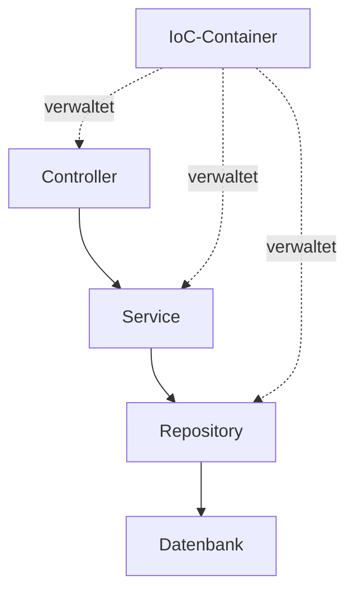

# Spring Boot — IT-Vokabular

> **Level:** B2 · **Focus:** the Spring Boot world in German — Abhängigkeitseinspritzung, Konfiguration, der Controller, das Repository, die Annotation, das Bean, Autokonfiguration · **Time:** ~1.5 h
> _After this module you can explain a Spring Boot service in German — layers, beans, dependency injection and configuration — with correct articles._

Spring Boot is the framework most German backend teams run on, and its vocabulary is a mix of German concept nouns and firmly established anglicisms. You will *write* `@RestController` but *say* "der Controller"; you will read *die Abhängigkeitseinspritzung* in a book but hear "Dependency Injection" in the *Daily*. This module teaches both registers so you can follow an architecture discussion and describe your own service cleanly. It assumes the Java object model from [Java](#/vocabulary/java) and feeds directly into [Microservices & Cloud](#/vocabulary/microservices-cloud).

## Objectives / Lernziele

- Explain **dependency injection and inversion of control** in German with the right nouns.
- Name the **layers** of a Spring app — Controller, Service, Repository — with article + plural.
- Talk about **Beans, Annotationen and Konfiguration** naturally.
- Read a German Spring tutorial and a `application.yml` out loud.

## Kernbegriffe · Core Spring concepts

The gender colours matter here: **die Konfiguration / die Annotation** are feminine (-tion), **der Controller** is masculine (-er), **das Bean / das Repository** are neuter.

| Deutsch | Artikel | Plural | English | Beispiel |
|---|---|---|---|---|
| Abhängigkeitseinspritzung | die | — | dependency injection | Die Abhängigkeitseinspritzung erfolgt über den Konstruktor. |
| Steuerungsumkehr | die | — | inversion of control | Steuerungsumkehr bedeutet, dass der Container die Objekte erzeugt. |
| Bean | das | Beans | bean | Jedes Bean wird vom Container verwaltet. |
| Anwendungskontext | der | Anwendungskontexte | application context | Der Anwendungskontext enthält alle Beans. |
| Container | der | Container | container (IoC) | Der Container verdrahtet die Abhängigkeiten automatisch. |
| Konfiguration | die | Konfigurationen | configuration | Die Konfiguration liegt in der Datei application.yml. |
| Annotation | die | Annotationen | annotation | Die Annotation markiert die Klasse als Controller. |
| Autokonfiguration | die | Autokonfigurationen | auto-configuration | Die Autokonfiguration richtet die Datenquelle selbst ein. |
| Starter | der | Starter | starter | Der Starter bringt alle nötigen Abhängigkeiten mit. |
| Eigenschaft | die | Eigenschaften | property | Diese Eigenschaft steht in der Konfigurationsdatei. |

## Die Schichten · The layers

A Spring service is layered. Each layer has a German name and a common anglicism.

| Deutsch | Artikel | Plural | English | Beispiel |
|---|---|---|---|---|
| Controller | der | Controller | controller | Der Controller nimmt die HTTP-Anfrage entgegen. |
| Dienst | der | Dienste | service | Der Dienst enthält die Geschäftslogik. |
| Repository | das | Repositories | repository | Das Repository greift auf die Datenbank zu. |
| Komponente | die | Komponenten | component | Jede Komponente ist ein verwaltetes Bean. |
| Schicht | die | Schichten | layer | Die oberste Schicht ist der Controller. |
| Endpunkt | der | Endpunkte | endpoint | Der Endpunkt liefert die Daten als JSON. |
| Anfrage | die | Anfragen | request | Die Anfrage erreicht zuerst den Controller. |
| Antwort | die | Antworten | response | Die Antwort enthält den Statuscode 200. |
| Zuordnung | die | Zuordnungen | mapping | Die Zuordnung verbindet die URL mit der Methode. |
| Validierung | die | Validierungen | validation | Die Validierung prüft die Eingabe vor der Verarbeitung. |

Here is a controller with dependency injection through the constructor:

```java
@RestController                          // der Controller
public class KontoController {

    private final KontoService dienst;   // das Bean, eingespritzt

    public KontoController(KontoService dienst) {
        this.dienst = dienst;            // Abhängigkeitseinspritzung
    }

    @GetMapping("/konten/{id}")          // die Zuordnung
    public Konto lade(@PathVariable Long id) {
        return dienst.finde(id);
    }
}
```

And the configuration a German colleague would call *die Konfigurationsdatei*:

```yaml
server:
  port: 8080
spring:
  datasource:                 # die Datenquelle
    url: jdbc:postgresql://localhost:5432/konten
  jpa:
    hibernate:
      ddl-auto: validate      # die Validierung
```



🇩🇪 **Der Container erzeugt die Beans und spritzt die Abhängigkeiten in den Controller, den Dienst und das Repository ein.**
*The container creates the beans and injects the dependencies into the controller, the service and the repository.*

```audio
Der Container verwaltet alle Beans. Er spritzt den Dienst in den Controller ein, und der Controller ruft bei jeder Anfrage die passende Methode auf.
```

## Verben & Kollokationen

*einspritzen* and *bereitstellen* are **separable** (*ich spritze den Dienst **ein***); *konfigurieren, annotieren, verwalten* are not.

| Deutsch | Artikel | Plural | English | Beispiel |
|---|---|---|---|---|
| einspritzen | — | — | to inject | Wir spritzen den Dienst über den Konstruktor ein. |
| injizieren | — | — | to inject (Latin form) | Spring injiziert das Repository automatisch. |
| konfigurieren | — | — | to configure | Wir konfigurieren die Anwendung in der YAML-Datei. |
| annotieren | — | — | to annotate | Wir annotieren die Klasse mit RestController. |
| verwalten | — | — | to manage | Der Container verwaltet den Lebenszyklus der Beans. |
| bereitstellen | — | — | to provide (a bean) | Diese Methode stellt ein Bean bereit. |
| zuordnen | — | — | to map | Wir ordnen die URL einer Methode zu. |
| validieren | — | — | to validate | Wir validieren die Eingabe vor dem Speichern. |
| starten | — | — | to start | Wir starten die Anwendung mit einem Befehl. |
| verdrahten | — | — | to wire | Spring verdrahtet die Abhängigkeiten automatisch. |

At a company like **N26** or **Trade Republic** an onboarding sentence sounds like: *"Der `KontoController` bekommt den `KontoService` per **Abhängigkeitseinspritzung**; beide sind **Beans**, die der **Container** **verwaltet**."* — four of today's terms in one breath.

---

## 🧾 Zusammenfassung · Summary

Spring Boot lives on **Steuerungsumkehr**: the **Container** creates the **Beans** and performs the **Abhängigkeitseinspritzung** so you never call `new` for your services. The app is layered — **der Controller → der Dienst → das Repository → die Datenbank** — and glued with **Annotationen** and a **Konfiguration**. Mind the genders: *-tion* nouns are *die*, *-er* nouns are *der*, and *das Bean / das Repository* are neuter. Write the German term, speak the anglicism. Next: scale these services in [Microservices & Cloud](#/vocabulary/microservices-cloud); persist them in [Database & SQL](#/vocabulary/database-sql).

## 📇 Vokabel-Checkliste · Vocabulary checklist

| Deutsch | Artikel | Plural | English | VI (if hard) |
|---|---|---|---|---|
| Abhängigkeitseinspritzung | die | — | dependency injection | tiêm phụ thuộc |
| Steuerungsumkehr | die | — | inversion of control | đảo ngược điều khiển |
| Bean | das | Beans | bean | |
| Anwendungskontext | der | Anwendungskontexte | application context | |
| Konfiguration | die | Konfigurationen | configuration | cấu hình |
| Annotation | die | Annotationen | annotation | chú thích / annotation |
| Autokonfiguration | die | Autokonfigurationen | auto-configuration | |
| Controller | der | Controller | controller | |
| Repository | das | Repositories | repository | |
| Zuordnung | die | Zuordnungen | mapping | ánh xạ |

→ Add these to [Flashcards](#/@flashcards) with article + plural.

## 🗣️ Sprechübung · Speaking practice

1. Explain **dependency injection** in German in three sentences (*Container*, *Bean*, *einspritzen*).
2. Trace one HTTP request through your layers: *"Die Anfrage erreicht den Controller, der Controller ruft den Dienst auf …"*.
3. Read the audio line, then describe your own service's beans and annotations.

```audio
Unser Dienst ist ein Bean, das der Container verwaltet. Der Controller ist mit einer Annotation markiert und ordnet jede URL einer Methode zu. Die Konfiguration steht in der application.yml.
```

## ❓ Mini-Quiz

1. Article of *Controller*, *Bean*, *Konfiguration* and *Annotation*? Why (heuristic)?
2. Plural of *Repository* and *Anwendungskontext*?
3. Which verb: *"Wir ___ den Dienst über den Konstruktor ___."* (to inject, separable)?
4. German noun for *inversion of control*?

> **Lösungen:** 1) **der** Controller (-er → der), **das** Bean, **die** Konfiguration & **die** Annotation (-tion → die). · 2) **die** Repositories, **die** Anwendungskontexte. · 3) *Wir **spritzen** den Dienst über den Konstruktor **ein**.* · 4) *die **Steuerungsumkehr***. More: [Quizzes](#/@quiz).

## 📝 Hausaufgabe · Homework

- [ ] Diagram your own service's layers and label each in German (Controller, Dienst, Repository).
- [ ] Write **4 sentences** explaining how a bean is created and injected.
- [ ] Read one German Spring article on heise Developer and note **5 new terms** with article + plural.
- [ ] Add the checklist to [Flashcards](#/@flashcards); confirm articles on DWDS.de.

## 📚 Empfohlene Ressourcen · Recommended resources

- **Confirm articles/plurals:** DWDS.de, dict.leo.org, Duden.de.
- **Read in German:** heise Developer (heise.de), entwickler.de, Informatik Aktuell.
- **Podcast:** programmier.bar (backend & Spring episodes), Engineering Kiosk.
- **Next:** [Microservices & Cloud](#/vocabulary/microservices-cloud) and [Database & SQL](#/vocabulary/database-sql).
