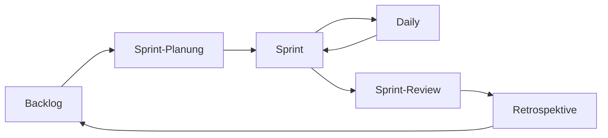

# Testen, Agile & Scrum — IT-Vokabular

> **Level:** B2 · **Focus:** test types & coverage, mocks & assertions, the Scrum cycle, backlog, estimation, ceremonies · **Time:** ~1.5 h
> _After this module you can survive every Scrum ceremony in German — stand-up, planning, review, retro — and talk about your tests with the right article and plural._

Most German dev teams run **Scrum** and speak a mix of German and English at the ceremonies. You'll hear *„Ziehst du die Story?"* and *„Wie ist die Testabdeckung?"* daily. This module splits into two halves: **testing** (what you write) and **Agile/Scrum** (how the team works). The canonical office words from the style guide apply — *das Daily* for the stand-up, *die Frist* for the deadline. Recall the polite request forms (*Könntest du …?*) from [Phase 1 · Grammar](#/phase-1/grammar); you'll use them all sprint.

## Objectives / Lernziele

- Name the **test types** (unit, integration, acceptance, load) and talk about **coverage**.
- Use **Attrappe/Mock**, **Zusicherung** and **Testfall** in a sentence.
- Run the **Scrum cycle** in German: sprint, backlog, planning, review, retro.
- Talk about **estimation, tasks and blockers** in a stand-up.

## 1. Testarten & Testbegriffe · Test types & terms

| Deutsch | Artikel | Plural | English | Beispiel |
|---|---|---|---|---|
| Testfall | der | Testfälle | test case | Jeder **Testfall** prüft genau ein Verhalten. |
| Komponententest | der | Komponententests | unit test | Der **Komponententest** läuft in Millisekunden. |
| Integrationstest | der | Integrationstests | integration test | Der **Integrationstest** startet eine echte Datenbank. |
| Abnahmetest | der | Abnahmetests | acceptance test | Der **Abnahmetest** prüft die Anforderung des Kunden. |
| Regressionstest | der | Regressionstests | regression test | Der **Regressionstest** verhindert alte Fehler. |
| Lasttest | der | Lasttests | load test | Der **Lasttest** simuliert 10.000 Nutzer. |
| Abdeckung | die | — | coverage | Die **Abdeckung** liegt bei 82 Prozent. |
| Testlauf | der | Testläufe | test run | Der nächtliche **Testlauf** ist fehlgeschlagen. |

## 2. Mocks, Zusicherungen & Fehler · Mocks, assertions & failures

| Deutsch | Artikel | Plural | English | Beispiel |
|---|---|---|---|---|
| Attrappe | die | Attrappen | mock | Die **Attrappe** ersetzt den echten Zahlungsdienst. |
| Platzhalter | der | Platzhalter | stub | Der **Platzhalter** liefert immer denselben Wert. |
| Zusicherung | die | Zusicherungen | assertion | Die **Zusicherung** vergleicht Erwartung und Ergebnis. |
| Testsuite | die | Testsuiten | test suite | Die ganze **Testsuite** läuft in zwei Minuten. |
| Testumgebung | die | Testumgebungen | test environment | Die **Testumgebung** ist von der Produktion getrennt. |
| Fehler | der | Fehler | bug / failure | Der **Fehler** tritt nur unter Last auf. |
| Fehlermeldung | die | Fehlermeldungen | error message | Die **Fehlermeldung** zeigt die genaue Zeile. |
| Randfall | der | Randfälle | edge case | Der **Randfall** mit null Elementen war nicht abgedeckt. |

> **VI:** *die Attrappe* (mock) = đối tượng giả, *die Zusicherung* (assertion) = khẳng định kiểm thử, *der Randfall* = trường hợp biên. In the office people also just say *der Mock* and *das Assertion* — know both, as with the anglicisms in [Phase 3 · Vocabulary](#/phase-3/vocabulary).

```java
@Test
void berechnetRabatt_beiStammkunde() {
    var kunde = new Kunde(Typ.STAMMKUNDE);
    var rabatt = rechner.berechne(kunde);
    assertEquals(10, rabatt); // die Zusicherung
}
```

🇩🇪 **Dieser Komponententest prüft mit einer Zusicherung, ob der Rabatt für Stammkunden stimmt.**
*This unit test uses an assertion to check whether the discount for regular customers is correct.*

## 3. Scrum-Zyklus & Zeremonien · Scrum cycle & ceremonies

| Deutsch | Artikel | Plural | English | Beispiel |
|---|---|---|---|---|
| Sprint | der | Sprints | sprint | Der **Sprint** dauert zwei Wochen. |
| Backlog | das | Backlogs | backlog | Das **Backlog** ist nach Priorität sortiert. |
| Nutzergeschichte | die | Nutzergeschichten | user story | Die **Nutzergeschichte** beschreibt den Nutzen für den Anwender. |
| Aufgabe | die | Aufgaben | task | Ich übernehme diese **Aufgabe** heute. |
| Besprechung | die | Besprechungen | meeting | Die **Besprechung** beginnt pünktlich um neun. |
| Planung | die | Planungen | planning | In der **Planung** schätzen wir die Geschichten. |
| Retrospektive | die | Retrospektiven | retrospective | In der **Retrospektive** sprechen wir über Verbesserungen. |
| Schätzung | die | Schätzungen | estimate | Meine **Schätzung** für die Aufgabe sind drei Punkte. |

> Canonical office words (from the style guide): the daily stand-up is **das Daily** (or *das Stand-up*); the review is **das Sprint-Review**; a deadline is **die Frist**. Most teams are *per du*: *„Wir sind hier alle per du."*



🇩🇪 **Aus dem Backlog planen wir den Sprint, arbeiten mit täglichen Dailies, zeigen das Ergebnis im Review und verbessern uns in der Retrospektive.**
*From the backlog we plan the sprint, work with daily stand-ups, show the result in the review and improve in the retrospective.*

## 4. Fortschritt & Hindernisse · Progress & blockers

| Deutsch | Artikel | Plural | English | Beispiel |
|---|---|---|---|---|
| Aufwand | der | Aufwände | effort | Der **Aufwand** war größer als geschätzt. |
| Hindernis | das | Hindernisse | impediment / blocker | Mein einziges **Hindernis** ist der fehlende Zugang. |
| Anforderung | die | Anforderungen | requirement | Die **Anforderung** ist noch nicht klar genug. |
| Abnahmekriterium | das | Abnahmekriterien | acceptance criterion | Jedes **Abnahmekriterium** muss erfüllt sein. |
| Geschwindigkeit | die | — | velocity | Die **Geschwindigkeit** des Teams ist stabil. |
| Priorität | die | Prioritäten | priority | Diese Aufgabe hat die höchste **Priorität**. |
| Frist | die | Fristen | deadline | Wir halten die **Frist** trotz des Fehlers ein. |
| Fortschritt | der | Fortschritte | progress | Ich berichte den **Fortschritt** im Daily. |

## Verben & Kollokationen

| Verb / Kollokation | English | Beispiel |
|---|---|---|
| einen Testfall **schreiben** | write a test case | Ich **schreibe** zuerst den Testfall, dann den Code. |
| ein Test **schlägt fehl** | a test fails | Der Test **schlägt** unter Last **fehl**. |
| die Abdeckung **erhöhen** | increase coverage | Wir **erhöhen** die Abdeckung auf 90 Prozent. |
| eine Abhängigkeit **mocken** | mock a dependency | Wir **mocken** den externen Dienst. |
| einen Fehler **reproduzieren** | reproduce a bug | Ich konnte den Fehler lokal **reproduzieren**. |
| eine Aufgabe **übernehmen** | take a task | Ich **übernehme** das Ticket für den Login. |
| eine Geschichte **schätzen** | estimate a story | Wir **schätzen** die Geschichte gemeinsam. |
| das Backlog **pflegen** | groom the backlog | Wir **pflegen** das Backlog einmal pro Woche. |
| ein Ticket **ziehen** | pull a ticket | Ich **ziehe** das nächste Ticket aus dem Backlog. |
| eine Retrospektive **abhalten** | hold a retro | Freitags **halten** wir eine Retrospektive **ab**. |

```audio
Im Daily berichte ich kurz: Gestern habe ich den Login getestet, heute ziehe ich das nächste Ticket, und mein einziges Hindernis ist der fehlende Zugang zur Testumgebung.
```

---

## 🧾 Zusammenfassung · Summary

Two vocabularies, one workflow. **Testing:** you write *Testfälle* (unit → integration → acceptance → load), check *die Abdeckung*, replace real services with *Attrappen*, and verify with *Zusicherungen*. **Scrum:** the cycle runs *Backlog → Planung → Sprint → Daily → Review → Retrospektive*; you *schätzt* stories, *übernimmst* tasks and name your *Hindernisse*. Use the canonical office words — *das Daily, die Frist* — and the polite request forms from [Phase 1 · Grammar](#/phase-1/grammar). Test environments connect to [Networking & Linux](#/vocabulary/networking-linux); quality attributes like reliability continue in [Architecture & System Design](#/vocabulary/architecture-system-design).

## 📇 Vokabel-Checkliste · Vocabulary checklist

| Deutsch | Artikel | Plural | English | VI (if hard) |
|---|---|---|---|---|
| Testfall | der | Testfälle | test case | ca kiểm thử |
| Abdeckung | die | — | coverage | độ bao phủ |
| Attrappe | die | Attrappen | mock | đối tượng giả |
| Zusicherung | die | Zusicherungen | assertion | khẳng định |
| Sprint | der | Sprints | sprint | |
| Backlog | das | Backlogs | backlog | |
| Nutzergeschichte | die | Nutzergeschichten | user story | |
| Schätzung | die | Schätzungen | estimate | ước lượng |
| Retrospektive | die | Retrospektiven | retrospective | |
| Hindernis | das | Hindernisse | blocker | trở ngại |

→ Drill these with audio in [Flashcards](#/@flashcards).

## 🗣️ Sprechübung · Speaking practice

1. Give a full **Daily update**: yesterday / today / blockers, in German.
2. Estimate a story out loud and justify it: *„Ich schätze drei Punkte, weil …"* (verb to the end!).
3. Describe your test strategy: *„Zuerst schreibe ich den Testfall, dann mocke ich …"*. Compare with the 🔊 below.

```audio
In der Planung schätzen wir die Nutzergeschichten. Danach ziehe ich das erste Ticket, schreibe die Testfälle und erhöhe damit die Abdeckung. In der Retrospektive sprechen wir über die Hindernisse.
```

## ❓ Mini-Quiz

1. Article + plural of *Testfall*? And of *Nutzergeschichte*?
2. Fill the gap: *„Der Test ___ unter Last ___."* (schlägt … fehl / hält … ein?)
3. Which German word is the canonical term for the daily stand-up?
4. Guess the article: *Schätzung*, *Backlog*, *Hindernis*.

> **Lösungen:** 1) **der** Testfall, **die** Testfälle · **die** Nutzergeschichte, **die** Nutzergeschichten. · 2) *schlägt … **fehl*** (fehlschlagen). · 3) **das Daily** (auch *das Stand-up*). · 4) **die** Schätzung (-ung → die), **das** Backlog, **das** Hindernis. More: [Quizzes](#/@quiz).

## 📝 Hausaufgabe · Homework

- [ ] Write your **real Daily update** for tomorrow in German (yesterday/today/blocker).
- [ ] Describe **3 test cases** from your project, each naming the test type.
- [ ] Estimate **2 stories** and justify each with a *weil*-clause (verb at the end).
- [ ] Add the checklist terms to [Flashcards](#/@flashcards) and do the [Quiz](#/@quiz).

## 📚 Empfohlene Ressourcen · Recommended resources

- **Confirm articles/plurals:** DWDS.de, dict.leo.org, Duden.de.
- **Agile in German:** heise Developer (heise.de), Informatik Aktuell, t3n.de; Podcast *Engineering Kiosk*.
- **SRS:** [Flashcards](#/@flashcards) + personal IT deck (Anki „Master German Vocabulary A1–C1").
- **Next:** [Architecture & System Design](#/vocabulary/architecture-system-design) · see also [Interview · Backend](#/interviews/backend).
